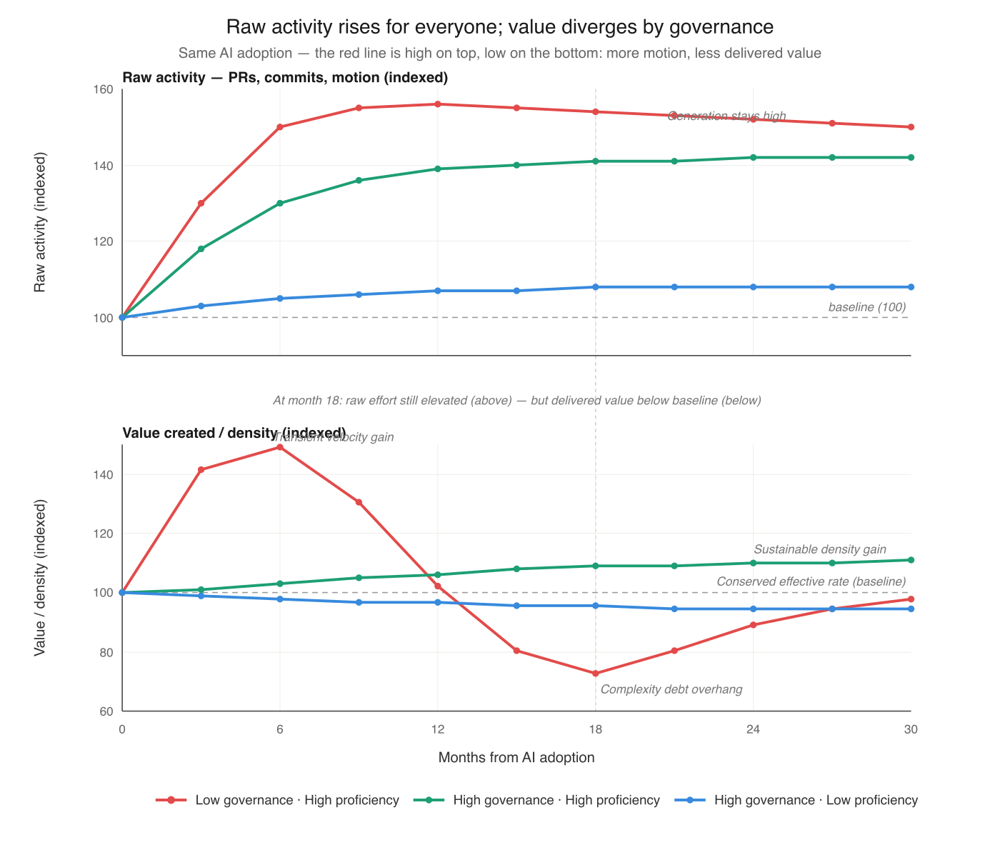

# AI Doesn't Break the Laws of Software Evolution — Part 1

## Five structural regularities from 1974 explain why AI productivity gains evaporate — and what continuous spec-reality reconciliation does about them

---

There is a pattern in the AI coding data that nobody can quite explain away. Velocity goes up — then goes down. Productivity feels real for a month or two — then dissipates. Teams that adopted Cursor, Copilot, or Claude Code in early 2024 are reporting in 2026 that their codebases are harder to reason about, their incidents are more frequent, and their senior engineers are spending more time debugging AI-generated code than they used to spend writing it.

The most rigorous causal study to date — He et al., MSR '26, 806 Cursor-adopting GitHub repositories with a staggered difference-in-differences design — quantifies this precisely. Code complexity rose 41.6% post-adoption. Static analysis warnings rose 30.3%. Velocity gains were real but transient, fully cancelled out within months by the complexity debt they generated. The authors describe a self-reinforcing cycle in which accumulated technical debt subsequently reduces future velocity. A scope note worth carrying forward: He et al.'s sample is open-source public GitHub repositories, which operate without the product governance, code review enforcement, acceptance criteria, or organizational accountability structures that enterprise software environments have. The study measures what AI adoption produces *in the absence of* the governance the framework will prescribe as the antidote — which makes it a measurement of the natural unmitigated dynamic, valuable on its own terms but not direct evidence about whether organizational governance fixes the dynamic at scale. The framework's claim that governance mitigates complexity accumulation is a prediction extrapolating from the structural mechanism, with the He et al. open-source data establishing the unmitigated baseline; whether enterprise governance actually closes the gap at organizational scale remains open empirical work.

METR's July 2025 randomized trial of experienced open-source developers found something even more uncomfortable: developers using AI tools on their own codebases were 19% slower while subjectively believing they were 20% faster. The perception of productivity diverged from the measurement by nearly 40 percentage points. METR later acknowledged in February 2026 that follow-up data with late-2025 tools showed a much smaller and statistically insignificant slowdown — likely indicating tool improvement, though also confounded by selection bias as developers increasingly refused to participate in AI-disallowed conditions. The headline finding stands as a snapshot of early-2025 capabilities; the perception-reality gap is the more durable result.

This pattern is not new. It was predicted in 1974, by Meir Lehman, watching IBM's OS/360 evolve.

## What Lehman Knew

Lehman's laws of software evolution describe the long-run dynamics of "E-type" systems — software embedded in the real world, whose requirements drift continuously. Eight laws, derived from decades of empirical observation. All eight are relevant to what we are seeing with AI coding agents. Five of them describe **structural regularities** — properties of E-type systems that have held empirically across the systems Lehman and his collaborators studied, regardless of who or what is writing the code. The other three prescribe the **architecture** that respects those regularities. In Part 1 we focus on the regularities. Part 2 takes up the architecture.

A framing note before we proceed. Lehman himself was careful to position the laws as social-science generalizations, not physical constants: "the word 'law' should be interpreted within the domain of the social sciences" (Lehman and Ramil, 2001), and the laws "are not expected to represent precise invariant relationships of measurable observations." The most authoritative systematic literature review of Lehman's framework (Herraiz et al., 2013) found uneven empirical support across the eight laws: Laws 1, 2, and 7 replicate robustly; Laws 3, 4, and 5 show mixed results that depend substantially on metric choice and study context. This paper takes Lehman's framework as the most coherent macro lens currently available for software-evolution dynamics, while flagging that the quantitative formulations of the conservation laws (Laws 4 and 5) remain actively debated. The synthesis that follows is offered in the spirit Lehman himself worked in — as structural pattern recognition under social-science epistemic conditions, not as physics-style invariance.

**Prior art and the paper's contribution.** The Lehman-validation literature concentrates on whether the laws empirically replicate. Herraiz et al. (2013) survey decades of replication evidence and find uneven support, as just noted; Godfrey and German (2013), in their retrospective on Lehman's legacy, argue that modern trends — emergent software architecture, de-monolithization, open-source and agile development — require new empirical models for studying evolution, but neither extends to governance architecture design. This paper's contribution sits in that gap. Three connections, to the author's knowledge not previously developed in the literature, are argued here as novel: (1) the **Lehman-DevOps mapping** — that the multi-loop architecture Law 8 prescribes is not the DevOps infinity loop, which centers operational health (DORA metrics, deploy frequency, error rates) and leaves the spec-reality calibration Loop 1 to scattered point practices (contract testing, property-based testing, SLO-based observability, BDD) rather than a coherent governance structure; (2) the **Lehman-Drucker mapping** — that the role-elimination restructuring Prince (Cloudflare, May 2026) frames through Drucker's builders/sellers/measurers categories is testable against what Law 8 requires for sustainable feedback, with concrete predictions about which conditions sustain the loops and which leave them with no one closing them; and (3) the **compound conservation extension** — that Catalini, Hui, and Wu's (2026) macroeconomic verification floor model, combined with Laws 4 and 5 read as compound conservation tendencies, predicts at the organizational layer which AI bets compound and which invert, with the 2024-2026 empirical record providing partial but suggestive evidence for the framework's directional predictions. The structural regularities themselves remain Lehman's; the recent empirical findings remain others'. What this paper contributes is the synthesis.

**Law 2 (Increasing Complexity):** As an E-type system evolves, its complexity increases unless work is done to maintain or reduce it.

**Law 3 (Self-Regulation):** E-type system evolution processes are self-regulating, with the distribution of product and process measures close to normal.

**Law 4 (Conservation of Organizational Stability):** The average effective global activity rate on an E-type system is invariant over the product's lifetime.

**Law 5 (Conservation of Familiarity):** All associated with an E-type system must maintain mastery of its content and behavior to achieve satisfactory evolution. Excessive growth diminishes that mastery.

**Law 7 (Declining Quality):** The quality of E-type systems will appear to be declining unless they are rigorously maintained and adapted to operational environment changes.

These five are not predictions of pathology. They are descriptions of dynamics that have held empirically across the systems Lehman studied — structural regularities rather than risk warnings. Entropy tends to increase. Activity rate tends to conserve. Comprehension bounds evolution. Quality degrades without maintenance. These properties have held whether the code is written by humans, agents, or any combination — though the strength and exact magnitude of each varies with system, organization, and time period. They are not laws that can be "engineered around" by treating them as optional, but they are also not physical constants. They describe tendencies the framework expects to persist, with consequences that compound when those tendencies are ignored.

AI coding agents do not repeal these regularities. They accelerate the rate at which the consequences of treating them as optional become visible. Each regularity predicts a specific symptom of that acceleration, and the empirical record from 2024-2026 is consistent with each one (with the scope caveats discussed below).

**Law 2 — the complexity accumulation.** The He et al. study is essentially an empirical proof of Law 2 operating on an accelerated timeline. The 41.6% figure measures something specific: SonarQube cognitive complexity — the metric designed to quantify how hard code is for humans to understand, distinct from McCabe's classic cyclomatic complexity. The authors are not just measuring "more branches" or "more code"; they are measuring comprehension burden directly, and the increase persists even when their models control for code volume. The codebase is not merely getting larger; it is getting denser in the dimension that costs human understanding. The transient velocity gain is the system burning through its slack before this complexity becomes the binding constraint. The self-reinforcing cycle the authors document — accumulated technical debt subsequently reducing future velocity — is exactly the dynamic Lehman described, compressed from years to months because AI appears to change the rate constant, not the underlying dynamics.

This is where Law 5 enters. The specific dimension that rises is exactly the one Conservation of Familiarity names as the binding constraint on evolution: cognitive complexity is what comprehension bandwidth has to keep up with. Law 2 generates the entropy; Law 5 caps what the system can absorb; the data shows the first rising while the second cannot follow.

Liu et al. (2026) provides the field-evidence complement at scale. Their large-scale longitudinal analysis of 302,600 verified AI-authored commits from 6,299 GitHub repositories across five widely-used coding assistants (Copilot, Claude, Cursor, Gemini, Devin) uses commit-level differential static analysis to attribute introduced issues precisely, then tracks each issue from its introducing commit to the latest repository revision. The headline finding: 22.7% of tracked AI-introduced issues still survive at the latest version, with cumulative surviving issues exceeding 100,000 by February 2026. Code smells account for 89.3% of issues; more than 15% of commits from every AI coding assistant introduce at least one issue. The same scope caveat applies: Liu et al.'s sample is public GitHub repositories; the persistence figure measures what happens to AI-introduced issues in environments where enterprise-grade review, refactoring discipline, and complexity budgets typically don't exist. The 22.7% persistence rate is the natural baseline; what governance does to that rate at organizational scale is what the framework predicts but neither He et al. nor Liu et al. directly measures.

He et al. shows the complexity accumulates in controlled adoption conditions; Liu et al. shows it persists across thousands of real-world repositories. The two are complementary — the entropy is generated, and the system does not regulate it back to baseline. This is the Law 2 dynamic measured directly at scale: entropy increases unless deliberate counter-work reduces it, and the deliberate counter-work is largely not happening in most repositories.

**Law 3 — the velocity reversion.** Self-regulation says E-type systems equilibrate around a sustainable rate through feedback. When changes get too large or too entropic, the system pushes back through defects, review friction, integration failures, and reduced velocity on subsequent work. The He et al. data is consistent with this directly. Velocity spikes when Cursor is adopted, complexity rises 41.6%, and that same complexity then dampens future velocity through the panel GMM estimation results. The system regulates itself back toward equilibrium. The transient gain is not a productivity improvement; it is the system temporarily running ahead of its own regulatory feedback before the feedback catches up.

**Law 4 — the flat organizational throughput.** Conservation of Organizational Stability says total effective activity rate tends to be conserved over the system's lifetime, regardless of inputs (in Lehman's original formulation, this is stated as an invariant; the social-science framing of the law makes it more accurately a strong tendency, as discussed in the framing note above). The standard AI narrative implicitly assumes this tendency does not hold — that agents are free additional capacity, so net throughput rises. The empirical record says otherwise. Faros's 2026 telemetry across 22,000 developers shows individual throughput up substantially (PRs merged nearly doubled, epics-per-developer up 66.2%) while organizational delivery metrics remain flat — what Faros calls "Acceleration Whiplash." The activity rate at the organizational level did not change. What changed was the distribution of that fixed activity — more raw generation, more review burden, more refactoring need, more incident response. If you include refactoring as work — which Lehman would, because Law 2 mandates it — then the extra capacity from AI is consumed by counter-work against the entropy AI itself generates. Generation and remediation net out. Conservation holds.

**Law 5 — the verification bottleneck.** Conservation of Familiarity says sustainable evolution is bounded by the comprehension bandwidth of those involved. Faster code generation does not change human comprehension bandwidth. It moves the bottleneck. The Stack Overflow 2025 Developer Survey of 49,000+ developers found that 66% cite "AI solutions that are almost right, but not quite" as their top frustration — the cognitive load to verify AI-generated code now exceeds the load to write it manually in many cases. 45% report debugging AI-generated code is more time-consuming. Generation cost dropped; comprehension cost did not; and the bottleneck migrated to where Lehman predicted it would.

This is also where the framework resolves what looks like a contradiction in the data. Developer self-reports of multifold productivity gains are real — generation has genuinely accelerated, and the experience of producing code at AI speed is qualitatively different from typing it. The METR randomized controlled trial measuring 19% longer task completion is also real — it captures end-to-end task time including verification, integration, debugging, and context-switching. (METR's RCT is a small study by design: 16 experienced open-source developers, 246 tasks, with 56% of participants having never used Cursor before the trial. The headline 19% number is a measured effect in early-2025 tooling conditions, not a general productivity estimate, and METR's February 2026 follow-up found a smaller and statistically insignificant slowdown with late-2025 tools. The framework treats METR primarily as evidence of the perception-reality gap rather than as a generalizable productivity measurement.) The two are not in conflict. They measure different segments of the same activity. Generation accelerated dramatically; the bottleneck moved to verification and absorption, which grew faster than generation shrank. METR's striking secondary finding — that developers continued perceiving a 20% speedup even after experiencing the 19% slowdown firsthand — is the cognitive-psychology mechanism Bainbridge (1983) described forty years ago: humans attend to the parts of work that feel transformed; the invisible verification cost grows but does not register as cognitive progress. The framework absorbs both observations because it names the relevant variable. The 10x reports are accurate measurements of generation speed; the 19% measurement is the accurate end-to-end picture; the gap between them is exactly the verification cost the framework predicts.

**Law 7 — the quality decay.** Declining Quality says systems appear to degrade unless rigorously maintained against operational environment changes. The empirical signals are unambiguous. Veracode's 2025 GenAI Code Security Report tested over 100 LLMs and found 45% of AI-generated code samples introduced OWASP Top 10 vulnerabilities. The 2024 Google DORA report associated AI adoption with a 7.2% decrease in delivery stability. The "almost right" failure mode is qualitatively new and exactly the kind of latent defect Law 7 describes — plausible enough to ship but subtly wrong, eroding perceived quality over time.

The pattern is consistent across all five regularities. What looked like productivity gains were system slack being burned. What looked like additional capacity was activity redistribution within a conserved total. What looked like an unlocked bottleneck was the bottleneck moving to a place that wasn't being measured. None of this contradicts Lehman; the 2024-2026 record is broadly consistent with his framework. With the framework as a lens, the data from 2024 to 2026 reads as accelerated empirical activity on questions Lehman first posed fifty years ago — with the scope caveats already noted (open-source samples for the field studies; small-RCT for METR; narrative-not-causal for the organizational reversals).

Lehman's framework describes dynamics operating at decade scales — longer than the panels modern empirical SE typically studies, which is part of why the framework has been cited less in recent literature. AI compresses the timeline. What required decade-scale observation to detect now produces signal in months, which also explains why apparently contradictory empirical results — multifold productivity self-reports alongside measured slowdown, transient velocity gains alongside long-term velocity decline — become coherent under the framework rather than canceling out. They sample the same underlying dynamics at different timescales.

Two objections deserve direct engagement. The first: modern empirical SE prefers the vocabulary of *technical debt* (Cunningham 1992) over Lehman's laws. These are not competing frameworks. Lehman provides the macro structural lens — entropy regularities, conservation tendencies, multi-level feedback architecture. Technical debt provides the micro operational vocabulary — specific failure modes, accumulated suboptimal decisions, the velocity-quality interaction. They describe the same dynamic at different levels of abstraction; the technical debt literature supplies much of the operational evidence consistent with the structural claims AI acceleration makes newly testable.

The second: Lehman's laws have not been uniformly validated. Israeli and Feitelson (2010) tested them against the Linux kernel and found Law 6's sub-linear growth prediction failed — Linux grew super-linearly for sustained periods. Herraiz et al. (2013), in *ACM Computing Surveys*, concluded validation was uneven: Laws 1, 2, and 7 replicated robustly, Law 6's quantitative formulations failed in significant cases, Laws 4 and 5 had mixed support depending on metrics. The reliance here is deliberate. The synthesis rests on the structural regularities (entropy, conservation, familiarity bounds, quality decay) and the qualitative architectural mandate of Laws 1, 6, 8 — the parts that replicated most robustly. The contested quantitative formulations of Law 6 are not what this synthesis depends on, and the contested quantitative formulations of Laws 4 and 5 are flagged explicitly in the framing above and treated as tendencies rather than constants throughout the paper.

## The Same Problem at Every Level

Here is the part that most analyses miss: the entropy regularity repeats at every level of abstraction.

At the engineering layer, drift operates in both directions of the system-understanding loop. The shared model of how the system should work — held jointly by humans and agents, recorded in specs, tests, ADRs — drifts from how the system actually behaves at runtime. Code drifts from intent (the original Lehman observation, true even without AI). Intent drifts from observed reality as the system's actual behavior evolves and new edge cases emerge. Both directions matter; both are inherent challenges of the loop between intent and implementation.

At the intent layer, system intent drifts from evolving user need and business strategy — which themselves keep moving as the market, regulatory environment, and competitive landscape shift. This drift is harder to see, easier to ignore, and rarely framed as an engineering concern at all.

Each level is an E-type system in its own right, subject to the same regularities. Entropy accumulates everywhere unless deliberate work counteracts it everywhere. AI agents change the cost equation at both levels — making generation cheap, making verification expensive, and making the gap between intent and reality prone to widening faster than humans alone can close it.

## What SDD Gets Right

Jaroslaw Wasowski's recent piece on Spec Driven Development describes a three-level maturity ladder that operationalizes exactly this problem, even if his framing doesn't explicitly invoke Lehman.

**Level 1 — Spec-first:** CLAUDE.md, .cursorrules, AGENTS.md. The spec is written once, fed to the agent as context, then abandoned after the feature ships. Every new session is a cold start. Specification drift accumulates silently. This is where most teams are.

**Level 2 — Spec-anchored:** The spec lives in the repository alongside the code. It updates bidirectionally — implementation discoveries feed back into the spec. Production signals feed into the spec. The spec becomes a living artifact that evolves with the system.

**Level 3 — Spec-as-source:** Code is generated from the spec and treated as disposable. The spec is the only artifact humans edit.

The SLUMP benchmark (Yan, Chen, and Zhang 2026) demonstrates the mechanism directly. On 20 ML papers totaling 371 atomic components, agents working from incrementally-disclosed requirements lost faithfulness compared to the same platforms given the full specification upfront — forgetting earlier decisions, breaking integration between modules, implementing logic that contradicted previous instructions. The authors' ProjectGuard mitigation — moving spec state out of conversation into a persistent external layer consulted at every step — recovered 90% of the semantic-faithfulness gap on Claude Code, with fully faithful components rising from 118 to 181 out of 371. Marri's (2026) Constitutional SDD work makes the same structural move for security: encoding CWE-derived constraints as persistent specification elements measurably reduced security defects in a single-project banking microservices case study. Both are supporting examples of one structural claim — persistent, machine-readable specs the agent actually consults outperform conversational specs that don't survive across sessions — not generalizable empirical magnitudes. The specific figures are benchmark- and case-study-specific; what generalizes is the mechanism.

More precisely: what these results generalize is the *persistence* half of Wasowski's Level 2 — the spec as persistent external state consulted at every step. The *bidirectionality* half — runtime behavior, test failures, debugging discoveries, and production signals flowing back to update the spec — remains substantially less demonstrated by current tooling. SLUMP and Constitutional SDD evidence the precondition for Level 2; full Level 2 as Wasowski defines it is still largely aspirational. This distinction matters for what Part 4 will identify as the durable bet with the most engineering headroom.

These are not accidents. They are Lehman's prescribed counter-work made operational. Stopping the entropy at the spec-to-code boundary is what each example demonstrates in its domain — semantic faithfulness on technical method implementation, security on regulated code generation. The mechanism is structural: encode the relevant constraints in a place the agent actually consults, and the entropy gradient flattens at that boundary.

A counter-finding sharpens this. Gloaguen et al. (ETH Zurich and LogicStar.ai, February 2026) conducted the first rigorous evaluation of naive repository-level context files across four coding agents (Claude Code/Sonnet-4.5, Codex with GPT-5.2 and GPT-5.1 Mini, Qwen Code with Qwen3-30B-Coder) on SWE-bench Lite and a novel AGENTBENCH benchmark of 138 real-world tasks from repositories with developer-committed context files. Their finding: AGENTS.md/CLAUDE.md style context files tend to *reduce* task success rates compared to providing no repository context, while increasing inference cost by over 20%. LLM-generated context files reduced average resolution rates by 0.5% on SWE-bench Lite and 2% on AGENTBENCH; developer-written files barely moved the needle. This is direct empirical evidence that the popular "add a CLAUDE.md and the agent will work better" prescription does not hold for one-shot SWE tasks.

The finding sharpens rather than undermines the Level 1 → Level 2 framing here: it identifies naive Level 1 super-prompting as empirically insufficient, which is precisely what the ladder predicts. The structural upgrade that actually works is persistent external state consulted at every step (the SLUMP mechanism), ideally with bidirectional updates flowing back from runtime — not a static markdown file written once at session start. Naive Level 1 fails; the persistence-and-consultation half of Level 2 works in controlled conditions; the full bidirectional half remains the open engineering frontier. The two findings are complementary in their joint message: form matters more than presence. A persistent file that doesn't update and isn't consulted at every step is not the same kind of artifact as one that does.

## The Real Insight

The technical answer is straightforward: move from Level 1 to Level 2. But the underlying mechanism is more fundamental than any specific tool or workflow.

**The key is continuous and conscious resolution of deviations between spec and system behavior.**

Continuous because entropy accumulates continuously. A spec-reality check that runs once per quarter cannot govern a system that drifts daily. The check must run at the frequency the system changes.

Conscious because the resolution requires human judgment. Detecting deviations is a pattern-matching problem that scales — agents can do this cheaply at any volume. Resolving deviations requires deciding which side is wrong: should the spec be updated to reflect new understanding, or should the code be corrected to match the original intent? That decision encodes organizational intent and cannot be delegated.

This division of labor — agents doing detection, humans doing judgment — is the structural answer to the productivity paradox. It explains why the He et al. study found velocity gains evaporating: those teams were generating without governing, accumulating spec-reality drift that eventually choked their ability to make changes. It explains why SLUMP's persistent-state mitigation recovered the faithfulness gap in benchmark conditions: that change creates the substrate for continuous spec-reality reconciliation. It explains why Constitutional SDD reduced security defects in its case study: the constitution becomes a persistent ground truth that every generation step is checked against. And it explains why Roy's (2026) Kitchen Loop produced 1,094+ merged pull requests with zero regressions across two production systems: the loop's specification surface, Unbeatable Tests, and Drift Control gates implement continuous spec-reality reconciliation at AI generation velocity (engaged in detail in Part 3).

Every empirical signal points in the same direction. The teams that win with AI are not the ones with the most sophisticated tools. They are the ones with the most disciplined feedback loops.

## The Proficiency-Governance Matrix

This reframes what "AI maturity" actually means.

Most maturity assessments measure only proficiency — tool adoption rates, feature usage, developer satisfaction, percentage of code AI-generated. These metrics are visible, quantifiable, and easy to brag about. They are also dangerously incomplete.

Proficiency and governance are two distinct axes, and they are multiplicative rather than additive.

**High proficiency without governance** is exactly the pattern the empirical studies are capturing — a team that is very good at generating complexity very fast. The tools work as advertised. The regularities assert themselves anyway.

**High governance without proficiency** is bureaucratic overhead with no payoff — elaborate constitutions and spec-reality loops governing agents that aren't being used effectively. The discipline exists but isn't amplifying anything.

**Only the combination produces sustainable lift.** Governance without proficiency produces low output, well-controlled. Proficiency without governance produces high output that self-destructs. The empirical record consistently shows the latter pattern in organizations that scaled AI adoption without building the governance infrastructure first.

This also explains the perception-reality gap in the METR study (the durable signal from that work, distinct from the headline 19% number that is sample- and tool-cohort-specific). The proficiency axis is felt — typing less, shipping more PRs, watching agents do work that used to be manual. The governance gap is not felt until much later, when complexity debt comes due. Subjectively, productivity goes up. Objectively, sustainable productivity goes down. Both can be true simultaneously, and usually are.

The practical implication for any organization building an AI maturity model is uncomfortable: **the proficiency dimension needs governance as a prerequisite gate, not a parallel track.** You don't advance proficiency maturity — more autonomous agents, larger scope, less human oversight — until the governance infrastructure at the current level is demonstrably functioning. Because the cost of getting that sequencing wrong scales with how proficient your agents become.

The better the tools, the more expensive the governance gap.

*Illustrative. Specific numerical values are stylized for the visualization, not measured empirics — the shapes capture the He et al. (2026) velocity spike-and-crash pattern, Law 3 self-regulation, and Law 4 conservation manifesting as long-term convergence across configurations.*

### Skills as Interim Scaffolding

There is a useful middle layer worth naming explicitly. Between the irreducible governance work and the eventual model capabilities that will absorb some of it, skills — structured, purpose-built guidance attached to specific contexts — can help agents do the right thing more of the time without bloating the spec or substituting for governance.

When an agent misbehaves in a recurring pattern, the reflex is to add a HOW rule to the spec. That path leads to MDA-style bloat — specs that micromanage implementation, hit the IFScale adherence cliff, and become harder to maintain than the code they govern. Skills offer a different option: encode the HOW in a separate artifact with its own update cycle, leaving the spec focused on WHAT and BOUNDARIES.

The framing that helps here is distinguishing two categories. **Capability scaffolds** compensate for what the model can't yet do reliably — temporary by design, candidates for deprecation as models improve. **Context scaffolds** encode what the model can never know from training data alone — organizational intent, domain constraints, architectural decisions — permanent by nature. Skills can serve either category, but the maintenance discipline differs: capability scaffolds need deprecation reviews triggered by model upgrades; context scaffolds need update reviews triggered by business and architectural change.

The "next model will eat your scaffolds" observation is correct on the capability axis and dangerous on the context axis. Models will keep getting better at inferring HOW. They will never get better at knowing your organizational intent unless you tell them. Skills help bridge the gap on the first axis while the governance infrastructure stays focused on the second.

This makes skills genuinely useful as an interim layer — they raise the floor of agent reliability without raising the ceiling of governance burden. But they don't substitute for the spec-reality loop and don't address the multiplicative governance gap. They are a force multiplier on proficiency. The governance axis still has to be built independently.

Part 3 returns to this with a broader frame: skills are one component inside what the industry has converged on calling *harness engineering* — the runtime infrastructure within which all of these governance disciplines actually operate. The capability/context distinction made here applies inside that bigger picture, and the same capability-scaffolds-get-eaten dynamic applies at the company-strategy scale Part 4 examines.

## Where Part 1 Leaves Us

Five of Lehman's regularities describe properties that have held empirically across the E-type systems his work and subsequent replication have examined: complexity increases, the system self-regulates, total activity tends to conserve, comprehension bounds evolution, quality degrades without maintenance. These properties are not easily engineered around when respected as binding tendencies, though their exact strength varies by context. What AI appears to change is how fast their consequences become visible — and the empirical record from 2024 through 2026 is consistent with each one (with the scope caveats noted throughout).

The Level 2 SDD architecture — persistent external spec, consulted at every step, bidirectionally updated as implementation discoveries and production signals accumulate — is the operational answer to those regularities at the code-to-spec boundary. It is what Lehman's Law 2 has always prescribed as deliberate counter-work — now defined in tooling, though only partially demonstrated. The SLUMP benchmark and the Constitutional SDD case study are supporting examples of the persistence-and-consultation half working in controlled conditions; the bidirectional half — runtime → spec writeback — is largely an open engineering problem the framework predicts will compound as it gets solved.

The Proficiency-Governance Matrix locks in why this matters. The two axes are multiplicative, not additive — and governance is the prerequisite gate, not a parallel track.

This is the answer, as far as it goes, to whether AI improves software development in the long run. Yes — but only when paired with the discipline of Level 2 governance applied continuously and consciously. Without it, AI accelerates entropy faster than the system can absorb. With it, AI becomes a force multiplier on accuracy rather than on waste.

But Level 2 governs only the bottom of a larger structure. The spec-to-code work is part of one loop — system understanding — calibrating how the system actually behaves against how it should. Above it lies a second loop — intent alignment — calibrating whether the spec still reflects business purpose, and whether business purpose still reflects environmental reality. This second loop is governed by Lehman's remaining three laws (1, 6, and 8) — and it is the difference between a team that builds the right thing well and a team that builds the wrong thing flawlessly.

Part 2 picks up there.

---

*Part 2 continues with the two-loop governance architecture, Lehman's prescriptive laws, and why under Conservation of Organizational Stability the only available lever for productivity is accuracy.*

---

## References

**Lehman's Laws**

Lehman, M. M. (1980). Programs, life cycles, and laws of software evolution. *Proceedings of the IEEE*, 68(9), 1060–1076.

Lehman, M. M., & Belady, L. A. (1985). *Program Evolution: Processes of Software Change*. Academic Press.

Lehman, M. M., Ramil, J. F., Wernick, P. D., Perry, D. E., & Turski, W. M. (1997). Metrics and laws of software evolution—The nineties view. *Proceedings of the 4th International Software Metrics Symposium (METRICS '97)*. (Source of the modern formulation of all eight laws, including Law 8.)

**Critical Engagement with Lehman's Framework**

Israeli, A., & Feitelson, D. G. (2010). The Linux kernel as a case study in software evolution. *Journal of Systems and Software*, 83(3), 485–501. Empirical test against Linux finding that Law 6's continuing-growth prediction holds but the sub-linear growth pattern does not.

Herraiz, I., Rodriguez, D., Robles, G., & González-Barahona, J. M. (2013). The evolution of the laws of software evolution: A discussion based on a systematic literature review. *ACM Computing Surveys*, 46(2), Article 28. Comprehensive review concluding uneven validation across the laws — Laws 1, 2, and 7 replicated robustly; Law 6's quantitative formulations contested; Laws 4 and 5 mixed depending on metric choices.

Cunningham, W. (1992). The WyCash portfolio management system. *Addendum to the Proceedings on Object-Oriented Programming Systems, Languages, and Applications (OOPSLA '92)*. Original "technical debt" metaphor, the dominant operational vocabulary in modern empirical SE for the dynamics Lehman described structurally.

**Empirical Studies on AI Coding Impact**

He, H., Miller, C., Agarwal, S., Kästner, C., & Vasilescu, B. (2026). Speed at the Cost of Quality: How Cursor AI Increases Short-Term Velocity and Long-Term Complexity in Open-Source Projects. *23rd International Conference on Mining Software Repositories (MSR '26)*. https://doi.org/10.1145/3793302.3793349 (arXiv:2511.04427). Sample: 806 Cursor-adopting GitHub repositories; staggered difference-in-differences using the Borusyak et al. (2024) imputation estimator. Key findings (ATT, log-transformed outcomes): code complexity (SonarQube cognitive complexity) +41.6%, static analysis warnings +30.3% post-adoption. Velocity gains transient (lines added +281% month 1, +48% month 2, dissipating after).

Liu, Y., Widyasari, R., Zhao, Y., Irsan, I. C., Chen, J., & Lo, D. (2026). Debt Behind the AI Boom: A Large-Scale Empirical Study of AI-Generated Code in the Wild. arXiv:2603.28592. Singapore Management University / Huazhong University of Science and Technology. Sample: 302,600 verified AI-authored commits from 6,299 GitHub repositories across five AI coding assistants (Copilot, Claude, Cursor, Gemini, Devin); commit-level differential static analysis using ESLint, Pylint, and Semgrep; longitudinal tracking of each introduced issue from introducing commit to latest revision. Key findings: 484,366 distinct issues identified, code smells = 89.3% of all issues, more than 15% of commits from every AI coding assistant introduce at least one issue, 22.7% of tracked AI-introduced issues still survive at the latest version, cumulative surviving issues exceed 100,000 by February 2026. Field-evidence complement to He et al.'s controlled DiD study.

Becker, J., Rush, N., Barnes, E., & Rein, D. (2025). Measuring the Impact of Early-2025 AI on Experienced Open-Source Developer Productivity. METR. arXiv:2507.09089. Sample: 16 developers, 246 tasks. Headline finding: AI tools associated with 19% longer task completion despite developers perceiving 20% speedup. February 2026 follow-up acknowledges smaller effect with late-2025 tools, confounded by selection bias.

Agarwal, S., He, H., & Vasilescu, B. (2026). AI IDEs or Autonomous Agents? Measuring the Impact of Coding Agents on Software Development. *23rd International Conference on Mining Software Repositories (MSR '26)*. https://doi.org/10.1145/3793302.3793589 (arXiv:2601.13597).

Yan, L., Chen, X., & Zhang, X. (2026). When the Specification Emerges: Benchmarking Faithfulness Loss in Long-Horizon Coding Agents. arXiv:2603.17104. Purdue University. Introduces the SLUMP (Faithfulness Loss Under eMergent sPecification) benchmark. Sample: 20 ML papers (10 ICML 2025, 10 NeurIPS 2025), 371 atomic verifiable components, interaction scripts of ~60 coding requests, evaluated on Claude Code and Codex under emergent-specification and single-shot-control conditions. Key finding: the ProjectGuard mitigation (external persistent project-state layer) recovers 90% of the semantic-faithfulness (MCF) gap on Claude Code; fully faithful components rise from 118 to 181 out of 371; severe failures decrease from 72 to 49; Wilcoxon signed-rank p=0.0003 on Claude Code for the main SLUMP effect. Scope: ML method implementation with substantial mathematical structure; authors acknowledge in Limitations that "the observed patterns may differ for broader software-engineering tasks." Cited here as a controlled-experiment demonstration of the structural mechanism, not as a generalizable magnitude.

Marri, S. R. (2026). Constitutional Spec-Driven Development: Enforcing Security by Construction in AI-Assisted Code Generation. arXiv:2602.02584. Single-author case study (n=1 project, single developer, two-week sprint, AI assistant: Claude) of a banking microservices example application addressing 10 CWE/MITRE Top 25 vulnerabilities. Reported a 73% reduction in CWE violations under constitutional constraints versus unconstrained AI generation. Author acknowledges in Threats to Validity (Section 6.6): single-project sample size limits statistical power for quantitative claims, Hawthorne effect risk, and that "banking was selected as the example domain" rather than reflecting actual banking sector deployment data. Cited here as a methodology proof-of-concept demonstrating the same structural mechanism as SLUMP applied to security constraints, not as field deployment data.

Gloaguen, T., Mündler, N., Müller, M., Raychev, V., & Vechev, M. (2026). Evaluating AGENTS.md: Are Repository-Level Context Files Helpful for Coding Agents? arXiv:2602.11988. ETH Zurich and LogicStar.ai. First rigorous evaluation of repository-level context files across four coding agents (Claude Code/Sonnet-4.5, Codex with GPT-5.2 and GPT-5.1 Mini, Qwen Code with Qwen3-30B-Coder) on SWE-bench Lite (300 tasks) and a novel AGENTBENCH benchmark (138 real-world tasks from 12 Python repositories with developer-committed context files). Three conditions tested: no context file, LLM-generated context file, developer-written context file. Key findings: context files tend to *reduce* task success rates compared to no repository context, with inference cost increasing by over 20%; LLM-generated context files reduce average resolution rates by 0.5% on SWE-bench Lite and 2% on AGENTBENCH; developer-written files barely improve outcomes. Cited here as empirical evidence that the Level 1 super-prompting pattern (static CLAUDE.md/AGENTS.md as session context) does not reliably help for one-shot SWE tasks, sharpening the Wasowski Level 1 → Level 2 distinction.

**Industry Reports**

Veracode. (2025). 2025 GenAI Code Security Report: Assessing the Security of Using LLMs for Coding. Methodology: 100+ LLMs tested across 80 coding tasks. Headline: 45% of AI-generated code samples introduce OWASP Top 10 vulnerabilities. https://www.veracode.com/resources/analyst-reports/2025-genai-code-security-report/

DORA / Google Cloud. (2024). Accelerate State of DevOps Report 2024. Finding: 25% increase in AI adoption associated with 1.5% decrease in delivery throughput and 7.2% decrease in delivery stability. https://dora.dev/research/2024/dora-report/

Faros AI. (2026). AI Engineering Report 2026: The Acceleration Whiplash. Two years of telemetry from 22,000 developers across 4,000+ teams. Key findings: median PR review time up 441%, PR sizes up 51.3%, 31% more PRs merging with no review, epics-per-developer up 66.2%. https://www.faros.ai/research

Stack Overflow. (2025). 2025 Developer Survey. Sample: 49,000+ developers. Key findings: 66% cite "AI solutions that are almost right, but not quite" as top frustration; 45% report debugging AI-generated code is more time-consuming. https://survey.stackoverflow.co/2025

**Industry Commentary and Methodology**

Wasowski, J. (2026, April 11). Spec Driven Development — Three Maturity Levels Every AI Team Should Know. *Medium*. Source of the three-level SDD maturity ladder framing (spec-first, spec-anchored, spec-as-source) used in Part 1. The article also reports Constitutional SDD figures under the heading "Production Data," which the series cites via the primary source (Marri 2026) instead, since the primary source describes a single-project case study rather than production deployment data. https://medium.com/@wasowski.jarek/spec-driven-development-three-maturity-levels-every-ai-team-should-know-648c93cf1e1d

**Note on citations:** Empirical figures from Veracode, DORA, Faros, and the Wasowski article have been verified against primary sources where possible. The Constitutional SDD methodology is now cited directly via Marri (2026), the primary source, rather than via the Wasowski (2026) secondary commentary which framed it as "production data"; the primary source describes a single-project case study (n=1), which is the framing the series adopts. Both SLUMP and Constitutional SDD are presented in the series as supporting examples of one structural mechanism — persistent, machine-readable specs the agent actually consults outperform conversational specs that don't survive across sessions — rather than as generalizable empirical magnitudes. The specific figures are benchmark- and case-study-specific; what generalizes via Lehman's Law 2 is the mechanism.
