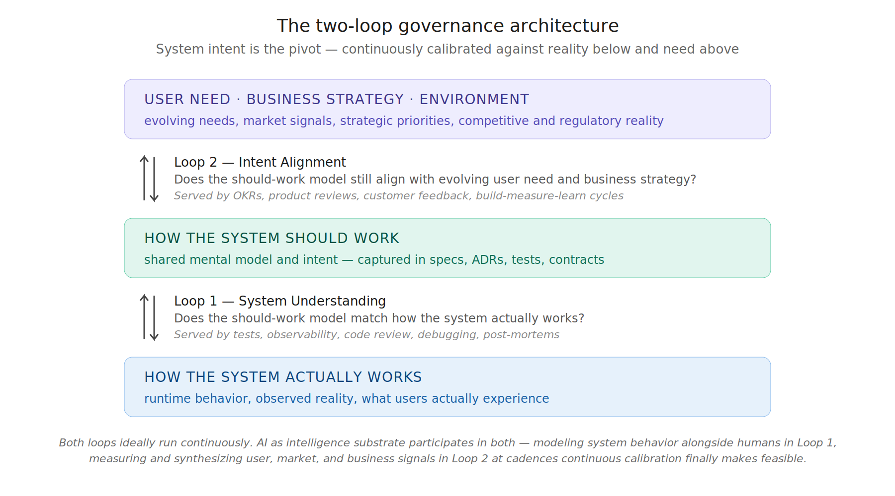

# AI Doesn't Break the Laws of Software Evolution — Part 2

## Two loops, two conservation tendencies, four ratios — and why AI is a density multiplier on bounded activity, not a volume multiplier on anything

---

[Part 1](part1-laws-and-empirical-record.md) established that Lehman's five structural regularities — Laws 2, 3, 4, 5, and 7 — describe properties of E-type systems that have held empirically regardless of who writes the code. AI doesn't repeal those regularities — it compresses the timeline on which their consequences become visible. The empirical record from 2024 through 2026 is consistent with each one (with the scope caveats discussed in Part 1).

Part 1 also established the operational answer at the code-to-spec boundary: Level 2 Spec Driven Development, with continuous and conscious resolution of spec-reality deviations, is what Lehman's Law 2 has always prescribed as deliberate counter-work. The SLUMP benchmark and the Constitutional SDD case study are supporting examples of the persistence-and-consultation precondition working in controlled conditions; the bidirectional half — runtime → spec writeback — remains substantially less solved. The Proficiency-Governance Matrix locks in why governance must precede proficiency, with the cost of inverted sequencing rising as tooling improves.

But the code-to-spec loop is only the bottom of a larger structure.

## The Two Loops — and Lehman's Prescription

The SDD model focuses on the loop between spec and code. That loop matters, but it is only one of two loops that have to function for the system to remain aligned with the reality it serves. The three prescriptive Lehman laws — Laws 1, 6, and 8, deferred in Part 1 — prescribe exactly this multi-loop structure.

**Law 1 (Continuing Change):** An E-type system must be continually adapted, else it becomes progressively less satisfactory in use.

**Law 6 (Continuing Growth):** The functional content of an E-type system must be continually increased to maintain user satisfaction over its lifetime.

**Law 8 (Feedback System):** E-type evolution processes constitute multi-level, multi-loop, multi-agent feedback systems and must be treated as such to achieve significant improvement.

Read together, these three laws describe a system that must continually adapt (Law 1), continually grow (Law 6), and operate as a multi-level multi-loop feedback structure (Law 8). The two-loop governance model is not a new framework being layered on top of Lehman. It is an operational reading of what Lehman already said the architecture had to be. Law 8 names the structure outright — Lehman explicitly used the phrase "multi-level, multi-loop, multi-agent" in 1996, before agents existed in any literal sense. The phrase is now also literal, not just figurative.

This framing has acquired an operational name in 2026. The industry has converged on calling the runtime infrastructure surrounding an AI model "harness engineering" — the multi-loop feedback structure that wraps the model and makes it act as an agent. Lehman articulated the multi-level multi-loop multi-agent architecture in the 1970s and 1980s from observation of large E-type systems. Practitioners working with LLM-based agents in 2024-2026 have arrived at structurally similar requirements — persistent state across sessions, verification loops on agent output, guardrails on what agents can do, observability into agent behavior — driven by what their systems actually need to work.

That practitioners are landing on the same structural answer at a different technological era is corroboration of the underlying principle, not coincidence. What Lehman named theoretically is what practitioners are now building from empirical necessity. Part 3 takes up the operational layers — tool orchestration, verification loops, context and memory, guardrails, observability — and how each maps to a governance discipline.

**Loop 1 — System Understanding:** The continuous calibration of how humans and agents understand the system should work against how the system actually works. The spec is one artifact serving this loop — alongside tests, observability, code review, debugging, and post-mortems. Both engineers and AI agents participate; both must maintain accurate models of system behavior, and the loop runs in both directions — design intent flows into implementation, runtime reality flows back to update the shared model. This is the loop SDD's Level 2 architecture targets, the loop in which SLUMP measures one direction (spec preservation during generation), and the loop where the empirical AI failure modes from 2024-2026 concentrate.

**Loop 2 — Intent Alignment:** The continuous calibration of how the system should work against evolving user need and business strategy. Served historically by OKRs, product reviews, customer feedback cycles, and build-measure-learn — frameworks that predate AI and persist with or without it. AI as intelligence substrate now participates here directly too: synthesizing user signals at scale, accelerating measurement cycles, surfacing patterns in customer behavior and market data, compressing the latency between strategic shift and intent update. This loop is rarely instrumented at the engineering boundary but well-served in mature product organizations; AI changes the achievable cadence, not the loop's existence.

Both loops are instances of Law 1 operating at different levels. The shared mental model of how the system should work must continually adapt to what the system actually does (Loop 1). It must equally continually adapt to evolving user need and business strategy (Loop 2). Both are also instances of Law 6 — the model expands because what it governs keeps expanding. And the whole structure is the multi-level multi-loop architecture Law 8 explicitly named.

Both loops ideally run continuously. Conventional wisdom puts them at different cadences — Loop 1 continuous in engineering, Loop 2 at product review or strategic planning intervals — but those cadences reflect human attention limits, not optimal design. The slower a loop runs, the more potentially misaligned activity accumulates between corrections. Every week Loop 2 doesn't run is a week of activity potentially spent on a target that has already shifted. AI as intelligence substrate makes truly continuous cadence newly feasible at both levels.

Failure in either loop propagates into the other. A strategic pivot that doesn't update the shared model produces a perfectly faithful implementation of obsolete intent. A model that doesn't reflect runtime reality produces code that solves an imagined version of yesterday's problem.

The structure has surface similarity to the DevOps infinity loop, but the resemblance is misleading: DevOps centers operational health (DORA metrics, deploy frequency, error rates) rather than spec-reality calibration. The disciplines that *do* calibrate — contract testing, property-based testing, SLO-based observability, BDD — exist as scattered point practices rather than as a coherent Loop 1. The framework's first novelty contribution, signposted in the introduction, is to identify what these point practices collectively serve: the multi-loop architecture Law 8 prescribed in 1996, which DevOps does not provide and which the practitioner literature has not yet named.

*Illustrative. The structure is what matters: system intent is the pivot, calibrated against runtime reality (Loop 1) and against evolving user need and business strategy (Loop 2). AI as intelligence substrate participates in both loops — modeling system behavior alongside humans in Loop 1, accelerating measurement and signal synthesis in Loop 2. Both loops ideally run continuously; current cadence differences reflect human attention limits the framework expects AI to compress.*

## Two Conservations Make Accuracy the Only Lever

This is where Lehman's conservation tendencies become the central frame for what AI is predicted to do at the organizational level. Law 4 — Conservation of Organizational Stability — observes that total *effective* activity rate tends to be conserved over a system's lifetime. If that tendency holds under AI generation conditions (the empirical record so far is consistent with it, though the question is not settled — Faros's 2026 Acceleration Whiplash finding admits multiple interpretations), then increasing aggregate delivery velocity is not an available lever in expectation. You cannot reliably expand the pie. You can only reallocate within it. Which means the optimization problem reduces to two things:

**The ratio between forward work and counter-work.** Too little refactoring and entropy chokes future activity. Too much and forward progress stalls. There is an optimal ratio that maximizes useful output within the bounded activity budget. AI changes the entropy generation rate, which shifts the optimal ratio toward more counter-work, not less.

**The accuracy of the forward work itself.** Every misdirected delivery is doubly expensive under conservation — it consumes activity to build the wrong thing, then consumes more activity to fix or replace it. The conservation tendency doesn't just constrain how much you can do; if it holds, it makes every wrong thing you do consume capacity you cannot easily replace.

This transforms what continuous loops are actually for. They are not just feedback mechanisms in the abstract. They are the only available lever to reduce the accuracy tax under conservation. An intent-alignment loop running quarterly tolerates a quarter of misaligned activity before correction. The same loop running monthly tolerates a month. The same loop running continuously tolerates the latency between signal and update — which is what AI-accelerated measurement is now compressing. Under conservation, that wasted activity is permanently lost — there are no extra hours to make it up with. The "production feedback loop" that SDD lists as a property of a living specification is actually one channel of signal into Loop 1; production feedback alone is insufficient for Loop 2 because strategic misalignment isn't always observable in production metrics until the damage is done.

The constraint is actually sharper than Law 4 alone suggests. Beyond the per-time activity rate, Lehman's empirical observations pointed to a second conservation: the incremental content successfully absorbed in each release tends toward a stable equilibrium, bounded by the organization's capacity to review, integrate, validate, and operate what it ships. This second constraint is closely tied to Law 5 (Conservation of Familiarity) and is the reason large releases historically get followed by stabilization releases. The system pulls itself back toward the absorbable rate. Push per-release content above that rate and the excess returns as defects, rework, and incidents — until the equilibrium reasserts.

The Faros 2026 telemetry shows this dynamic playing out under AI in real time. Pull request sizes are up 51.3%. Raw generated content per release is rising. But median PR review time is up 441%, 31% more PRs are merging with no review at all, and incident rates per PR have risen substantially. The raw content is increasing. The absorbed and validated content is not. The system is pushing against the second conservation and the second conservation is pushing back through quality and stability signals.

Two conservations together compound the question of where AI actually accelerates value creation. If the **effective** activity rate is conserved (Law 4) **and** per-release absorbable content is also bounded (Law 5 plus Lehman's empirical release dynamics), then the volume of value creation has not one but two structural constraints. In **volume terms** — total amount of value created per unit time at the organizational level — AI cannot accelerate value creation. The effective rate is conserved and the absorbable content is bounded; raw activity, meanwhile, rises freely. The total volume is structurally bounded by properties of how organizations and the software they produce evolve, not by tooling capability.

An independent macro figure sharpens why automating code generation cannot expand this volume. Atlassian's State of Developer Experience 2025 (~3,500 respondents) finds the average developer spends only about 16% of the working week writing code; the remainder goes to review, design, coordination, debugging, and planning. Driving the cost of that 16% toward zero therefore frees only a small slice of total activity — and the slice that remains is precisely the two-loop work this framework names: keeping the shared model of the system calibrated to reality (Loop 1) and keeping intent aligned to evolving need (Loop 2). This is the substance behind the practitioner refrain that "writing code fast was never the bottleneck" (Orosz, 2026): the bottleneck has always been verification and alignment — the two activities conservation makes the only available levers.

In **density terms** — value created per unit of activity (total effort expended), per unit of absorbed content — yes, conditionally. AI is a density multiplier on what each unit of bounded activity is worth, conditional on governance discipline most organizations have not yet built. The teams that build it extract real compounding gains. The teams that don't run their rising activity against the second conservation and watch it return as quality degradation, rework, and incidents — density falling below where it started.

Put as a control system, this is one mechanism, not two. The conserved quantity is a *setpoint* — the effective, value-delivering rate — held by two governors: the absorption ceiling (Law 5) and the entropy tax (Law 2). AI raises the *inflow* (raw generation), not the setpoint; the surplus returns as counter-work, so density — value over total effort — falls by default. The only way to lift the setpoint is to move a governor: raise genuine absorption capacity, or cut the entropy generated per unit of output. And those governors are now staffed by both people and software — agents can extend them, but only on the *detection* side, checking against encoded criteria (the machine-tractable layer of the verification floor developed in Part 3); the *judgment* that owns intent still binds to humans. Which is why the lever is governance, not generation speed: it is the only thing that moves the setpoint rather than the inflow.

The arithmetic is unforgiving. If the only honest dimension of AI value creation is density, and density only improves with governance, then the entire ROI case reduces to: does the value-density gain from disciplined governance exceed the cost of building that governance? For mature organizations with strong existing practices, yes — likely substantially. For organizations without governance infrastructure, closer to no, until they build it.

## Efficiency, Effectiveness, and the Four Ratios

The volume conservation argument can read as deflating if stopped there. It shouldn't. Lehman's laws constrain the *system* — the software, the organization producing it, the relationship between them. They do not constrain how much value the conserved system extracts from its activity. Value is determined by what the activity targets, how accurately it targets it, and how well it lands. AI affects all three. The volume is bounded; the ratios are not.

Two mechanisms drive the ratio improvement, and both are compatible with Law 4. **Efficiency improvement** — same activity produces output faster. An engineer who spent four hours implementing a CRUD endpoint now spends one hour reviewing and refining an agent-generated implementation. The activity quantum is similar; the output per activity is higher. **Effectiveness improvement** — same activity produces better output. An engineer thinking through a design with an agent as sounding board may arrive at a better architecture than the same engineer thinking alone. The activity quantum is the same; the quality per activity is higher. Both are measurable. Both happen under conservation. What Law 4 constrains is the total quantity of activity the organization sustainably performs. What it does not constrain is how much value each unit of that activity produces.

A third mechanism deserves its own name, and it has one already. Peter Drucker, in 1954, classified organizational work into three categories: builders who make the product, sellers who find the market, and **measurers** who track, coordinate, and feed information into decisions. The density gain AI produces in both loops is fundamentally measurer work — synthesizing signals at scale, detecting drift, surfacing patterns, accelerating the closing of feedback. In Loop 1 the measurer work is technical: observability synthesis, log analysis, anomaly detection, test result interpretation, runtime behavior characterization. In Loop 2 it is product and strategic: customer signal aggregation, market trend detection, OKR-to-outcome attribution, automated theme extraction from support and sales transcripts. Both are forms of the same operation — making calibration continuous instead of episodic. Drucker called measurer work necessary but secondary to building and selling, capacity-constrained by human attention. AI as intelligence substrate is the first technology to relax that constraint directly. Part 4 examines a specific bet (Cloudflare) that operationalizes Drucker's framing as a corporate reorganization.

This is also why empirical productivity studies disagree so sharply. Studies measuring activity volume find mixed results — conservation predicts this. Studies measuring quality and value density find clearer signals, but they diverge depending on governance. Studies measuring developer experience find the strongest positive signals — because the felt experience of work is genuinely improved by having an agent handle routine cognitive load, even when measurable output is similar. All three frames are looking at real phenomena. They reach different conclusions because they measure different conserved or non-conserved quantities.

The Pragmatic Engineer 2026 survey (Orosz and Nilsson, 2026) shows the divergence inside a single dataset. It is predominantly a developer-experience instrument, and on that frame its combined sentiment moved toward the middle rather than upward — a "nuanced/mixed" plurality rising from roughly a third of respondents in the newsletter's 2024 survey to about half in 2026, the primarily-negative share falling from ~23% to ~10%, and the primarily-positive share roughly flat — while the same respondents' observations about codebase quality, review load, and maintainability were markedly negative. The felt experience improved; the quality frame did not. Because the survey is self-selected and self-report, its developer-experience positivity is exactly the rosiest frame the account above predicts — which is why its internal split across frames, rather than its headline sentiment, is the informative signal.

The operational manifestation of value-density improvement breaks into four ratios, each mapping to a different stakeholder's concern.

**Value per unit of activity** — the core density argument. Each PR carries more value because the agent surfaced edge cases the engineer would have missed. Each architectural decision is better grounded because more alternatives were explored. Each review meeting produces a sharper outcome because preparation was deeper. The effective rate stays bounded; value extracted from it rises.

**Value per unit of time** — follows from density improvement, because that activity is performed within time. If each unit of activity carries more value and the effective rate tends to conserve (as Law 4 holds), then value per calendar period rises mechanically. This is the metric most relevant to operational pace and competitive timing, and it improves without violating any conservation.

**Value per unit of capital** — improves on two axes simultaneously when AI substitutes for capital expenses that previously bought activity. Tooling cost replaces some labor cost; value per unit activity rises while cost per unit activity falls. This is the strongest economic case for AI in software development and the one most defensible to a CFO.

**Value per person involved** — improves through the same mechanism with an important caveat. If AI lets fewer people produce the same density-improved output, value per person rises through workforce reduction. If AI lets the same people work on higher-density problems, value per person also rises through workforce repurposing. Both paths are real and the math works out the same on the ratio. They have different organizational implications, and which path an organization takes is a strategic choice — not a tool consequence.

The reframing this enables is significant. AI does not make organizations produce more software. It makes the software they do produce more valuable, more accurate, and more efficient to generate — per unit of bounded activity, per unit of calendar time, per unit of capital deployed, per person in the loop. None of those ratios are subject to the conservation that bounds activity volume.

A measurement candor note belongs here before the arithmetic. The four ratios as named above are conceptual decompositions, not a deployable measurement program. "Value" in the numerator is left underspecified deliberately — it refers to whatever construct of business or stakeholder outcome the organization is optimizing, which varies by context (revenue impact, user outcomes, strategic alignment, regulatory standing, mission progress). Each ratio has known operational proxies that Part 3 develops (defect rates per PR, calendar-time-to-validated-business-outcome, full-stack cost accounting, workforce composition shifts), but no settled aggregation method combines those proxies into a unified density score. And the attribution problem is genuine: if defect rates drop, the contribution of AI governance versus team experience, product maturity, regulatory pressure, or seasonality is rarely cleanly separable in real organizational data. The framework's claim is that value density is the *right dimension* to optimize and that its proxies, taken together, give an organization signal about whether it is succeeding. The framework does not claim that value density is a measured quantity available on a dashboard today. Building the measurement program — turning conceptual proxies into actionable measurement — is itself part of what Part 4 identifies as the verification-infrastructure durable bet.

With that caveat in place, the structural arithmetic is worth seeing. As a thought experiment: if AI lifts value-per-activity by some factor X in a well-governed organization, then value-per-time, value-per-capital, and value-per-person all rise by roughly the same factor X, sometimes more if capital costs simultaneously decline as tooling replaces labor. Whatever X turns out to be empirically — and the answer will vary substantially by organization, codebase, governance maturity, and time period — that X compounds across all four ratios mechanically, sustained over years. This is not the 10x productivity the marketing claims. It is closer to compounding interest on the value the organization extracts from its existing capacity to do work — and compounding interest, sustained at any positive rate, is among the strongest economic forces most organizations will ever encounter. The framework's argument is structural: there is a dimension on which AI can compound durably even with the effective rate conserved. The exact magnitude on that dimension is open empirical work.

This framing also resolves the apparent contradiction between the Lehman conservation argument and the empirical evidence of real value creation under AI. Both are true simultaneously. Volume is conserved. Density improves. The ratios involving time, capital, and people all rise because none of those are subject to the same conservation as activity itself.

The conditions remain stringent. The density gain requires governance to direct activity at high-value targets. It requires both loops to keep those targets accurate. It requires absorption infrastructure to scale with generation rate so the second conservation doesn't reassert through quality degradation. None of these are automatic. All of them are possible.

This is the actual ROI mechanism the framework predicts. AI plus governance lets you do the same amount of work but extract more value from it. The conservation tendency isn't repealed — if it holds, it operates on a different dimension than the one productivity claims focus on. Activity-level velocity gains tend to evaporate because they push against conservation; value-density gains are predicted to persist because they do not.

## Why This Gets Worse With Better Tools

The most important consequence of the proficiency-governance multiplicative relationship is that **the cost of every kind of misalignment scales with proficiency.**

A misaligned team with low proficiency builds the wrong thing slowly. Natural friction — implementation cost, review cycles, human fatigue — limits the damage. The misalignment is expensive but bounded.

A misaligned team with high proficiency builds the wrong thing at speed and scale. Agents don't question strategic direction. They execute faithfully against the spec they're given. If the spec encodes wrong business intent, the agents are perfectly obedient in the wrong direction. The better the tools, the faster you arrive at the wrong destination.

This makes organizational alignment a first-class governance concern, not just a management concern. The two-loop structure has to function across engineering and product/strategy simultaneously. The organizations least prepared for that — with weak product-engineering communication, unclear strategic priorities, slow decision cycles — are precisely the ones for whom higher AI proficiency is most dangerous.

There is an irony here that deserves to be named. Organizations adopt AI agents to move faster. Moving faster amplifies the cost of every misalignment in the system. Under Lehman conservation, that misaligned activity is not just wasted — it is irreplaceable. There are no extra hours hiding somewhere to make it up with. The prerequisite for safely moving faster is therefore tighter alignment across both loops than the organization needed before — not because alignment matters more philosophically, but because the cost of misalignment has increased while the available activity budget has not.

This also reframes what governance is for. The conventional framing positions governance as defense against entropy — slower but safer. The conservation framing positions governance as the only available offensive lever for productivity. You cannot do more work. You can only do more accurate work. Continuous loops are how accuracy is maintained. Skills are how individual deliveries become more accurate within the loops. Specs are how accuracy is preserved across sessions. The governance infrastructure is the productivity infrastructure under conservation, not a tax on it.

AI doesn't just stress test engineering discipline — it stress tests organizational coherence at every level. Part 4 examines specific organizations betting on different implementations of this architecture — Block's architectural substitution being one of several distinct theses currently in flight.

## Where This Leaves Us

Lehman's laws were derived from observation of human-only software evolution in the 1970s and 1980s. They describe a structural dynamic — entropy accumulates, counter-work is required, activity tends to conserve, absorbable content tends to bound, feedback systems are multi-level and multi-agent — that held before AI and that the 2024-2026 evidence is consistent with continuing to hold under AI. What appears to change is the rate constant and the binding constraint, not the underlying dynamic.

Spec Driven Development at Level 2 — fully realized, with both persistence and bidirectional updates — is the clearest theoretical answer to the Level 1 entropy problem at the code-to-spec boundary, though current tooling only demonstrates the persistence half. But even fully realized, Level 2 is necessary, not sufficient. The same entropy dynamic operates at the intent-alignment layer — calibrating whether the spec still serves business purpose, and whether business purpose still serves environmental reality. Continuous reconciliation is required at every level where intent meets execution — exactly the multi-level multi-loop structure Lehman's Laws 1, 6, and 8 prescribe. Without it, the agents will faithfully amplify whatever misalignment exists in the system.

The compound conservation problem sharpens the conclusion. AI cannot accelerate the volume of value creation through software at the organizational level. The effective rate is conserved. Absorbable content is bounded; raw activity rises. The total quantum of value an organization can sustainably produce is bounded by properties of how systems and organizations evolve, not by tooling. What AI can do is increase the value density per unit of activity and per unit of absorbed content — and that increase is conditional on governance discipline that most organizations have not built. The teams that build it will extract real, compounding gains in density. The teams that don't will run their rising activity against the second conservation constraint and watch it return as quality degradation.

The teams succeeding with AI are not the ones with the most sophisticated agents but the ones treating governance maturity as a precondition for proficiency maturity, instrumenting both loops explicitly, and accepting that human judgment scales upward — not downward — as agents become more capable. The window to get this sequencing right is closing exactly when most organizations are pushing hardest to expand AI scope. The misalignment penalty compounds while the activity budget does not.

All eight of Lehman's laws are engaged. Five describe the structural regularities of E-type systems. Three prescribe the architecture those regularities require. None of them appear to be broken by AI. All of them are predicted to be accelerated by it. The honest case for AI in software development is narrower than the productivity marketing claims and stronger than the dismissive critiques allow. It is a value-density multiplier on bounded organizational activity, conditional on governance, lifting value-per-time, value-per-capital, and value-per-person at rates that compound substantially when the governance is in place. The 2024-2026 data is broadly consistent with what was on the books in 1974 and 1996.

Knowing this is necessary but not sufficient. Part 3 turns to the practical question: given the framework, what does an organization actually do — at each loop, on each ratio — to convert the structural opportunity into compounding value-density gains.

---

*Part 3 turns the framework into practice: how to instrument both loops, how to measure density rather than volume, how to improve each of the four ratios, and what to avoid.*

---

## References

**Lehman's Laws**

Lehman, M. M. (1980). Programs, life cycles, and laws of software evolution. *Proceedings of the IEEE*, 68(9), 1060–1076.

Lehman, M. M., & Belady, L. A. (1985). *Program Evolution: Processes of Software Change*. Academic Press.

Lehman, M. M., Ramil, J. F., Wernick, P. D., Perry, D. E., & Turski, W. M. (1997). Metrics and laws of software evolution—The nineties view. *Proceedings of the 4th International Software Metrics Symposium (METRICS '97)*. (Source of the modern formulation of all eight laws, including Law 8.)

**Empirical Studies on AI Coding Impact**

He, H., Miller, C., Agarwal, S., Kästner, C., & Vasilescu, B. (2026). Speed at the Cost of Quality: How Cursor AI Increases Short-Term Velocity and Long-Term Complexity in Open-Source Projects. *23rd International Conference on Mining Software Repositories (MSR '26)*. https://doi.org/10.1145/3793302.3793349 (arXiv:2511.04427).

Becker, J., Rush, N., Barnes, E., & Rein, D. (2025). Measuring the Impact of Early-2025 AI on Experienced Open-Source Developer Productivity. METR. arXiv:2507.09089.

Yan, L., Chen, X., & Zhang, X. (2026). When the Specification Emerges: Benchmarking Faithfulness Loss in Long-Horizon Coding Agents. arXiv:2603.17104. (SLUMP benchmark.)

**Industry Reports**

Veracode. (2025). 2025 GenAI Code Security Report. https://www.veracode.com/resources/analyst-reports/2025-genai-code-security-report/

DORA / Google Cloud. (2024). Accelerate State of DevOps Report 2024. https://dora.dev/research/2024/dora-report/

Faros AI. (2026). AI Engineering Report 2026: The Acceleration Whiplash. Two years of telemetry from 22,000 developers across 4,000+ teams. https://www.faros.ai/research

Stack Overflow. (2025). 2025 Developer Survey. https://survey.stackoverflow.co/2025

Orosz, G., & Nilsson, E. (2026). The impact of AI on software engineers in 2026: key trends (Parts 1–2). *The Pragmatic Engineer* newsletter. Reader survey of 900+ software engineers and engineering leaders on AI tooling use, sentiment, and impact. Self-selected, self-report sample; cited as practitioner field evidence, with developer-experience-frame positivity discounted per the three-frames argument. https://newsletter.pragmaticengineer.com/p/ai-impact-on-software-engineers-part-2

Atlassian. (2025). State of Developer Experience Report 2025. ~3,500 developers/managers across six countries; average developer spends ~16% of the working week writing code. https://www.atlassian.com/teams/software-development/state-of-developer-experience-2025 Cited in support of the volume-conservation argument; ~16% figure verified against the primary report.

**Industry Commentary and Methodology**

Wasowski, J. (2026, April 11). Spec Driven Development — Three Maturity Levels Every AI Team Should Know. *Medium*. https://medium.com/@wasowski.jarek/spec-driven-development-three-maturity-levels-every-ai-team-should-know-648c93cf1e1d

Orosz, G. (2026, January 6). When AI writes almost all code, what happens to software engineering? *The Pragmatic Engineer*. Source of the "writing code fast was never the bottleneck" refrain. Distinct from Orosz & Nilsson (2026); exact article URL to be confirmed.
