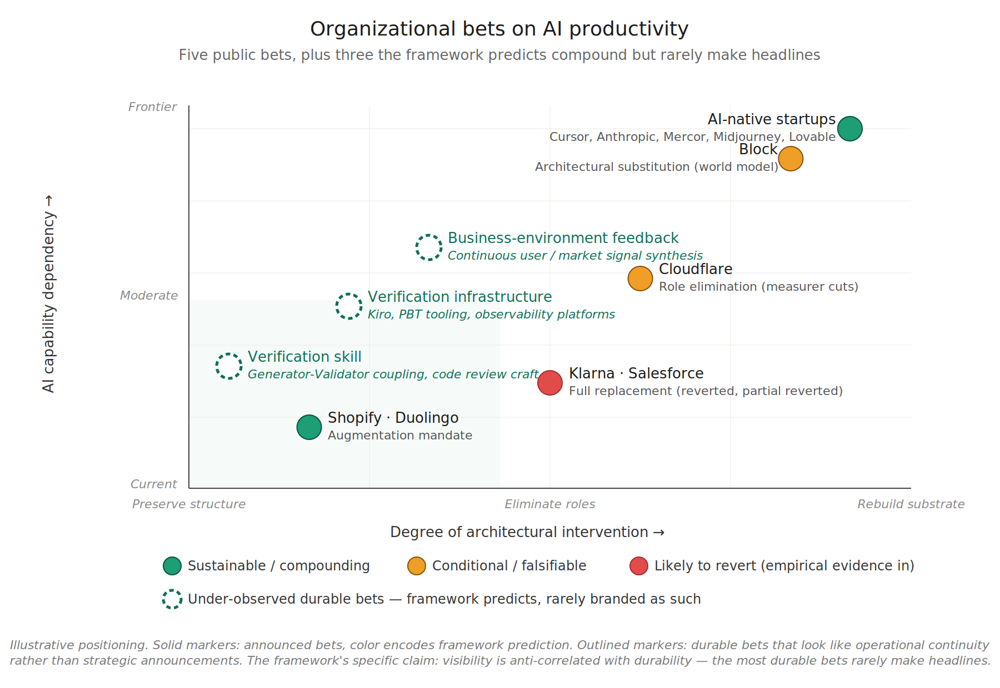

# AI Doesn't Break the Laws of Software Evolution — Part 4

## Five organizational bets the framework predicts will compound or invert — and the durable bets the empirical record doesn't see

---

Parts 1-3 built the framework. Lehman's eight laws describe an architecture: five structural regularities of E-type systems (Laws 2, 3, 4, 5, 7), and three prescriptive laws (1, 6, 8) that mandate the multi-level multi-loop multi-agent feedback structure required to respect those regularities. Earlier parts argued that AI does not repeal these regularities — it accelerates the rate at which their consequences become visible. The volume of value creation is predicted to be bounded by conservation tendencies. Density of value extracted from that bounded volume is, on the framework's account, the available lever, and only conditionally accessible through governance discipline applied at every loop level.

That argument was theoretical when written. The empirical record is being written now, in real time, by organizations betting on different ways to capture AI value at the organizational level. As of mid-2026, at least five distinct organizational theses are in flight — each making a different bet about how AI changes (or doesn't change) the fundamental architecture Lehman described.

This part examines those five bets, what the framework predicts about each, and what the empirical record so far suggests about which compound and which invert.

## Five Theses, Five Bets

The bets are genuinely distinct — not different participants in the same experiment but different theories about what AI does to organizational dynamics.

**1. Architectural substitution.** Build AI explicitly as the coordination substrate the organization runs on. A world model replaces the information-routing function of middle management; three roles (Individual Contributors, Directly Responsible Individuals, Player-Coaches) operate on top. Replace hierarchical coordination with AI-mediated coordination by design. **Block** is the public flagship.

**2. Role elimination.** Cut the human roles that performed coordination, measurement, and governance functions. Rely on existing AI tools to fill the gap. **Cloudflare** is the most visible recent example, with Prince's May 2026 WSJ op-ed applying Peter Drucker's 1954 builders/sellers/measurers framework and announcing the elimination of measurers.

**3. Full functional replacement.** Replace specific human functions — typically customer-facing — entirely with AI agents at production scale. **Klarna** and **Salesforce** are the largest examples, and both have now generated empirical data the other bets are still waiting for.

**4. AI-native from inception.** Never hire the roles AI can do. Build the org structure around AI from day one. Achieve revenue-per-employee ratios that traditional SaaS organizations cannot match. **Cursor, Anthropic, Mercor, Midjourney, Lovable** — all sit in this category.

**5. Augmentation mandate.** Keep the existing org structure. Mandate AI proficiency across all roles. Improve density without restructuring. **Shopify** and **Duolingo** have both publicly committed to this path.

These bets test different framework predictions. Block tests whether AI can be the Law 8 multi-agent feedback substrate architecturally. Cloudflare tests whether AI can be that substrate structurally, via role elimination. Klarna and Salesforce test whether full replacement of customer-facing functions can outrun the verification floor. AI-native startups test whether inception-level AI structure escapes the conservation tendencies or just delays their binding. Shopify and Duolingo test whether augmentation alone produces compounding density gains.

The framework predicts different outcomes for each. The empirical record will determine whether those predictions hold.

## Architectural Substitution: Block

In March 2026, Jack Dorsey and Roelof Botha published "From Hierarchy to Intelligence" on Sequoia Capital's site. The piece followed Block's February 2026 layoffs of roughly 4,000 employees (around 40% of the workforce) and recast those cuts as the operational consequence of a structural argument: the hierarchical structure of the corporation is an information-routing protocol built around a constraint — a leader can manage three to eight people effectively — that AI now relaxes. The trace runs from the Roman Army's nested span-of-control hierarchies to the Prussian General Staff and 1850s railroad bureaucracies to the modern org chart. Each layer existed to aggregate context upward and relay decisions downward. AI can now do that continuously and at scale.

Block's model replaces middle-management coordination with a **world model** — a continuously updated, machine-readable representation of the company's operations, decisions, and customer signals — combined with three roles: **Individual Contributors** (deep specialists operating their layer), **Directly Responsible Individuals** (owners of cross-cutting outcomes with authority to pull resources), and **Player-Coaches** (leaders who combine building with developing people). The world model provides the context that a manager previously provided; the three roles operate on top of it.

Read through Lehman, this is Law 8 implemented explicitly. The multi-level multi-loop multi-agent feedback structure isn't an organizational behavior emerging from human coordination — it's a designed system where AI is the substrate. The accuracy thesis is implicit but central: if AI is the coordination layer, the coordination can be accurate by construction in a way humans-coordinating-humans never quite manages.

This is the series' argument at organizational scale. Parts 1-3 argued that under conservation, accuracy is the only available lever. Block's bet is that AI as the coordination substrate makes accuracy structural rather than aspirational.

The relationship between the cuts and the architecture matters. Block did cut roles — large-scale layoffs preceded the public articulation of the architecture by roughly a month. The framework applied here treats the cuts and the architecture as a single bet: that the world model and the three-role structure can perform what the eliminated middle layers performed. The bet succeeds if the architecture genuinely delivers; it inverts if the architecture cannot absorb the coordination load the cut roles were carrying.

The framework predicts Block's success depends on one specific thing: whether the world model can be maintained accurately at the rate of business change. The world model is the substrate. If it drifts from reality, the architecture reasoning on top of it produces faithful implementations of obsolete intent — exactly the Law 7 quality degradation pattern described in Part 1, relocated to the organizational layer. Block has essentially moved the discipline of spec-reality reconciliation from the engineering layer to the organizational layer. The same discipline, the same risk.

Falsifiability conditions are concrete. If Block compounds its current advantages (revenue per employee, decision latency, organizational agility) over a 3-5 year window, the bet pays off and Law 8 is implementable architecturally at organizational scale. If Block's world model maintenance burden grows faster than its operational gains — if the team maintaining the world model becomes the new bottleneck — then the bet inverts and Law 5 (Conservation of Familiarity) reasserts at organizational scale, with the world model itself becoming the entity whose evolution must be governed.

The technology to attempt this — making Law 8 implementable at organizational scale rather than merely aspirational — has only recently become possible. Whether the bet succeeds depends on whether the world model can be maintained accurately at the rate of business change. That is the same discipline described in earlier parts at the engineering level, relocated to a different level of the system.

## Role Elimination: Cloudflare

Matthew Prince wrote in the Wall Street Journal in May 2026 that Cloudflare had laid off roughly 20% of its workforce despite record revenue. Prince explicitly draws his framework from Peter Drucker's 1954 *The Practice of Management*, which classified organizational work into three functions — **builders** (engineers, product) who make the product, **sellers** (sales, customer-facing) who find the market, and **measurers** (middle management, audit, finance, legal, compliance, operations) who track, control, and coordinate. Prince's claim is that AI now performs the measurement function with a level of objective detail and precision that exceeds what human measurers could achieve, and that builders and sellers should be preserved while measurer roles are eliminated.

The framework's reading of this is different from Block's. Block builds AI architecturally as the substrate; Cloudflare eliminates the human roles and relies on existing AI tools to fill the function. Same fundamental question — can AI be the Law 8 multi-agent feedback substrate? — different implementation.

Measurers in Prince's framework span more than verification. The list (middle management, audit, finance, legal, compliance, operations) includes coordination (middle management routing information and surfacing issues), familiarity maintenance (operations and management as institutional memory), verification and audit (compliance, financial reviews, legal reviews), drift detection (compliance and audit catching when reality diverges from expectation), and decision support (finance and operations providing data and analysis for leadership).

These are governance functions, not just verification. Mapped to Lehman, they touch Law 8 (multi-agent feedback nodes), Law 5 (cross-team familiarity), Law 2 (counter-work against drift), and the verification floor as one specific aspect among several.

Part 2's framework converges with Drucker's category here. The density gain AI produces in both governance loops is fundamentally measurer work — synthesizing signals, detecting drift, accelerating calibration cycles. Drucker named this work in 1954 and treated it as necessary but capacity-constrained by human attention. The framework's prediction is that AI relaxes that constraint directly, in both Loop 1 (system understanding) and Loop 2 (intent alignment). Cloudflare's bet operationalizes this insight as a corporate reorganization. The question the bet poses is not whether AI can do measurer work — the framework argues it can. The question is whether removing the humans who were doing it makes the AI more effective at sustaining the loops, or whether it leaves the loops with no one closing them.

Cloudflare's bet is that AI can perform all of these functions when the humans previously performing them are removed. This is a stronger claim than "AI can do verification." It is "AI can be the coordination and governance layer."

The optimistic interpretation: measurers performed governance work AI can now do more efficiently. The human portion of conserved activity reallocates to building and selling. Value per human rises proportionally. This is consistent with the four-ratios argument and would be a real, large density gain.

The skeptical interpretation: measurers performed real Lehman counter-work — closing entropy loops, maintaining cross-team familiarity, enforcing invariants, catching drift. If those functions are now undone rather than performed by AI, the framework predicts accelerated complexity, comprehension debt, security degradation, and quality regression on a 2-3 year timeline. Bainbridge's warning applies directly: cutting the people who performed the easy parts of governance work leaves a smaller team responsible for the hard parts, with less depth of expertise and exhausted vigilance against the rare-but-consequential failures monitoring exists to catch.

The difference between the two interpretations is whether AI actually performs the governance function or whether Cloudflare's automated tools merely surface signals that no remaining human has capacity to act on. The framework's prediction is conditional, falsifiable, and concrete. The empirical signals that will distinguish success from failure are observable on a 2-3 year timeline: complexity accumulation in Cloudflare's codebases of the kind He et al. measured, incident rates per remaining engineer, security finding rates, customer-facing quality signals, burnout among the remaining humans handling the now-broader scope of judgment work.

The contrast with Block sharpens both bets. Block bets that AI-mediated coordination can perform what hierarchies kludged together — building the architecture explicitly. Cloudflare bets that AI-mediated measurement can perform what middle-management measurers explicitly did — removing the humans and letting AI tools fill the gap. Different bets, same underlying test: does the AI substrate actually perform the prescribed function (closing loops, maintaining accuracy, sustaining verification), or does it just remove the humans who used to perform it?

## Full Replacement and the Verification Floor Reasserting: Klarna and Salesforce

This is where the empirical record so far is most informative. Two large public bets have generated enough data to evaluate against framework predictions, and both have moved away from their initial replacement strategies.

**Klarna.** In February 2024, Klarna announced that its OpenAI-powered AI assistant had handled 2.3 million customer service conversations in its first month of global operation. The chatbot was handling two-thirds of all customer service chats, doing "the equivalent work of 700 full-time agents." Between 2022 and 2024, Klarna eliminated approximately 700 customer service positions. Total headcount fell from 5,527 to 3,422 — roughly 40% reduction. CEO Sebastian Siemiatkowski claimed in late 2024 that "AI can already do all of the jobs that we, as humans, do."

By mid-2025, the empirical signals had turned. Customer satisfaction had dropped roughly 22%. Service quality on complex interactions — dispute resolution, refunds, financial advice — was degrading. The CEO acknowledged the company had "focused too much on efficiency and cost" with the result being "lower quality." In May 2025, Klarna announced it would begin recruiting human customer service agents in an "Uber-style" gig-worker model.

Reading through Lehman, Klarna's trajectory is the verification floor reasserting at customer-service scale. AI handled the high-volume, low-complexity portion of the work well. It could not handle the long-tail, high-judgment portion — and the human review capacity to catch its errors had been eliminated. Quality degradation followed. The framework's prediction — verification floor binds when humans are removed faster than AI can perform the verification function they were doing — appears borne out.

**Salesforce.** In September 2025, CEO Marc Benioff revealed that Salesforce had cut customer service headcount from 9,000 to 5,000 — a 45% reduction — citing AI agents (Agentforce) now handling 50% of customer interactions. Benioff framed this as efficiency-enabled rebalancing, with redeployed employees moving to professional services, sales, and customer success.

By February 2026, the framing was shifting. Internal acknowledgments described the company as "too confident in the ability of AI systems to fully replace human judgment, particularly in complex customer service scenarios." Automated systems struggled with nuanced issues, escalations, and long-tail customer problems. Loss of institutional knowledge, longer resolution times, and supervision burden on remaining staff were eroding the productivity gains the layoffs were meant to deliver. The framing shifted from "replacement" to "rebalancing."

Both Klarna and Salesforce attempted aggressive replacement of customer-facing functions. Both encountered the verification floor in operational terms — AI handled the easy portion well, struggled with the hard portion, and the human capacity to catch its errors had been eliminated. Both have moved toward hybrid models the framework would have predicted as more sustainable from the start.

This is the most important empirical data point in the current dataset. The bets that ran ahead of the verification floor have partially inverted. The bets that didn't run ahead — Shopify's augmentation, Block's architectural substitution (still in early evaluation), AI-native startups (operating at AI-native scale) — have not encountered the same reversal pattern.

For Block and Cloudflare, the Klarna/Salesforce pattern is instructive but not directly comparable. Block isn't replacing humans with AI agents in production — it's building AI as the coordination substrate. Cloudflare is eliminating humans in coordination roles and relying on AI tools, which is closer to the Klarna/Salesforce pattern but at a different functional level. The framework predicts Cloudflare's bet has higher inversion risk than Block's because Cloudflare is more reliant on existing AI tools substituting for human verification, where Block is building the verification substrate explicitly.

## AI-Native from Inception: Cursor, Anthropic, Mercor, Midjourney

The most analytically interesting category. These companies were never structured around the assumption that human coordination would be the binding constraint. They were built with AI as a first-class part of the operating model from day one. They do not have measurers to cut, hierarchies to flatten, or customer service teams to replace. The roles AI can do were never hired.

The empirical signals are extraordinary. Revenue per employee in mid-2025 to early 2026:

- Mercor: ~$4.5M per employee at $850M ARR
- Midjourney: ~$2-4.8M per employee at $200M+ ARR with a 40-50 person team
- Cursor (Anysphere): ~$3.3M per employee
- OpenAI: ~$1.5-2.8M per employee at $3.7B+ ARR
- Anthropic: ~$2.5M+ per employee
- Perplexity: ~$1.8M per employee

Compare to traditional tech: Microsoft $1.1M/employee, Google $1.8M/employee. Compare to traditional SaaS average: $200-300K/employee. The AI-native startups are 5-15x more revenue-productive than traditional SaaS.

Time-to-scale is similarly compressed. Cursor reached $100M ARR in roughly 1 year with approximately 19 employees. Lovable hit the milestone in 8 months with 45 people. Top-quartile traditional SaaS took 5+ years and 500-700 employees to reach the same milestone.

Tomasz Tunguz frames the structural advantage in communication-channel terms. A traditional 150-person organization with four hierarchical layers creates roughly 11,175 potential communication channels. An AI-enabled team producing equivalent output with 30 people creates roughly 435 channels — a 96% reduction in coordination overhead.

The framework reading is uncertain in an interesting way. The conservation tendencies operate at the level of E-type systems and the organizations evolving them. Laws 4 and 5 (Conservation of Organizational Stability, Conservation of Familiarity) describe properties that emerge at organizational scale. The question is whether AI-native startups at 20-50 employees are operating below the scale at which conservation effects bind, whether they are genuinely escaping the conservation dynamics through structural redesign, or whether the conservation tendencies bind less tightly than Lehman's data suggested — a possibility the social-science framing of the laws explicitly allows.

The honest answer is that we do not yet know. Two interpretations are tenable.

**The "conservation tendencies scale" interpretation:** these companies are extracting genuine density gains because they were built around the AI-native operating model from inception. They will encounter conservation dynamics as they scale, but from a higher density baseline. Their revenue-per-employee will compress as they reach 500-1000 employees, but not back to traditional SaaS levels.

**The "conservation tendencies bind" interpretation:** these companies are operating below the scale at which Lehman's empirical observations were derived. As they scale to the OS/360-equivalent size that generated Lehman's data, the same conservation dynamics will likely emerge. The current revenue-per-employee figures may be early-stage artifacts that will compress significantly.

The framework's prediction is closer to the first interpretation but cannot rule out the second. The empirical test is concrete: watch what happens when these companies scale from 50 to 500 to 5000 employees. Anthropic at roughly 4,300 employees is the closest current test — and revenue per employee remains in the multi-million range, which suggests the AI-native structure does sustain density gains at meaningful scale.

What the AI-native startups demonstrate that Block and Cloudflare cannot is that AI-native organizational structure produces measurable density advantages without requiring legacy structure to be undone first. This is a different test than Block's (rebuilding the substrate) or Cloudflare's (removing humans). It is the cleanest test of "what does an AI-native organization look like when built from inception?" — and the empirical signals so far are dramatic enough to take seriously.

## Augmentation Mandate: Shopify and Duolingo

The fifth thesis is the closest to the framework's recommended path. Keep the existing org structure. Mandate AI proficiency across all roles. Improve the four ratios through density gains within the existing structure rather than through restructuring.

**Shopify.** In April 2025, CEO Tobi Lütke issued a memo titled "AI usage is now a baseline expectation." The memo's three core elements: AI proficiency required across all roles and integrated into performance reviews; AI usage from the prototype phase in product workflows; and "AI first, headcount second" — teams must demonstrate AI cannot perform a task before requesting additional hires. The framing positioned AI as an "exoskeleton" augmenting human performance rather than replacing it.

**Duolingo.** A similar approach announced April 2025. Same headcount, 4-5x content output. As of late 2025, Duolingo had not laid off a single full-time employee. CEO Luis von Ahn: "The goal is not to save money. The goal is not to replace human employees. The goal is to do a lot more...with a slightly larger number of employees." The company gradually phased out contractors where AI could handle their work, but full-time roles were preserved and augmented.

Tensions have emerged. Duolingo initially evaluated employees on AI usage as part of performance reviews. After employee pushback, von Ahn backtracked, saying performance should be judged on doing the job "as well as possible" with AI as one tool among others, not as a metric in itself. The tension is between mandating proficiency (which the framework supports) and measuring proficiency-for-its-own-sake (which can distort behavior).

Read through Lehman, the augmentation thesis is the path Parts 1-3 implicitly recommended. It respects all the structural regularities. It treats AI as a density multiplier on bounded organizational activity rather than as a volume substitute. It pairs proficiency with governance — Shopify's "AI first, headcount second" is a governance rule, not just a proficiency mandate.

The framework predicts the augmentation path should produce compounding density gains in the four ratios (value per activity, per time, per capital, per person) without the verification-floor risk that replacement strategies carry. It is the lowest-variance bet in the dataset — and likely the highest-probability-of-success path.

It is also the least dramatic. Shopify and Duolingo do not generate the same headlines as Klarna's "AI replaces 700 agents" or Cloudflare's 20% workforce cut. The framework predicts they will outperform the dramatic bets over a 5-year window, but the empirical signals are slower and more diffuse than layoff announcements.

The Duolingo tension is instructive. The instinct to measure AI proficiency as a metric in itself is the proficiency-without-governance failure mode Part 1 warned about. The retreat from that metric to "outcomes, not AI usage" is governance-correcting-proficiency in real time. This is what disciplined AI integration looks like inside an existing organization.

## What the Framework Predicts About Each Bet

The five bets are not equally likely to succeed. The framework sorts them into three tiers.

**Most likely to compound:** Augmentation (Shopify, Duolingo) and AI-native from inception (Cursor, Anthropic, Mercor). Both respect the conservation tendencies and the verification floor — improving density within bounded activity in one case, operating at structurally lower coordination overhead in the other. The framework predicts both paths compound durably.

**Conditional on execution:** Architectural substitution (Block). Succeeds if the world model stays accurate at the rate of business change; fails if world model maintenance becomes the new bottleneck — the same Lehman dynamic relocated to a different layer. High variance, high upside.

**Higher inversion risk:** Role elimination (Cloudflare) and full replacement (Klarna, Salesforce). Both rely on existing AI tools substituting for human verification at scale. Klarna and Salesforce have publicly partially reversed their replacement bets (Klarna fully, Salesforce partially), which is consistent with the framework's prediction that running ahead of the verification floor inverts. The honest caveat: organizational reversals like these can have multiple plausible causes — overhiring during the prior cycle, integration friction with retained staff, regulatory or customer pressure, executive turnover, generic execution problems — and the publicly available evidence is press coverage and CEO statements rather than controlled studies. The pattern is consistent with the framework; the causal claim that the verification floor specifically drove the reversals would require evidence that does not yet exist. Cloudflare's bet is the harder version of the same test — AI substituting for the broader coordination function, not just verification.

The pattern: bets that respect the verification floor and the conservation tendencies compound. Bets that ignore them — particularly when scaling up before the verification capacity scales — invert.

This is not a critique of the bold bets. Block's substitution may succeed in ways augmentation cannot. Cloudflare's elimination may pay off if its tooling investments compensate for the eliminated human capacity. But the base-case prediction, weighted by what the empirical record has shown so far, favors augmentation-and-AI-native over role-elimination-and-replacement.

## What the Five Bets Don't Cover

The five bets above share a hidden common dimension: they are all organizational restructuring decisions visible from outside. Each generated a public-record event — layoffs, op-eds, recruitment patterns, blog posts articulating new structures. This is one cross-section through what the framework predicts about how organizations are responding to AI. It is the most observable cross-section. It is not the complete set.

The framework also predicts three categories of bet that compound durably without generating headlines.

*The chart with the durable bets the original five-bets framing missed. Solid markers: announced bets, color-coded by framework prediction. Outlined markers: durable bets that look like operational continuity rather than strategic announcements. The lower-left cluster is where the framework says sustainable bets concentrate — and where almost no announced bet sits. The visual distance between announced positions and durable positions is the observability bias.*

**Verification infrastructure as primary strategy.** Catalini-Hui-Wu's verifiable share s_v is the binding constraint on AI value creation; Part 3's verification floor is the same point operationally. Organizations whose primary AI investment is verification capacity — review platforms, static analysis at scale, contract testing at module boundaries, differential review concentration on high-leverage decisions — compound durably. CodeRabbit, Greptile, and Bito sit here as platform vendors; Salesforce's Prizm system is internal infrastructure inside a company already classified above; large enterprises building internal review infrastructure don't generate external signal. The framework's prediction here has teeth: this bet is more durable than the harness-as-product bet (Cursor, Cognition Labs, Replit, Vercel building harness around models) because successive model generations don't eat verification capacity the way they eat scaffolding. The capability-scaffolds vs context-scaffolds distinction from Part 1 applies at the company level, not just the internal-tooling level. A company whose strategic surface is scaffolding the model gets compressed each generation; a company building verification infrastructure does not. The largest open engineering frontier inside this category is the bidirectional half of Level 2 SDD — runtime behavior, test failures, and production signals flowing back to update specs automatically. SLUMP, ProjectGuard, and similar work demonstrate the persistence-and-consultation precondition; the writeback half remains substantially unsolved and is where the durable bet has the most headroom.

**Verification skill development as organizational asset.** Bainbridge's 1983 paper is, read literally, a warning about under-investing in verification skill. When automating the easy parts of a task leaves humans with the hard parts, skill at verification determines whether the remaining work is performed well or rubber-stamped. Ageless (2026) formalizes this for the AI era as the *Generator-Validator coupling thesis*: validation competence is functionally inseparable from sustained generative engagement, so the cheaper generation gets, the more humans delegate it, hollowing out the discriminative capacity validation depends on — what Ageless terms the *Validator Trap*. The Anthropic study by Shen and Tamkin (2026) provides empirical signature: AI-assisted software engineers showed pronounced deficits in debugging skill (the discriminative competence) despite no significant time savings. The framework's prediction follows: organizations investing explicitly in verification skill development — deliberate practice, rotation through high-stakes reviews, deep code reading exercises, career ladders that reward verification expertise — outperform organizations treating verification as something every engineer does by default. Model improvements do not erode this investment; they amplify its value, because the residual judgment work is higher-stakes as model output improves at the easier parts. The signal is hard to observe from outside because the investment is in personnel development, not in headcount events.

**Business-environment feedback synthesis for course-correction.** Loop 2 in the framework — intent alignment — is about whether the spec still reflects business purpose and whether business purpose still reflects environmental reality. Organizations investing explicitly in feedback synthesis infrastructure — wiring competitive intelligence into engineering planning, treating production signals as evidence about spec-purpose alignment rather than just bug tickets, compressing strategic review cadence — compound durably. AI can substantively help here — synthesizing market signals, drafting competitive analyses, surfacing patterns in customer behavior — which makes this a particularly interesting bet for the AI era. But it doesn't show up as an *AI-era* bet because the underlying discipline is foundational software-business management, AI-relevant or not. The framework's contribution here is not to invent the discipline but to name what AI changes: the cost of neglecting it. Under conservation, misaligned activity is more expensive to recover from when generation is fast.

These three bets share a property: their durability does not depend on the current capability of AI models. They are context-scaffold bets at company scale rather than capability-scaffold bets. Verification work remains valuable as models improve because verification capacity is the binding human constraint. Verification skill compounds as models improve because residual judgment work is higher-stakes. Loop 2 governance was foundational before AI and remains foundational during it. By contrast, the harness-as-product bet has the opposite property: each model generation compresses the durable surface of the harness layer.

One last category is partly behavioral rather than strategic. Many organizations are in "wait-and-see" mode — explicitly delaying major AI bets. The framework can predict when this is rational: when verification capacity is the binding constraint, the opportunity cost of delayed density gains is bounded while the risk of premature commitment running ahead of verification capacity is large (the Klarna/Salesforce inversion pattern). But wait-and-see is often also a trained heuristic of risk-averse decision-makers under uncertainty, not a deliberate strategic position assessed against verification capacity. Both versions exist; the framework's prediction is that the assessed version outperforms the heuristic version, with the difference being whether the wait is informed by an honest read of where the organization's verification capacity sits relative to its AI generation appetite.

The systematic observability bias should be named. The empirical record over-samples restructuring events and under-samples continuous disciplines. The Klarna-style inversions get covered; the durable compounding gains from disciplined verification, skill development, and feedback synthesis don't. This is not just a journalistic artifact — it shapes what organizational decision-makers think the available strategy space is. The framework's view here is uncomfortable for a field driven by visible events: **the bets most likely to compound durably are the least visible from outside.**

## What to Watch in 2026-2028

The framework's predictions are falsifiable. Concrete empirical signals will determine which bets compound.

**Block:** world model maintenance burden as a fraction of total activity; complexity accumulation in Block's own products; incident rates per remaining engineer; whether the world model becomes the entity whose evolution must be governed, replacing the burden rather than reducing it.

**Cloudflare:** complexity accumulation in Cloudflare's codebases of the kind He et al. measured; incident rates per remaining engineer; security finding rates; customer-facing quality signals; burnout among the remaining humans handling the broader scope of judgment work. These are observable on a 2-3 year timeline.

**Klarna and Salesforce:** how the partial reversals stabilize. Hybrid AI-human models will likely outperform either pure replacement or pre-AI human-only configurations. The interesting question is what equilibrium they settle at.

**AI-native startups:** scaling dynamics. Watch what happens when Cursor, Mercor, or Lovable scales to 500-1000 employees. Do conservation effects emerge? Does revenue-per-employee compress? Or does the inception-level AI structure sustain density advantages through scale?

**Shopify and Duolingo:** whether the augmentation tensions resolve productively. Whether AI-as-tool augmentation produces compounding gains over a 5-year window. Whether the lower-variance bet generates the lower-variance compounding the framework predicts.

**Industry-wide:** how many additional full-replacement bets reverse like Klarna and Salesforce. The Klarna/Salesforce pattern is the framework's prediction borne out. If the pattern repeats across additional industries — customer service was the first; what's next? — the framework's verification-floor argument moves from theoretical to empirically established.

## An Open Question: Beyond Built Software

One further consideration deserves to be named for future work. As software itself becomes agentic — taking actions in the world, making decisions, executing goals without continuous human authorization — the framework may need extension. Lehman's laws were derived from software as artifact; agentic software is software as actor. Feedback loops compress further when deployed agents produce environmental changes that feed back into their own requirements faster than human-mediated systems can absorb. The comprehension bandwidth Law 5 names becomes harder to define when systems make decisions humans do not oversee.

Whether agentic software requires quantitative compression of the existing framework or qualitatively new structural regularities is an open question. The series stops at the boundary where built software meets the framework. What lies beyond is where the next synthesis will need to begin.

## Closing

The series' argument was theoretical when written. It synthesized Lehman's 50-year-old laws with the 2024-2026 empirical record on AI coding agents and argued that AI does not break the structural regularities — it accelerates the rate at which their consequences become visible.

The five bets examined here are different theories about what to do with that conclusion. Block bets on rebuilding the architecture. Cloudflare bets on removing the humans. Klarna and Salesforce bet on full replacement and partially walked it back. AI-native startups bet on never building the legacy structure in the first place. Shopify and Duolingo bet on augmenting the structure that already exists.

The framework predicts differential outcomes. Not all bets are equally informed by Lehman. The empirical record in 2026-2028 will sort them out.

The pattern emerging from the current data: bets that respect the verification floor and the conservation tendencies compound. Bets that ignore them invert. Klarna and Salesforce demonstrate the inversion pattern in operational terms. Cursor and Anthropic demonstrate the compounding pattern at AI-native scale. Shopify and Duolingo demonstrate the slower, lower-variance compounding pattern at incumbent scale. Block and Cloudflare are still pending.

Three predictions follow that the next two to three years will adjudicate.

**First — Verification investment compounds.** Organizations that build verification infrastructure proportional to their AI generation rate will compound real value-density gains across the four ratios — value per unit activity, per unit time, per unit capital, per person — and the gains will be visible in metrics most organizations are not currently tracking (rework rates, time-to-validated-outcome, full-cost-stack ROI per AI deployment).

**Second — Replacement bets revert.** Organizations attempting to outrun the verification floor through aggressive headcount reduction without architectural substitution will produce more Klarna-style reversals on roughly 12-24 month cycles, as the eliminated capacity for governance work reasserts through quality degradation, security incidents, and customer-facing failures.

**Third — AI-native structure sustains.** AI-native organizational structure will become a durable competitive advantage when early-stage density gains meet the scaling discipline that has traditionally bound organizational growth — the organizations that figure out how to sustain AI-native structure past the 500-1000 employee threshold will define the next decade of enterprise software economics.

Same framework, different bets, predictable differential outcomes. The argument is becoming testable in ways it wasn't in 2024. The framework Lehman left in 1974 and refined through 1996 is doing what good frameworks do — predicting which organizational experiments will compound and which will invert, on what timeline, and through what mechanisms.

The empirical record is being written now. The framework is watching.

---

*This concludes the four-part series.*

---

## References

**Lehman's Laws**

Lehman, M. M. (1980). Programs, life cycles, and laws of software evolution. *Proceedings of the IEEE*, 68(9), 1060–1076.

Lehman, M. M., & Belady, L. A. (1985). *Program Evolution: Processes of Software Change*. Academic Press.

Lehman, M. M., Ramil, J. F., Wernick, P. D., Perry, D. E., & Turski, W. M. (1997). Metrics and laws of software evolution—The nineties view. *Proceedings of the 4th International Software Metrics Symposium (METRICS '97)*.

**Architectural Substitution: Block**

Dorsey, J., & Botha, R. (2026, March 31). From Hierarchy to Intelligence. Sequoia Capital. https://sequoiacap.com/article/from-hierarchy-to-intelligence/

**Role Elimination: Cloudflare**

Prince, M. (2026, May 20). How I Choose Which Cloudflare Employees to Replace With AI. *Wall Street Journal*. Op-ed by Cloudflare CEO framing the May 2026 ~20% workforce reduction as a response to AI's ability to perform measurement and middle-management functions; explicitly applies Peter Drucker's builders/sellers/measurers framework to classify the cuts.

Drucker, P. F. (1954). *The Practice of Management*. Harper & Row. Original source of the builders/sellers/measurers framework Prince applies. Drucker's argument was that customer value is earned through building and selling, and that measurement is necessary but secondary to the value-creating functions.

**Full Replacement: Klarna and Salesforce**

Siemiatkowski, S. (2024). Klarna AI assistant performance announcement. Klarna press release, February 2024. (Source for "2.3 million customer service conversations in first month" and "work of 700 full-time agents" claims.)

Klarna. (2025, May). Recruitment announcement for human customer service agents. (Source for "Uber-style" gig worker model reversal and CSAT decline figures.)

Bloomberg interview with S. Siemiatkowski, May 2025. (Source for "lower quality" admission and "always a human if you want" repositioning.)

Benioff, M. (2025, September 2). Interview, *The Logan Bartlett Show*. (Source for "I've reduced it from 9,000 heads to about 5,000" and Agentforce 17% support cost reduction figures.)

Salesforce internal acknowledgments, February 2026 (per industry reporting). Source for "too confident in the ability of AI systems to fully replace human judgment" framing and partial reversal narrative.

**AI-Native from Inception**

Tunguz, T. (2026, March 10). The Org Chart Math Behind AI-Native Speed. https://tomtunguz.com/communication-tax-small-orgs/ (Source for communication-channel analysis: 4-layer 150-person org = 11,175 channels; 30-person AI-enabled team = 435 channels.)

ICONIQ Capital. (2025). State of Software Report 2025. (Source for AI-native time-to-$100M ARR data: Cursor 1 year/19 employees; Lovable 8 months/45 employees; traditional SaaS top quartile 18-20 quarters/500-700 employees.)

Dealroom. (2025). AI startup revenue per employee estimates. (Source for revenue-per-employee figures: Cursor $3.3M, Midjourney $2-4.8M, OpenAI $1.5-2.8M, Anthropic $2.5M+, Perplexity $1.8M, Mercor $4.5M.)

**Augmentation Mandate: Shopify and Duolingo**

Lütke, T. (2025, April). AI usage is now a baseline expectation. Shopify internal memo (subsequently shared publicly by Lütke). (Source for "AI first, headcount second" and "AI exoskeleton" framing.)

von Ahn, L. (2025, April). Duolingo AI-first announcement. (Source for contractor phase-out and AI-first commitment.)

von Ahn, L. (2025, September 17). Interview, Fast Company Innovation Festival. (Source for "no full-time layoffs" and 4-5x content output figures.)

von Ahn, L. (2026, April). Podcast interview, on backtracking AI-use as performance review metric. (Source for tension between proficiency mandate and metric distortion.)

**Empirical Studies Referenced**

He, H., Miller, C., Agarwal, S., Kästner, C., & Vasilescu, B. (2026). Speed at the Cost of Quality: How Cursor AI Increases Short-Term Velocity and Long-Term Complexity in Open-Source Projects. *MSR '26*. https://doi.org/10.1145/3793302.3793349 (Referenced as the basis for complexity-accumulation measurement at Cloudflare and Block.)

Bainbridge, L. (1983). Ironies of Automation. *Automatica*, 19(6), 775–779. (Referenced for the warning that cutting humans performing easy parts of governance leaves remaining humans with the hard parts under exhausted vigilance.)

Ageless (2026, April). Generation Got Cheap. Validation Didn't. *Canaries in the Mind*, Medium. https://medium.com/canaries-in-the-mind/generation-got-cheap-validation-didnt-d0d0e6c897e8 (Cited in the meta-section for the *Generator-Validator coupling thesis* — validation competence is functionally inseparable from sustained generative engagement — and the *Validator Trap* — cheap generation drives the delegation that hollows out validation, making "reviewing harder" structurally unable to escape the trap. Full framework developed in companion preprint: https://github.com/AgelessK/RGAD.)

Shen, A., & Tamkin, A. (2026). Anthropic study on AI-assisted software engineers learning a new async library. Cited via Ageless (2026): AI-assisted participants showed pronounced deficits in debugging skill — the discriminative competence specifically — despite no significant time savings on the task. Patterns of sustained cognitive engagement preserved learning; patterns of full delegation surrendered it.
