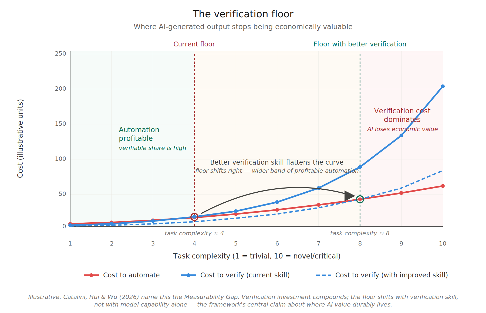

\newpage

# Part 1: The Laws and the Empirical Record

There is a pattern in the AI coding data that nobody can quite explain away. Velocity goes up — then goes down. Productivity feels real for a month or two — then dissipates. Teams that adopted Cursor, Copilot, or Claude Code in early 2024 are reporting in 2026 that their codebases are harder to reason about, their incidents are more frequent, and their senior engineers are spending more time debugging AI-generated code than they used to spend writing it.

The most rigorous causal study to date — He et al., MSR '26, 806 Cursor-adopting GitHub repositories with a staggered difference-in-differences design — quantifies this precisely. Code complexity rose 41.6% post-adoption. Static analysis warnings rose 30.3%. Velocity gains were real but transient, fully cancelled out within months by the complexity debt they generated. The authors describe a self-reinforcing cycle in which accumulated technical debt subsequently reduces future velocity. A scope note worth carrying forward: He et al.'s sample is open-source public GitHub repositories, which operate without the product governance, code review enforcement, acceptance criteria, or organizational accountability structures that enterprise software environments have. The study measures what AI adoption produces *in the absence of* the governance the framework will prescribe as the antidote — which makes it a measurement of the natural unmitigated dynamic, valuable on its own terms but not direct evidence about whether organizational governance fixes the dynamic at scale. The framework's claim that governance mitigates complexity accumulation is a prediction extrapolating from the structural mechanism, with the He et al. open-source data establishing the unmitigated baseline; whether enterprise governance actually closes the gap at organizational scale remains open empirical work.

METR's July 2025 randomized trial of experienced open-source developers found something even more uncomfortable: developers using AI tools on their own codebases were 19% slower while subjectively believing they were 20% faster. The perception of productivity diverged from the measurement by nearly 40 percentage points. METR later acknowledged in February 2026 that follow-up data with late-2025 tools showed a much smaller and statistically insignificant slowdown — likely indicating tool improvement, though also confounded by selection bias as developers increasingly refused to participate in AI-disallowed conditions. The headline finding stands as a snapshot of early-2025 capabilities; the perception-reality gap is the more durable result.

This pattern is not new. It was predicted in 1974, by Meir Lehman, watching IBM's OS/360 evolve.

### What Lehman Knew

Lehman's laws of software evolution describe the long-run dynamics of "E-type" systems — software embedded in the real world, whose requirements drift continuously. Eight laws, derived from decades of empirical observation. All eight are relevant to what we are seeing with AI coding agents. Five of them describe **structural regularities** — properties of E-type systems that have held empirically across the systems Lehman and his collaborators studied, regardless of who or what is writing the code. The other three prescribe the **architecture** that respects those regularities. In Part 1 we focus on the regularities. Part 2 takes up the architecture.

A framing note before we proceed. Lehman himself was careful to position the laws as social-science generalizations, not physical constants: "the word 'law' should be interpreted within the domain of the social sciences" (Lehman and Ramil, 2001), and the laws "are not expected to represent precise invariant relationships of measurable observations." The most authoritative systematic literature review of Lehman's framework (Herraiz et al., 2013) found uneven empirical support across the eight laws: Laws 1, 2, and 7 replicate robustly; Laws 3, 4, and 5 show mixed results that depend substantially on metric choice and study context. This paper takes Lehman's framework as the most coherent macro lens currently available for software-evolution dynamics, while flagging that the quantitative formulations of the conservation laws (Laws 4 and 5) remain actively debated. The synthesis that follows is offered in the spirit Lehman himself worked in — as structural pattern recognition under social-science epistemic conditions, not as physics-style invariance.

**Prior art and the paper's contribution.** The Lehman-validation literature concentrates on whether the laws empirically replicate. Herraiz et al. (2013) survey decades of replication evidence and find uneven support, as just noted; Godfrey and German (2013), in their retrospective on Lehman's legacy, argue that modern trends — emergent software architecture, de-monolithization, open-source and agile development — require new empirical models for studying evolution, but neither extends to governance architecture design. This paper's contribution sits in that gap. Three connections, to the author's knowledge not previously developed in the literature, are argued here as novel: (1) the **Lehman-DevOps mapping** — that the multi-loop architecture Law 8 prescribes is not the DevOps infinity loop, which centers operational health (DORA metrics, deploy frequency, error rates) and leaves the spec-reality calibration Loop 1 to scattered point practices (contract testing, property-based testing, SLO-based observability, BDD) rather than a coherent governance structure; (2) the **Lehman-Drucker mapping** — that the role-elimination restructuring Prince (Cloudflare, May 2026) frames through Drucker's builders/sellers/measurers categories is testable against what Law 8 requires for sustainable feedback, with concrete predictions about which conditions sustain the loops and which leave them with no one closing them; and (3) the **compound conservation extension** — that Catalini, Hui, and Wu's (2026) macroeconomic verification floor model, combined with Laws 4 and 5 read as compound conservation tendencies, predicts at the organizational layer which AI bets compound and which invert, with the 2024-2026 empirical record providing partial but suggestive evidence for the framework's directional predictions. The structural regularities themselves remain Lehman's; the recent empirical findings remain others'. What this paper contributes is the synthesis.

**Law 2 (Increasing Complexity):** As an E-type system evolves, its complexity increases unless work is done to maintain or reduce it.

**Law 3 (Self-Regulation):** E-type system evolution processes are self-regulating, with the distribution of product and process measures close to normal.

**Law 4 (Conservation of Organizational Stability):** The average effective global activity rate on an E-type system is invariant over the product's lifetime.

**Law 5 (Conservation of Familiarity):** All associated with an E-type system must maintain mastery of its content and behavior to achieve satisfactory evolution. Excessive growth diminishes that mastery.

**Law 7 (Declining Quality):** The quality of E-type systems will appear to be declining unless they are rigorously maintained and adapted to operational environment changes.

These five are not predictions of pathology. They are descriptions of dynamics that have held empirically across the systems Lehman studied — structural regularities rather than risk warnings. Entropy tends to increase. Effective activity rate tends to conserve. Comprehension bounds evolution. Quality degrades without maintenance. These properties have held whether the code is written by humans, agents, or any combination — though the strength and exact magnitude of each varies with system, organization, and time period. They are not laws that can be "engineered around" by treating them as optional, but they are also not physical constants. They describe tendencies the framework expects to persist, with consequences that compound when those tendencies are ignored.

AI coding agents do not repeal these regularities. They accelerate the rate at which the consequences of treating them as optional become visible. Each regularity predicts a specific symptom of that acceleration, and the empirical record from 2024-2026 is consistent with each one (with the scope caveats discussed below).

**Law 2 — the complexity accumulation.** The He et al. study is essentially an empirical proof of Law 2 operating on an accelerated timeline. The 41.6% figure measures something specific: SonarQube cognitive complexity — the metric designed to quantify how hard code is for humans to understand, distinct from McCabe's classic cyclomatic complexity. The authors are not just measuring "more branches" or "more code"; they are measuring comprehension burden directly, and the increase persists even when their models control for code volume. The codebase is not merely getting larger; it is getting denser in the dimension that costs human understanding. The transient velocity gain is the system burning through its slack before this complexity becomes the binding constraint. The self-reinforcing cycle the authors document — accumulated technical debt subsequently reducing future velocity — is exactly the dynamic Lehman described, compressed from years to months because AI appears to change the rate constant, not the underlying dynamics.

This is where Law 5 enters. The specific dimension that rises is exactly the one Conservation of Familiarity names as the binding constraint on evolution: cognitive complexity is what comprehension bandwidth has to keep up with. Law 2 generates the entropy; Law 5 caps what the system can absorb; the data shows the first rising while the second cannot follow.

Liu et al. (2026) provides the field-evidence complement at scale. Their large-scale longitudinal analysis of 302,600 verified AI-authored commits from 6,299 GitHub repositories across five widely-used coding assistants (Copilot, Claude, Cursor, Gemini, Devin) uses commit-level differential static analysis to attribute introduced issues precisely, then tracks each issue from its introducing commit to the latest repository revision. The headline finding: 22.7% of tracked AI-introduced issues still survive at the latest version, with cumulative surviving issues exceeding 100,000 by February 2026. Code smells account for 89.3% of issues; more than 15% of commits from every AI coding assistant introduce at least one issue. The same scope caveat applies: Liu et al.'s sample is public GitHub repositories; the persistence figure measures what happens to AI-introduced issues in environments where enterprise-grade review, refactoring discipline, and complexity budgets typically don't exist. The 22.7% persistence rate is the natural baseline; what governance does to that rate at organizational scale is what the framework predicts but neither He et al. nor Liu et al. directly measures.

He et al. shows the complexity accumulates in controlled adoption conditions; Liu et al. shows it persists across thousands of real-world repositories. The two are complementary — the entropy is generated, and the system does not regulate it back to baseline. This is the Law 2 dynamic measured directly at scale: entropy increases unless deliberate counter-work reduces it, and the deliberate counter-work is largely not happening in most repositories.

**Law 3 — the velocity reversion.** Self-regulation says E-type systems equilibrate around a sustainable rate through feedback. When changes get too large or too entropic, the system pushes back through defects, review friction, integration failures, and reduced velocity on subsequent work. The He et al. data is consistent with this directly. Velocity spikes when Cursor is adopted, complexity rises 41.6%, and that same complexity then dampens future velocity through the panel GMM estimation results. The system regulates itself back toward equilibrium. The transient gain is not a productivity improvement; it is the system temporarily running ahead of its own regulatory feedback before the feedback catches up.

**Law 4 — the flat organizational throughput.** Conservation of Organizational Stability says total effective activity rate tends to be conserved over the system's lifetime, regardless of inputs (in Lehman's original formulation, this is stated as an invariant; the social-science framing of the law makes it more accurately a strong tendency, as discussed in the framing note above). The standard AI narrative implicitly assumes this tendency does not hold — that agents are free additional capacity, so net throughput rises. The empirical record says otherwise. Faros's 2026 telemetry across 22,000 developers shows individual throughput up substantially (PRs merged nearly doubled, epics-per-developer up 66.2%) while organizational delivery metrics remain flat — what Faros calls "Acceleration Whiplash." The *effective* activity rate at the organizational level did not change — only the *raw* count did. What changed was the distribution: more raw generation, more review burden, more refactoring need, more incident response. If you include refactoring as work — which Lehman would, because Law 2 mandates it — then the extra capacity from AI is consumed by counter-work against the entropy AI itself generates. Generation and remediation net out *in value terms* even as raw motion climbs; conservation holds at the level Lehman specified — the *effective* rate, not the raw count. The corollary sets up Part 2: when total effort rises while delivered value stays flat, value *density* — value per unit of effort — falls. Ungoverned AI does not leave density flat; its default is to push it down.

**Law 5 — the verification bottleneck.** Conservation of Familiarity says sustainable evolution is bounded by the comprehension bandwidth of those involved. Faster code generation does not change human comprehension bandwidth. It moves the bottleneck. The Stack Overflow 2025 Developer Survey of 49,000+ developers found that 66% cite "AI solutions that are almost right, but not quite" as their top frustration — the cognitive load to verify AI-generated code now exceeds the load to write it manually in many cases. 45% report debugging AI-generated code is more time-consuming. Generation cost dropped; comprehension cost did not; and the bottleneck migrated to where Lehman predicted it would.

This is also where the framework resolves what looks like a contradiction in the data. Developer self-reports of multifold productivity gains are real — generation has genuinely accelerated, and the experience of producing code at AI speed is qualitatively different from typing it. The METR randomized controlled trial measuring 19% longer task completion is also real — it captures end-to-end task time including verification, integration, debugging, and context-switching. (METR's RCT is a small study by design: 16 experienced open-source developers, 246 tasks, with 56% of participants having never used Cursor before the trial. The headline 19% number is a measured effect in early-2025 tooling conditions, not a general productivity estimate, and METR's February 2026 follow-up found a smaller and statistically insignificant slowdown with late-2025 tools. The framework treats METR primarily as evidence of the perception-reality gap rather than as a generalizable productivity measurement.) The two are not in conflict. They measure different segments of the same activity. Generation accelerated dramatically; the bottleneck moved to verification and absorption, which grew faster than generation shrank. METR's striking secondary finding — that developers continued perceiving a 20% speedup even after experiencing the 19% slowdown firsthand — is the cognitive-psychology mechanism Bainbridge (1983) described forty years ago: humans attend to the parts of work that feel transformed; the invisible verification cost grows but does not register as cognitive progress. The framework absorbs both observations because it names the relevant variable. The 10x reports are accurate measurements of generation speed; the 19% measurement is the accurate end-to-end picture; the gap between them is exactly the verification cost the framework predicts.

**Law 7 — the quality decay.** Declining Quality says systems appear to degrade unless rigorously maintained against operational environment changes. The empirical signals are unambiguous. Veracode's 2025 GenAI Code Security Report tested over 100 LLMs and found 45% of AI-generated code samples introduced OWASP Top 10 vulnerabilities. The 2024 Google DORA report associated AI adoption with a 7.2% decrease in delivery stability. Cortex's 2026 Benchmark Report — *Engineering in the Age of AI*, surveying 50+ engineering leaders alongside cross-organization metric analysis — found change failure rates (the share of deployments that cause outages or rollbacks) up ~30% and incidents per pull request up 23.5% year over year, an independent signal in the same direction. The "almost right" failure mode is qualitatively new and exactly the kind of latent defect Law 7 describes — plausible enough to ship but subtly wrong, eroding perceived quality over time.

The pattern is consistent across all five regularities. What looked like productivity gains were system slack being burned. What looked like additional capacity was activity redistribution within a conserved effective total. What looked like an unlocked bottleneck was the bottleneck moving to a place that wasn't being measured. None of this contradicts Lehman; the 2024-2026 record is broadly consistent with his framework. With the framework as a lens, the data from 2024 to 2026 reads as accelerated empirical activity on questions Lehman first posed fifty years ago — with the scope caveats already noted (open-source samples for the field studies; small-RCT for METR; narrative-not-causal for the organizational reversals).

Lehman's framework describes dynamics operating at decade scales — longer than the panels modern empirical SE typically studies, which is part of why the framework has been cited less in recent literature. AI compresses the timeline. What required decade-scale observation to detect now produces signal in months, which also explains why apparently contradictory empirical results — multifold productivity self-reports alongside measured slowdown, transient velocity gains alongside long-term velocity decline — become coherent under the framework rather than canceling out. They sample the same underlying dynamics at different timescales.

Two objections deserve direct engagement. The first: modern empirical SE prefers the vocabulary of *technical debt* (Cunningham 1992) over Lehman's laws. These are not competing frameworks. Lehman provides the macro structural lens — entropy regularities, conservation tendencies, multi-level feedback architecture. Technical debt provides the micro operational vocabulary — specific failure modes, accumulated suboptimal decisions, the velocity-quality interaction. They describe the same dynamic at different levels of abstraction; the technical debt literature supplies much of the operational evidence consistent with the structural claims AI acceleration makes newly testable.

The second: Lehman's laws have not been uniformly validated. Israeli and Feitelson (2010) tested them against the Linux kernel and found Law 6's sub-linear growth prediction failed — Linux grew super-linearly for sustained periods. Herraiz et al. (2013), in *ACM Computing Surveys*, concluded validation was uneven: Laws 1, 2, and 7 replicated robustly, Law 6's quantitative formulations failed in significant cases, Laws 4 and 5 had mixed support depending on metrics. The reliance here is deliberate. The synthesis rests on the structural regularities (entropy, conservation, familiarity bounds, quality decay) and the qualitative architectural mandate of Laws 1, 6, 8 — the parts that replicated most robustly. The contested quantitative formulations of Law 6 are not what this synthesis depends on, and the contested quantitative formulations of Laws 4 and 5 are flagged explicitly in the framing above and treated as tendencies rather than constants throughout the paper.

### The Same Problem at Every Level

Here is the part that most analyses miss: the entropy regularity repeats at every level of abstraction.

At the engineering layer, drift operates in both directions of the system-understanding loop. The shared model of how the system should work — held jointly by humans and agents, recorded in specs, tests, ADRs — drifts from how the system actually behaves at runtime. Code drifts from intent (the original Lehman observation, true even without AI). Intent drifts from observed reality as the system's actual behavior evolves and new edge cases emerge. Both directions matter; both are inherent challenges of the loop between intent and implementation.

At the intent layer, system intent drifts from evolving user need and business strategy — which themselves keep moving as the market, regulatory environment, and competitive landscape shift. This drift is harder to see, easier to ignore, and rarely framed as an engineering concern at all.

Each level is an E-type system in its own right, subject to the same regularities. Entropy accumulates everywhere unless deliberate work counteracts it everywhere. AI agents change the cost equation at both levels — making generation cheap, making verification expensive, and making the gap between intent and reality prone to widening faster than humans alone can close it.

### What SDD Gets Right

Jaroslaw Wasowski's recent piece on Spec Driven Development describes a three-level maturity ladder that operationalizes exactly this problem, even if his framing doesn't explicitly invoke Lehman.

**Level 1 — Spec-first:** CLAUDE.md, .cursorrules, AGENTS.md. The spec is written once, fed to the agent as context, then abandoned after the feature ships. Every new session is a cold start. Specification drift accumulates silently. This is where most teams are.

**Level 2 — Spec-anchored:** The spec lives in the repository alongside the code. It updates bidirectionally — implementation discoveries feed back into the spec. Production signals feed into the spec. The spec becomes a living artifact that evolves with the system.

**Level 3 — Spec-as-source:** Code is generated from the spec and treated as disposable. The spec is the only artifact humans edit.

The SLUMP benchmark (Yan, Chen, and Zhang 2026) demonstrates the mechanism directly. On 20 ML papers totaling 371 atomic components, agents working from incrementally-disclosed requirements lost faithfulness compared to the same platforms given the full specification upfront — forgetting earlier decisions, breaking integration between modules, implementing logic that contradicted previous instructions. The authors' ProjectGuard mitigation — moving spec state out of conversation into a persistent external layer consulted at every step — recovered 90% of the semantic-faithfulness gap on Claude Code, with fully faithful components rising from 118 to 181 out of 371. Marri's (2026) Constitutional SDD work makes the same structural move for security: encoding CWE-derived constraints as persistent specification elements measurably reduced security defects in a single-project banking microservices case study. Both are supporting examples of one structural claim — persistent, machine-readable specs the agent actually consults outperform conversational specs that don't survive across sessions — not generalizable empirical magnitudes. The specific figures are benchmark- and case-study-specific; what generalizes is the mechanism.

More precisely: what these results generalize is the *persistence* half of Wasowski's Level 2 — the spec as persistent external state consulted at every step. The *bidirectionality* half — runtime behavior, test failures, debugging discoveries, and production signals flowing back to update the spec — remains substantially less demonstrated by current tooling. SLUMP and Constitutional SDD evidence the precondition for Level 2; full Level 2 as Wasowski defines it is still largely aspirational. This distinction matters for what Part 4 will identify as the durable bet with the most engineering headroom.

These are not accidents. They are Lehman's prescribed counter-work made operational. Stopping the entropy at the spec-to-code boundary is what each example demonstrates in its domain — semantic faithfulness on technical method implementation, security on regulated code generation. The mechanism is structural: encode the relevant constraints in a place the agent actually consults, and the entropy gradient flattens at that boundary.

A counter-finding sharpens this. Gloaguen et al. (ETH Zurich and LogicStar.ai, February 2026) conducted the first rigorous evaluation of naive repository-level context files across four coding agents (Claude Code/Sonnet-4.5, Codex with GPT-5.2 and GPT-5.1 Mini, Qwen Code with Qwen3-30B-Coder) on SWE-bench Lite and a novel AGENTBENCH benchmark of 138 real-world tasks from repositories with developer-committed context files. Their finding: AGENTS.md/CLAUDE.md style context files tend to *reduce* task success rates compared to providing no repository context, while increasing inference cost by over 20%. LLM-generated context files reduced average resolution rates by 0.5% on SWE-bench Lite and 2% on AGENTBENCH; developer-written files barely moved the needle. This is direct empirical evidence that the popular "add a CLAUDE.md and the agent will work better" prescription does not hold for one-shot SWE tasks.

The finding sharpens rather than undermines the Level 1 → Level 2 framing here: it identifies naive Level 1 super-prompting as empirically insufficient, which is precisely what the ladder predicts. The structural upgrade that actually works is persistent external state consulted at every step (the SLUMP mechanism), ideally with bidirectional updates flowing back from runtime — not a static markdown file written once at session start. Naive Level 1 fails; the persistence-and-consultation half of Level 2 works in controlled conditions; the full bidirectional half remains the open engineering frontier. The two findings are complementary in their joint message: form matters more than presence. A persistent file that doesn't update and isn't consulted at every step is not the same kind of artifact as one that does.

### The Real Insight

The technical answer is straightforward: move from Level 1 to Level 2. But the underlying mechanism is more fundamental than any specific tool or workflow.

**The key is continuous and conscious resolution of deviations between spec and system behavior.**

Continuous because entropy accumulates continuously. A spec-reality check that runs once per quarter cannot govern a system that drifts daily. The check must run at the frequency the system changes.

Conscious because the resolution requires human judgment. Detecting deviations is a pattern-matching problem that scales — agents can do this cheaply at any volume. Resolving deviations requires deciding which side is wrong: should the spec be updated to reflect new understanding, or should the code be corrected to match the original intent? That decision encodes organizational intent and cannot be delegated.

This division of labor — agents doing detection, humans doing judgment — is the structural answer to the productivity paradox. It explains why the He et al. study found velocity gains evaporating: those teams were generating without governing, accumulating spec-reality drift that eventually choked their ability to make changes. It explains why SLUMP's persistent-state mitigation recovered the faithfulness gap in benchmark conditions: that change creates the substrate for continuous spec-reality reconciliation. It explains why Constitutional SDD reduced security defects in its case study: the constitution becomes a persistent ground truth that every generation step is checked against. And it explains why Roy's (2026) Kitchen Loop produced 1,094+ merged pull requests with zero regressions across two production systems: the loop's specification surface, Unbeatable Tests, and Drift Control gates implement continuous spec-anchored outcome conformance and quality-trend drift control at AI generation velocity — the forward direction, with the spec held as ground truth (engaged in detail in Part 3).

Every empirical signal points in the same direction. The teams that win with AI are not the ones with the most sophisticated tools. They are the ones with the most disciplined feedback loops.

This conclusion has independent corroboration from outside the controlled-study and telemetry literature. The Pragmatic Engineer's 2026 AI tooling survey (Orosz and Nilsson, 2026), drawing on 900+ responses from engineers and engineering leaders, finds that the teams seeing real benefit from AI are those that already had testing and deployment guardrails, documented architectural decisions and engineering practices, and a quality codebase for agents to pattern-match against — and distills the pattern into a single line: "AI is an amplifier, not a fixer. Good software engineering practices get multiplied. So do the bad ones." That is the proficiency-governance relationship the next section formalizes, and the governance-precedes-proficiency sequencing it implies, surfaced independently from a large qualitative sample rather than from repository mining or benchmarks. The survey is self-selected, senior-skewing, and self-report; it is cited here as corroborating practitioner field evidence in the spirit of the Stack Overflow and Sonar developer surveys, not as a controlled measurement, and its sentiment-level positivity is discounted in Part 2 for the reasons the three-frames argument gives. A second source lands on the same metaphor by a partly different route: Cortex's 2026 Benchmark Report, pairing a leader survey with cross-organization delivery-metric analysis, concludes that AI behaves as "an indiscriminate amplifier" of existing engineering practices — magnifying the good and the bad alike. Two methodologically different instruments converging on the amplifier framing is stronger than either alone.

### The Proficiency-Governance Matrix

This reframes what "AI maturity" actually means.

Most maturity assessments measure only proficiency — tool adoption rates, feature usage, developer satisfaction, percentage of code AI-generated. These metrics are visible, quantifiable, and easy to brag about. They are also dangerously incomplete.

Proficiency and governance are two distinct axes, and they are multiplicative rather than additive.

**High proficiency without governance** is exactly the pattern the empirical studies are capturing — a team that is very good at generating complexity very fast. The tools work as advertised. The regularities assert themselves anyway.

**High governance without proficiency** is bureaucratic overhead with no payoff — elaborate constitutions and spec-reality loops governing agents that aren't being used effectively. The discipline exists but isn't amplifying anything.

**Only the combination produces sustainable lift.** Governance without proficiency produces low output, well-controlled. Proficiency without governance produces high output that self-destructs. The empirical record consistently shows the latter pattern in organizations that scaled AI adoption without building the governance infrastructure first.

This also explains the perception-reality gap in the METR study (the durable signal from that work, distinct from the headline 19% number that is sample- and tool-cohort-specific). The proficiency axis is felt — typing less, shipping more PRs, watching agents do work that used to be manual. The governance gap is not felt until much later, when complexity debt comes due. Subjectively, productivity goes up. Objectively, sustainable productivity goes down. Both can be true simultaneously, and usually are.

The practical implication for any organization building an AI maturity model is uncomfortable: **the proficiency dimension needs governance as a prerequisite gate, not a parallel track.** You don't advance proficiency maturity — more autonomous agents, larger scope, less human oversight — until the governance infrastructure at the current level is demonstrably functioning. Because the cost of getting that sequencing wrong scales with how proficient your agents become.

The better the tools, the more expensive the governance gap.

*Illustrative; the numerical values are stylized for the visualization, not measured empirics. The top panel shows raw activity (PRs, commits, motion) rising for every high-proficiency team; the bottom shows delivered value diverging by governance. The shapes capture the He et al. (2026) velocity spike-and-crash, Law 3 self-regulation pulling the ungoverned line back toward the conserved effective rate, and value density compounding above baseline only under governance — divergence, not convergence.*

#### Skills as Interim Scaffolding

There is a useful middle layer worth naming explicitly. Between the irreducible governance work and the eventual model capabilities that will absorb some of it, skills — structured, purpose-built guidance attached to specific contexts — can help agents do the right thing more of the time without bloating the spec or substituting for governance.

When an agent misbehaves in a recurring pattern, the reflex is to add a HOW rule to the spec. That path leads to MDA-style bloat — specs that micromanage implementation, hit the IFScale adherence cliff, and become harder to maintain than the code they govern. Skills offer a different option: encode the HOW in a separate artifact with its own update cycle, leaving the spec focused on WHAT and BOUNDARIES.

The framing that helps here is distinguishing two categories. **Capability scaffolds** compensate for what the model can't yet do reliably — temporary by design, candidates for deprecation as models improve. **Context scaffolds** encode what the model can never know from training data alone — organizational intent, domain constraints, architectural decisions — permanent by nature. Skills can serve either category, but the maintenance discipline differs: capability scaffolds need deprecation reviews triggered by model upgrades; context scaffolds need update reviews triggered by business and architectural change.

The "next model will eat your scaffolds" observation is correct on the capability axis and dangerous on the context axis. Models will keep getting better at inferring HOW. They will never get better at knowing your organizational intent unless you tell them. Skills help bridge the gap on the first axis while the governance infrastructure stays focused on the second.

This makes skills genuinely useful as an interim layer — they raise the floor of agent reliability without raising the ceiling of governance burden. But they don't substitute for the spec-reality loop and don't address the multiplicative governance gap. They are a force multiplier on proficiency. The governance axis still has to be built independently.

Part 3 returns to this with a broader frame: skills are one component inside what the industry has converged on calling *harness engineering* — the runtime infrastructure within which all of these governance disciplines actually operate. The capability/context distinction made here applies inside that bigger picture, and the same capability-scaffolds-get-eaten dynamic applies at the company-strategy scale Part 4 examines.

# Part 2: The Framework

### The Two Loops — and Lehman's Prescription

The SDD model focuses on the loop between spec and code. That loop matters, but it is only one of two loops that have to function for the system to remain aligned with the reality it serves. The three prescriptive Lehman laws — Laws 1, 6, and 8, deferred in Part 1 — prescribe exactly this multi-loop structure.

**Law 1 (Continuing Change):** An E-type system must be continually adapted, else it becomes progressively less satisfactory in use.

**Law 6 (Continuing Growth):** The functional content of an E-type system must be continually increased to maintain user satisfaction over its lifetime.

**Law 8 (Feedback System):** E-type evolution processes constitute multi-level, multi-loop, multi-agent feedback systems and must be treated as such to achieve significant improvement.

Read together, these three laws describe a system that must continually adapt (Law 1), continually grow (Law 6), and operate as a multi-level multi-loop feedback structure (Law 8). The two-loop governance model is not a new framework being layered on top of Lehman. It is an operational reading of what Lehman already said the architecture had to be. Law 8 names the structure outright — Lehman explicitly used the phrase "multi-level, multi-loop, multi-agent" in 1996, before agents existed in any literal sense. The phrase is now also literal, not just figurative.

This framing has acquired an operational name in 2026. The industry has converged on calling the runtime infrastructure surrounding an AI model "harness engineering" — the multi-loop feedback structure that wraps the model and makes it act as an agent. Lehman articulated the multi-level multi-loop multi-agent architecture in the 1970s and 1980s from observation of large E-type systems. Practitioners working with LLM-based agents in 2024-2026 have arrived at structurally similar requirements — persistent state across sessions, verification loops on agent output, guardrails on what agents can do, observability into agent behavior — driven by what their systems actually need to work.

That practitioners are landing on the same structural answer at a different technological era is corroboration of the underlying principle, not coincidence. What Lehman named theoretically is what practitioners are now building from empirical necessity. Part 3 takes up the operational layers — tool orchestration, verification loops, context and memory, guardrails, observability — and how each maps to a governance discipline.

**Loop 1 — System Understanding:** The continuous calibration of how humans and agents understand the system should work against how the system actually works. The spec is one artifact serving this loop — alongside tests, observability, code review, debugging, and post-mortems. Both engineers and AI agents participate; both must maintain accurate models of system behavior, and the loop runs in both directions — design intent flows into implementation, runtime reality flows back to update the shared model. This is the loop SDD's Level 2 architecture targets, the loop in which SLUMP measures one direction (spec preservation during generation), and the loop where the empirical AI failure modes from 2024-2026 concentrate.

**Loop 2 — Intent Alignment:** The continuous calibration of how the system should work against evolving user need and business strategy. Served historically by OKRs, product reviews, customer feedback cycles, and build-measure-learn — frameworks that predate AI and persist with or without it. AI as intelligence substrate now participates here directly too: synthesizing user signals at scale, accelerating measurement cycles, surfacing patterns in customer behavior and market data, compressing the latency between strategic shift and intent update. This loop is rarely instrumented at the engineering boundary but well-served in mature product organizations; AI changes the achievable cadence, not the loop's existence.

Both loops are instances of Law 1 operating at different levels. The shared mental model of how the system should work must continually adapt to what the system actually does (Loop 1). It must equally continually adapt to evolving user need and business strategy (Loop 2). Both are also instances of Law 6 — the model expands because what it governs keeps expanding. And the whole structure is the multi-level multi-loop architecture Law 8 explicitly named.

Both loops ideally run continuously. Conventional wisdom puts them at different cadences — Loop 1 continuous in engineering, Loop 2 at product review or strategic planning intervals — but those cadences reflect human attention limits, not optimal design. The slower a loop runs, the more potentially misaligned activity accumulates between corrections. Every week Loop 2 doesn't run is a week of activity potentially spent on a target that has already shifted. AI as intelligence substrate makes truly continuous cadence newly feasible at both levels.

Failure in either loop propagates into the other. A strategic pivot that doesn't update the shared model produces a perfectly faithful implementation of obsolete intent. A model that doesn't reflect runtime reality produces code that solves an imagined version of yesterday's problem.

The structure has surface similarity to the DevOps infinity loop, but the resemblance is misleading: DevOps centers operational health (DORA metrics, deploy frequency, error rates) rather than spec-reality calibration. The disciplines that *do* calibrate — contract testing, property-based testing, SLO-based observability, BDD — exist as scattered point practices rather than as a coherent Loop 1. The framework's first novelty contribution, signposted in the introduction, is to identify what these point practices collectively serve: the multi-loop architecture Law 8 prescribed in 1996, which DevOps does not provide and which the practitioner literature has not yet named.

*Illustrative. The structure is what matters: system intent is the pivot, calibrated against runtime reality (Loop 1) and against evolving user need and business strategy (Loop 2). AI as intelligence substrate participates in both loops — modeling system behavior alongside humans in Loop 1, accelerating measurement and signal synthesis in Loop 2. Both loops ideally run continuously; current cadence differences reflect human attention limits the framework expects AI to compress.*

### Two Conservations Make Accuracy the Only Lever

This is where Lehman's conservation tendencies become the central frame for what AI is predicted to do at the organizational level. Law 4 — Conservation of Organizational Stability — observes that total *effective* activity rate tends to be conserved over a system's lifetime. If that tendency holds under AI generation conditions (the empirical record so far is consistent with it, though the question is not settled — Faros's 2026 Acceleration Whiplash finding admits multiple interpretations), then increasing aggregate delivery velocity is not an available lever in expectation. You cannot reliably expand the pie. You can only reallocate within it. Which means the optimization problem reduces to two things:

**The ratio between forward work and counter-work.** Too little refactoring and entropy chokes future activity. Too much and forward progress stalls. There is an optimal ratio that maximizes useful output within the bounded activity budget. AI changes the entropy generation rate, which shifts the optimal ratio toward more counter-work, not less.

**The accuracy of the forward work itself.** Every misdirected delivery is doubly expensive under conservation — it consumes activity to build the wrong thing, then consumes more activity to fix or replace it. The conservation tendency doesn't just constrain how much you can do; if it holds, it makes every wrong thing you do consume capacity you cannot easily replace.

This transforms what continuous loops are actually for. They are not just feedback mechanisms in the abstract. They are the only available lever to reduce the accuracy tax under conservation. An intent-alignment loop running quarterly tolerates a quarter of misaligned activity before correction. The same loop running monthly tolerates a month. The same loop running continuously tolerates the latency between signal and update — which is what AI-accelerated measurement is now compressing. Under conservation, that wasted activity is permanently lost — there are no extra hours to make it up with. The "production feedback loop" that SDD lists as a property of a living specification is actually one channel of signal into Loop 1; production feedback alone is insufficient for Loop 2 because strategic misalignment isn't always observable in production metrics until the damage is done.

The constraint is actually sharper than Law 4 alone suggests. Beyond the per-time activity rate, Lehman's empirical observations pointed to a second conservation: the incremental content successfully absorbed in each release tends toward a stable equilibrium, bounded by the organization's capacity to review, integrate, validate, and operate what it ships. This second constraint is closely tied to Law 5 (Conservation of Familiarity) and is the reason large releases historically get followed by stabilization releases. The system pulls itself back toward the absorbable rate. Push per-release content above that rate and the excess returns as defects, rework, and incidents — until the equilibrium reasserts.

The Faros 2026 telemetry shows this dynamic playing out under AI in real time. Pull request sizes are up 51.3%. Raw generated content per release is rising. But median PR review time is up 441%, 31% more PRs are merging with no review at all, and incident rates per PR have risen substantially. The raw content is increasing. The absorbed and validated content is not. The system is pushing against the second conservation and the second conservation is pushing back through quality and stability signals.

Two conservations together compound the question of where AI actually accelerates value creation. If the **effective** activity rate is conserved (Law 4) **and** per-release absorbable content is also bounded (Law 5 plus Lehman's empirical release dynamics), then the volume of value creation has not one but two structural constraints. In **volume terms** — total amount of value created per unit time at the organizational level — AI cannot accelerate value creation. The effective rate is conserved and the absorbable content is bounded; raw activity, meanwhile, rises freely. The total volume is structurally bounded by properties of how organizations and the software they produce evolve, not by tooling capability.

An independent macro figure sharpens why automating code generation cannot expand this volume. Atlassian's State of Developer Experience 2025 (~3,500 respondents) finds the average developer spends only about 16% of the working week writing code; the remainder goes to review, design, coordination, debugging, and planning. Driving the cost of that 16% toward zero therefore frees only a small slice of total activity — and the slice that remains is precisely the two-loop work this framework names: keeping the shared model of the system calibrated to reality (Loop 1) and keeping intent aligned to evolving need (Loop 2). This is the substance behind the practitioner refrain that "writing code fast was never the bottleneck" (Orosz, 2026): the bottleneck has always been verification and alignment — the two activities conservation makes the only available levers.

In **density terms** — value created per unit of activity (total effort expended), per unit of absorbed content — yes, conditionally. AI is a density multiplier on what each unit of bounded activity is worth, conditional on governance discipline most organizations have not yet built. The teams that build it extract real compounding gains. The teams that don't run their rising activity against the second conservation and watch it return as quality degradation, rework, and incidents — density falling below where it started.

Put as a control system, this is one mechanism, not two. The conserved quantity is a *setpoint* — the effective, value-delivering rate — held by two governors: the absorption ceiling (Law 5) and the entropy tax (Law 2). AI raises the *inflow* (raw generation), not the setpoint; the surplus returns as counter-work, so density — value over total effort — falls by default. The only way to lift the setpoint is to move a governor: raise genuine absorption capacity, or cut the entropy generated per unit of output. And those governors are now staffed by both people and software — agents can extend them, but only on the *detection* side, checking against encoded criteria (the machine-tractable layer of the verification floor developed in Part 3); the *judgment* that owns intent still binds to humans. Which is why the lever is governance, not generation speed: it is the only thing that moves the setpoint rather than the inflow.

The arithmetic is unforgiving. If the only honest dimension of AI value creation is density, and density only improves with governance, then the entire ROI case reduces to: does the value-density gain from disciplined governance exceed the cost of building that governance? For mature organizations with strong existing practices, yes — likely substantially. For organizations without governance infrastructure, closer to no, until they build it.

### Efficiency, Effectiveness, and the Four Ratios

The volume conservation argument can read as deflating if stopped there. It shouldn't. Lehman's laws constrain the *system* — the software, the organization producing it, the relationship between them. They do not constrain how much value the conserved system extracts from its activity. Value is determined by what the activity targets, how accurately it targets it, and how well it lands. AI affects all three. The volume is bounded; the ratios are not.

Two mechanisms drive the ratio improvement, and both are compatible with Law 4. **Efficiency improvement** — same activity produces output faster. An engineer who spent four hours implementing a CRUD endpoint now spends one hour reviewing and refining an agent-generated implementation. The activity quantum is similar; the output per activity is higher. **Effectiveness improvement** — same activity produces better output. An engineer thinking through a design with an agent as sounding board may arrive at a better architecture than the same engineer thinking alone. The activity quantum is the same; the quality per activity is higher. Both are measurable. Both happen under conservation. What Law 4 constrains is the total quantity of activity the organization sustainably performs. What it does not constrain is how much value each unit of that activity produces.

A third mechanism deserves its own name, and it has one already. Peter Drucker, in 1954, classified organizational work into three categories: builders who make the product, sellers who find the market, and **measurers** who track, coordinate, and feed information into decisions. The density gain AI produces in both loops is fundamentally measurer work — synthesizing signals at scale, detecting drift, surfacing patterns, accelerating the closing of feedback. In Loop 1 the measurer work is technical: observability synthesis, log analysis, anomaly detection, test result interpretation, runtime behavior characterization. In Loop 2 it is product and strategic: customer signal aggregation, market trend detection, OKR-to-outcome attribution, automated theme extraction from support and sales transcripts. Both are forms of the same operation — making calibration continuous instead of episodic. Drucker called measurer work necessary but secondary to building and selling, capacity-constrained by human attention. AI as intelligence substrate is the first technology to relax that constraint directly. Part 4 examines a specific bet (Cloudflare) that operationalizes Drucker's framing as a corporate reorganization.

This is also why empirical productivity studies disagree so sharply. Studies measuring activity volume find mixed results — conservation predicts this. Studies measuring quality and value density find clearer signals, but they diverge depending on governance. Studies measuring developer experience find the strongest positive signals — because the felt experience of work is genuinely improved by having an agent handle routine cognitive load, even when measurable output is similar. All three frames are looking at real phenomena. They reach different conclusions because they measure different conserved or non-conserved quantities.

The Pragmatic Engineer 2026 survey (Orosz and Nilsson, 2026) shows the divergence inside a single dataset. It is predominantly a developer-experience instrument, and on that frame its combined sentiment moved toward the middle rather than upward — a "nuanced/mixed" plurality rising from roughly a third of respondents in the newsletter's 2024 survey to about half in 2026, the primarily-negative share falling from ~23% to ~10%, and the primarily-positive share roughly flat — while the same respondents' observations about codebase quality, review load, and maintainability were markedly negative. The felt experience improved; the quality frame did not. Because the survey is self-selected and self-report, its developer-experience positivity is exactly the rosiest frame the account above predicts — which is why its internal split across frames, rather than its headline sentiment, is the informative signal.

The operational manifestation of value-density improvement breaks into four ratios, each mapping to a different stakeholder's concern.

**Value per unit of activity** — the core density argument. Each PR carries more value because the agent surfaced edge cases the engineer would have missed. Each architectural decision is better grounded because more alternatives were explored. Each review meeting produces a sharper outcome because preparation was deeper. The effective rate stays bounded; value extracted from it rises.

**Value per unit of time** — follows from density improvement, because that activity is performed within time. If each unit of activity carries more value and the effective rate tends to conserve (as Law 4 holds), then value per calendar period rises mechanically. This is the metric most relevant to operational pace and competitive timing, and it improves without violating any conservation.

**Value per unit of capital** — improves on two axes simultaneously when AI substitutes for capital expenses that previously bought activity. Tooling cost replaces some labor cost; value per unit activity rises while cost per unit activity falls. This is the strongest economic case for AI in software development and the one most defensible to a CFO.

**Value per person involved** — improves through the same mechanism with an important caveat. If AI lets fewer people produce the same density-improved output, value per person rises through workforce reduction. If AI lets the same people work on higher-density problems, value per person also rises through workforce repurposing. Both paths are real and the math works out the same on the ratio. They have different organizational implications, and which path an organization takes is a strategic choice — not a tool consequence.

The reframing this enables is significant. AI does not make organizations produce more software. It makes the software they do produce more valuable, more accurate, and more efficient to generate — per unit of bounded activity, per unit of calendar time, per unit of capital deployed, per person in the loop. None of those ratios are subject to the conservation that bounds activity volume.

A measurement candor note belongs here before the arithmetic. The four ratios as named above are conceptual decompositions, not a deployable measurement program. "Value" in the numerator is left underspecified deliberately — it refers to whatever construct of business or stakeholder outcome the organization is optimizing, which varies by context (revenue impact, user outcomes, strategic alignment, regulatory standing, mission progress). Each ratio has known operational proxies that Part 3 develops (defect rates per PR, calendar-time-to-validated-business-outcome, full-stack cost accounting, workforce composition shifts), but no settled aggregation method combines those proxies into a unified density score. And the attribution problem is genuine: if defect rates drop, the contribution of AI governance versus team experience, product maturity, regulatory pressure, or seasonality is rarely cleanly separable in real organizational data. The framework's claim is that value density is the *right dimension* to optimize and that its proxies, taken together, give an organization signal about whether it is succeeding. The framework does not claim that value density is a measured quantity available on a dashboard today. Building the measurement program — turning conceptual proxies into actionable measurement — is itself part of what Part 4 identifies as the verification-infrastructure durable bet.

With that caveat in place, the structural arithmetic is worth seeing. As a thought experiment: if AI lifts value-per-activity by some factor X in a well-governed organization, then value-per-time, value-per-capital, and value-per-person all rise by roughly the same factor X, sometimes more if capital costs simultaneously decline as tooling replaces labor. Whatever X turns out to be empirically — and the answer will vary substantially by organization, codebase, governance maturity, and time period — that X compounds across all four ratios mechanically, sustained over years. This is not the 10x productivity the marketing claims. It is closer to compounding interest on the value the organization extracts from its existing capacity to do work — and compounding interest, sustained at any positive rate, is among the strongest economic forces most organizations will ever encounter. The framework's argument is structural: there is a dimension on which AI can compound durably even with the effective rate conserved. The exact magnitude on that dimension is open empirical work.

This framing also resolves the apparent contradiction between the Lehman conservation argument and the empirical evidence of real value creation under AI. Both are true simultaneously. Volume is conserved. Density improves. The ratios involving time, capital, and people all rise because none of those are subject to the same conservation as activity itself.

The conditions remain stringent. The density gain requires governance to direct activity at high-value targets. It requires both loops to keep those targets accurate. It requires absorption infrastructure to scale with generation rate so the second conservation doesn't reassert through quality degradation. None of these are automatic. All of them are possible.

This is the actual ROI mechanism the framework predicts. AI plus governance lets you do the same amount of work but extract more value from it. The conservation tendency isn't repealed — if it holds, it operates on a different dimension than the one productivity claims focus on. Activity-level velocity gains tend to evaporate because they push against conservation; value-density gains are predicted to persist because they do not.

### Why This Gets Worse With Better Tools

The most important consequence of the proficiency-governance multiplicative relationship is that **the cost of every kind of misalignment scales with proficiency.**

A misaligned team with low proficiency builds the wrong thing slowly. Natural friction — implementation cost, review cycles, human fatigue — limits the damage. The misalignment is expensive but bounded.

A misaligned team with high proficiency builds the wrong thing at speed and scale. Agents don't question strategic direction. They execute faithfully against the spec they're given. If the spec encodes wrong business intent, the agents are perfectly obedient in the wrong direction. The better the tools, the faster you arrive at the wrong destination.

This makes organizational alignment a first-class governance concern, not just a management concern. The two-loop structure has to function across engineering and product/strategy simultaneously. The organizations least prepared for that — with weak product-engineering communication, unclear strategic priorities, slow decision cycles — are precisely the ones for whom higher AI proficiency is most dangerous.

There is an irony here that deserves to be named. Organizations adopt AI agents to move faster. Moving faster amplifies the cost of every misalignment in the system. Under Lehman conservation, that misaligned activity is not just wasted — it is irreplaceable. There are no extra hours hiding somewhere to make it up with. The prerequisite for safely moving faster is therefore tighter alignment across both loops than the organization needed before — not because alignment matters more philosophically, but because the cost of misalignment has increased while the available activity budget has not.

This also reframes what governance is for. The conventional framing positions governance as defense against entropy — slower but safer. The conservation framing positions governance as the only available offensive lever for productivity. You cannot do more work. You can only do more accurate work. Continuous loops are how accuracy is maintained. Skills are how individual deliveries become more accurate within the loops. Specs are how accuracy is preserved across sessions. The governance infrastructure is the productivity infrastructure under conservation, not a tax on it.

AI doesn't just stress test engineering discipline — it stress tests organizational coherence at every level. Part 4 examines specific organizations betting on different implementations of this architecture — Block's architectural substitution being one of several distinct theses currently in flight.

### Where This Leaves Us

Lehman's laws were derived from observation of human-only software evolution in the 1970s and 1980s. They describe a structural dynamic — entropy accumulates, counter-work is required, activity tends to conserve, absorbable content tends to bound, feedback systems are multi-level and multi-agent — that held before AI and that the 2024-2026 evidence is consistent with continuing to hold under AI. What appears to change is the rate constant and the binding constraint, not the underlying dynamic.

Spec Driven Development at Level 2 — fully realized, with both persistence and bidirectional updates — is the clearest theoretical answer to the Level 1 entropy problem at the code-to-spec boundary, though current tooling only demonstrates the persistence half. But even fully realized, Level 2 is necessary, not sufficient. The same entropy dynamic operates at the intent-alignment layer — calibrating whether the spec still serves business purpose, and whether business purpose still serves environmental reality. Continuous reconciliation is required at every level where intent meets execution — exactly the multi-level multi-loop structure Lehman's Laws 1, 6, and 8 prescribe. Without it, the agents will faithfully amplify whatever misalignment exists in the system.

The compound conservation problem sharpens the conclusion. AI cannot accelerate the volume of value creation through software at the organizational level. The effective rate is conserved. Absorbable content is bounded; raw activity rises. The total quantum of value an organization can sustainably produce is bounded by properties of how systems and organizations evolve, not by tooling. What AI can do is increase the value density per unit of activity and per unit of absorbed content — and that increase is conditional on governance discipline that most organizations have not built. The teams that build it will extract real, compounding gains in density. The teams that don't will run their rising activity against the second conservation constraint and watch it return as quality degradation.

The teams succeeding with AI are not the ones with the most sophisticated agents but the ones treating governance maturity as a precondition for proficiency maturity, instrumenting both loops explicitly, and accepting that human judgment scales upward — not downward — as agents become more capable. The window to get this sequencing right is closing exactly when most organizations are pushing hardest to expand AI scope. The misalignment penalty compounds while the activity budget does not.

All eight of Lehman's laws are engaged. Five describe the structural regularities of E-type systems. Three prescribe the architecture those regularities require. None of them appear to be broken by AI. All of them are predicted to be accelerated by it. The honest case for AI in software development is narrower than the productivity marketing claims and stronger than the dismissive critiques allow. It is a value-density multiplier on bounded organizational activity, conditional on governance, lifting value-per-time, value-per-capital, and value-per-person at rates that compound substantially when the governance is in place. The 2024-2026 data is broadly consistent with what was on the books in 1974 and 1996.

# Part 3: Operational Practice

### First: Stop Measuring Raw Volume

The single most consequential practical change is reframing what gets measured. Most organizational AI maturity dashboards measure proficiency proxies — tool adoption rates, percentage of code AI-generated, PRs merged per developer, feature velocity. Under Lehman conservation, these are the wrong metrics: they track raw volume, which rises freely under AI while the effective, value-delivering rate stays bounded — so a climbing PR count reports redistribution, not improvement.

Each of the four ratios has known operational proxies. These are starting points for organizations to build their own value-density measurement, not a ready-to-deploy dashboard. The framework's claim is that these are the right things to triangulate; the work of stitching them into actionable measurement is the organization's, and is itself one of the under-observed durable bets Part 4 identifies (verification infrastructure includes measurement infrastructure).

**Value per unit activity** is the hardest to measure directly but the most important. Proxies: defect rates per PR (lower density of bugs per PR = higher value density); rework rate (PRs that survive without follow-up correction); architectural decisions traceable to documented intent versus drift; time-to-resolution on incidents tied to specific subsystems. None of these are perfect. Together they triangulate.

**Value per unit time** is operationalized as calendar-time-to-business-outcome rather than calendar-time-to-merge. Shipping code faster is not value if the code shipped is the wrong code. The right metric runs from intent-formation to validated business outcome, including the time spent in both loops.

**Value per unit capital** requires honest cost accounting. Total cost includes tooling licenses, developer time at fully loaded cost, review and verification cost, incident response cost, and the carrying cost of complexity debt. Most organizations only count the first. The ratio improves only when the value lift exceeds the full cost stack.

**Value per person involved** depends on whether the strategy is workforce reduction or workforce repurposing. The ratio improves under either; the organizational implications differ profoundly. Be explicit about which path the organization is on.

Without reframed metrics, every other practical step is invisible. Volume metrics actively obscure the dimensions where AI helps. But also: the proxies above remain proxies. The honest organizational stance is to instrument the proxies, watch them over time, and treat the measurement program itself as engineering work that compounds — exactly the verification-infrastructure pattern Part 4 names as a durable bet. The framework gives you the right dimensions to track. Building the measurement that converts those dimensions into operationally useful signals is the organization's own engineering investment, and one that the empirical record suggests very few organizations have made yet.

### Governance at Loop 1: System Understanding

This is the most familiar loop and where most practical AI governance literature focuses. The spec is the primary actionable artifact, but it serves a broader objective: keeping the shared model of how the system should work calibrated against how the system actually does work. Tests, observability, code review, debugging, and post-mortems all serve the same loop. The work here breaks into four disciplines.

**Establish the persistent, bidirectional spec.** Move from CLAUDE.md as super-prompt to spec-anchored architecture as Part 1 described. Concretely: the spec lives in the repo, updates flow back from implementation discoveries, production signals feed in, and the spec is consulted at every generation step rather than only at session start. SLUMP measured the persistence-and-consultation half in benchmark conditions; the writeback half is the engineering work organizations need to build for themselves — light at first (post-incident spec updates, code review notes feeding back into spec sections, periodic spec-vs-reality audits) and progressively more automated as tooling catches up. The work is unglamorous — naming things, documenting decisions, capturing edge cases as they emerge — but the empirical lift on the persistence half alone is substantial, and the writeback half compounds it further.

**Separate WHAT, BOUNDARIES, and HOW into distinct artifacts.** The spec carries WHAT and BOUNDARIES. Skills carry recurring HOW patterns. Code is generated implementation within those constraints. The discipline is to resist the natural pressure, when an agent misbehaves, to add HOW rules to the spec. That path leads to MDA-style bloat. Skills are the pressure valve that protects spec integrity.

**Distinguish capability scaffolds from context scaffolds explicitly.** Maintain a register that classifies each rule, skill, or constraint as either compensating for current model limitation (capability) or encoding organizational knowledge the model cannot know (context). Capability scaffolds need quarterly deprecation reviews triggered by model upgrades. Context scaffolds need update reviews triggered by architectural or business change. Conflating them produces governance debt in both directions: scaffolds that were necessary for GPT-4-era models persist past their useful life, while context that should have been captured stays in senior engineers' heads.

**Budget refactoring as an explicit percentage of agent capacity.** The He et al. data implies that AI-generated complexity rises by roughly 41.6% under typical adoption. To hold complexity flat under Law 2, refactoring effort needs to scale proportionally. A practical rule: 20-25% of agent capacity on refactoring and counter-work, treated as non-negotiable rather than as something that gets cut under deadline pressure. Teams that don't enforce this watch complexity compound until velocity collapses on the timeline the He et al. data predicts.

### Governance at Loop 2: Intent Alignment

This loop is rarely owned at the engineering boundary even though it determines whether engineering's output produces value. Most of the practical work is organizational rather than technical, with one major change in 2026: AI as intelligence substrate is now a direct participant in the loop, not just a consumer of its outputs. The frameworks that have served this loop for decades — OKRs, product reviews, customer feedback cycles, build-measure-learn — remain foundational; what AI changes is the achievable cadence and the scale of signal synthesis.

**Assign explicit ownership of intent-need alignment.** Someone has to own the question "does the spec still ask for what users and the business actually need?" In most organizations this is implicit and therefore unowned. Product managers own roadmap; engineering owns implementation; nobody owns the consistency between them at the spec level. The role doesn't need to be new; it needs to be explicit. A senior engineer or technical product manager whose job description includes maintaining spec-need alignment is the minimum viable configuration.

**Wire signals from users, production, and market into intent updates.** Incidents, user behavior signals, adoption metrics, competitive intelligence, regulatory shifts, market trend signals — all are evidence about whether intent still matches need. Most organizations route these to operations or marketing without ever asking whether they indicate the spec itself needs updating. The signals have to reach the people setting intent, not just the people responding to symptoms. AI now extends what is tractable here: continuous customer signal synthesis at scale, pattern detection in usage data, competitive intelligence aggregation, automated theme extraction from support and sales transcripts — work that historically waited for quarterly review can now flow continuously and inform intent in near real time.

**Compress intent review cadence to track the cadence of underlying change.** Annual strategic planning is incompatible with AI-accelerated execution. The activity rate is the same — Law 4 — but the cost of misaligned activity is amplified by proficiency. Quarterly intent reviews are the minimum; monthly is better; continuous (AI-mediated) is now technically feasible for the first time. The cost of running the loop faster is trivial compared to the cost of a quarter of misaligned execution.

**Tie architectural decisions to documented intent.** ADRs are the existing artifact best positioned to carry the intent-decision linkage. Every significant architectural decision should reference the intent it serves. When intent shifts, the ADR is a flag that the decision may need to be revisited. This is the audit trail that makes the loop legible.

**Treat strategic pivots as intent updates, not engineering disruptions.** When the business pivots, the question is not "how do we redirect engineering effort" but "how does the spec change to reflect the new intent." This reframing makes the pivot legible at every downstream level. The spec changes; the implementation reconciles to the new spec through Loop 1; the engineering effort follows naturally. Skipping the spec update produces the worst of all worlds — code drifts independently of both the old intent and the new strategy.

Stepping back: the five disciplines above describe one general operation AI now makes newly tractable — the measurer work Part 2 named via Drucker. Tracking OKR-to-outcome alignment continuously, synthesizing customer feedback at scale, detecting strategic drift in near real time, ensuring intent updates propagate to specs — these are tasks that historically required dedicated humans (middle management, operations, business analysts) to perform episodically. AI as intelligence substrate can perform them continuously and at scales humans alone could not reach. The governance work above is largely the work of deciding *what* to measure and *how* the signals flow into decisions; AI as intelligence substrate performs the measurement and synthesis itself. The same principle applies to Loop 1: the disciplines there decide what spec, what tests, what observability matter; AI performs the continuous reconciliation between them and runtime reality.

### Improving the Four Ratios

The governance work above sets up the conditions for ratio improvement. The actual lift comes from how that activity gets directed within those conditions.

**Value per unit activity.** Concentrate AI on the activities where density gain is highest — design exploration, edge case generation, code review preparation, refactoring analysis. The instinct to use AI for raw code typing is the lowest-leverage application. Typing is rarely the binding constraint on value. Using an agent to surface fifteen alternative architectures during a design discussion produces more density gain than using it to autocomplete fifty CRUD endpoints.

**Value per unit time.** Compress decision latency at every loop level. Continuous loops, as Part 2 argued, are the lever here. The specific tactics: automate the detection side of spec-reality diffs so they surface in near real time; route conflicts to humans in batched but frequent reviews rather than letting them accumulate; reduce the queue depth between loops so signals from Loop 2 reach Loop 1 within weeks rather than quarters.

**Value per unit capital.** Substitute tooling for labor strategically, not uniformly. The capital efficiency gain is largest where the tooling reliably handles the work — well-scoped, well-specified, fast-feedback tasks. The capital cost is highest where governance overhead dominates — novel work, ambiguous requirements, long-horizon judgment. Avoid the trap of measuring tooling ROI in lines of code generated. Measure it in value delivered per dollar of fully loaded cost, including the governance overhead the tooling requires.

**Value per person involved.** Reallocate freed activity toward judgment-dense work — design, architecture, strategic alignment, review, mentorship. This is where individual humans produce disproportionate value and where AI cannot substitute. The opposite move — using freed activity to staff more parallel feature work — runs into the second conservation (absorbable content) and produces the Faros 2026 pattern of unreviewed PRs and quality degradation. The teams getting compounding value per person are the ones moving their humans up the abstraction stack as agents handle more of the routine implementation.

### The Verification Floor

There is a constraint underneath all four ratios that the paper has only implied: value density only rises to the extent that AI's output is actually verified and absorbed. Unverifiable output doesn't carry value regardless of how much agent activity produced it.

The formalization comes from a recent paper by Catalini, Hui, and Wu (MIT / Washington University / UCLA, February 2026). They model the transition to advanced AI as the collision of two cost curves: a Cost to Automate that falls exponentially with compute and accumulated knowledge, and a Cost to Verify that is "biologically bottlenecked" — bounded by human time and embodied experience. The asymmetry creates what they call a Measurability Gap: a widening difference between what AI can execute and what humans can afford to verify. The verifiable share of agent output (s_v in their notation) is what separates truly productive output from merely plausible output.

A scope note. Catalini, Hui, and Wu's model operates at macroeconomic scale: it characterizes the transition where AI capability outruns human-bottlenecked verification across the economy as a whole. This paper applies their structural insight at organizational scale — the third novelty contribution signposted in the introduction, the *compound conservation extension* that combines Catalini-Hui-Wu's verification floor with Lehman's Laws 4 and 5 read as compound conservation tendencies — which is a meaningful scope change. The intra-organizational verification floor described here, and the multi-layer refinement developed below, are analogical extensions of Catalini et al.'s framework, not derivations from it. They inherit the *direction* of the conclusion — that verification cost is the binding constraint where execution becomes cheap — but not the formal proof. The 2024-2026 organizational evidence (He et al.'s complexity accumulation, Liu et al.'s debt persistence, Faros's review-time inflation, METR's experience reports) is consistent with the analogical extension; a formal model at organizational scale — measuring s_v inside teams, characterizing how it shifts with governance, calibrating where the floor sits for a given codebase — does not yet exist. Building that model is itself one of the verification-infrastructure durable bets Part 4 identifies.

*Illustrative. The verification floor is where cost to verify equals cost to automate. Below it, the verifiable share is high and automation pays off; above it, verification cost dominates and AI loses economic value. The dashed curve shows the framework's central practical claim: verification skill (and AI-assisted verification infrastructure) flattens the verification cost curve, shifting the floor substantially to the right. Model capability improvements move the red curve down; verification investment moves the floor.*

This is Lehman's Law 5 (Conservation of Familiarity) restated in economic terms. Lehman observed in the 1970s that sustainable software evolution was bounded by the comprehension bandwidth of those involved. Catalini et al. derive the same constraint from cost dynamics: verification capacity is the binding constraint when execution becomes cheap. Two paths to the same conclusion, forty-three years apart.

The cognitive-psychology foundation is older still. Lisanne Bainbridge's "Ironies of Automation" (1983) identified the paradox: automating the easy parts of a task leaves humans with the hard parts (judgment, exception handling, monitoring), and cognitive demands on remaining humans paradoxically increase rather than decrease. Skills atrophy from disuse precisely when they're most needed for intervention. Forty-three years later, the AI code review pattern matches Bainbridge's prediction — Sonar 2026 finds 96% of developers don't fully trust AI code accuracy while only 48% always verify, and Faros 2026 measures median PR review time up 441% with 31% of PRs merging without review.

This is the verification floor. Below it, the four ratios cannot improve regardless of how proficient the tooling becomes, because the value at the numerator depends on the work being correct, integrated, and absorbed — not just generated. Unverified output adds to the codebase but not to the value-producing portion of it. The He et al. complexity-accumulation data is essentially what happens when generation runs above the verification floor: the unverified portion comes back as defects, rework, and compounding entropy on the timeline the data documents.

The practical implication reframes Part 3's earlier advice. Verification infrastructure is not optional supporting infrastructure for governance — it is the binding constraint determining whether AI investments produce density gains or verification debt. Teams that scale AI generation faster than verification capacity are not getting more value per unit activity; they are accumulating unverified output that will manifest as Lehman-predicted entropy within months.

This sharpens which investments actually compound. Three categories matter most.

**Automated checks that genuinely substitute for human verification.** Static analysis, type systems, comprehensive test coverage, formal verification where applicable, contract testing at module boundaries. The goal is to raise the floor — increase the share of AI output that can be verified without consuming human cognitive load. Every unit of verification that can be performed mechanically is a unit of human capacity freed for higher-leverage judgment.

**Differential review concentration.** Apply scarce human verification to the highest-leverage portion of agent output (architectural decisions, security-critical paths, novel logic, anything touching invariants) rather than spreading it uniformly. Auto-approve low-risk changes with full automated coverage; deep-review high-risk ones with concentrated human attention. This is Salesforce Engineering's Prizm approach and the emerging best practice in the field. It treats human attention as the scarce resource it is.

**Verification skill development.** Bainbridge's skill-atrophy warning matters. If humans only ever rubber-stamp AI output, they lose the skills needed to catch the cases where the rubber stamp would have failed. Treating verification as a craft to invest in — through deliberate practice, rotation through high-stakes reviews, deep code reading exercises — preserves the capability the framework depends on. Verification expertise is an organizational asset, and Bainbridge's 1983 paper is essentially a warning about under-investing in it.

**An operational example.** AWS's Kiro IDE shipped two pieces in 2025-2026 that operationalize the verification floor framework directly. Requirements analysis (Dobe et al., AWS Applied Science, May 2026) uses neuro-symbolic techniques — LLMs paired with SMT solvers — to detect requirement-level bugs (ambiguity, inconsistency, completeness gaps, wrong level of detail) before any code is generated, surfacing problems as two-choice clarification questions for the user. Property-based testing (Eline, AWS, November 2025) translates specifications into executable Hypothesis tests with random input generation and counterexample shrinking, so verification scales sub-linearly with input space rather than linearly with hand-written test cases. Both are AI doing the measurer work humans historically did episodically: checking spec quality, generating tests, exploring input distributions. Both are deliberate engineering against the verification cost curve. A complementary open example targets drift directly: spec-kit-canon (2026), an extension to GitHub's Spec Kit, holds a canonical Markdown specification as the project's authoritative baseline and runs agent workflows to detect and reconcile divergence between that canon and the code, in both spec-first and code-first (vibecoding) directions. It is early and unvalidated at scale, but it is a concrete instance of the spec-to-implementation layer becoming machine-tractable — an agent reading the spec, reading the implementation, and flagging where they have parted ways.

These pieces surface a refinement worth making the spine of the section: the verification floor is not a single position but a stack along the chain **intent → spec → implementation → runtime**, and at every layer the same split recurs. Part of the work is *detection / analysis* — checking an artifact or behavior against an encoded criterion — which is increasingly machine-tractable and whose cost falls with model capability. The rest is *judgment / resolution* — deciding which side is wrong, designing the oracle, owning what the system is *for* — which stays human-bound. The floor at each layer is that second column. Verification investment compounds because each layer's detection makes the next layer's cheaper (clearer specs sharpen testing; better testing makes runtime signals legible), while the judgment residue is what governance has to keep staffing — which is what the durable-bet category in Part 4 looks like operationalized at the infrastructure level.

**The line is specifiability — and LLMs moved the frontier, not the line.** What the machine can take is exactly what is *specifiable*: detection against an encoded criterion, resolution derivable from encoded intent. The irreducible floor is whatever requires intent or experience the system cannot be told. That boundary is not new — it has always separated the automatable from the not. What LLMs changed is *where it sits*. "Specifiable" used to mean *formally* encodable — types, assertions, schemas, SMT — so anything whose criterion lived only in natural language fell to humans by default. LLMs expanded it to natural-language and fuzzy, example-based criteria, and a band of verification that was human *only because its criterion was unparseable by machines* — natural-language spec conformance, requirements analysis over prose, test generation from descriptions — crossed into the detection column. This is the same primitive that lowers the cost-to-automate (creating the drift the He et al. and Liu et al. data measure) now also lowering the cost-to-verify: the LLM is both the problem and the solution. It also explains the cost-curve structure of the table — detection is machine-tractable and falling at every layer because LLMs made each layer's criterion parseable; what stays bounded is the judgment column, heaviest at *intent → spec* (knowing what the system is for) and thinnest at *spec → implementation* (just "which side is wrong"), with Bainbridge's irony and Shen and Tamkin's debugging-skill deficits the field evidence that the residual genuinely binds.

| Layer (intent → system) | **Detection / analysis** — *machine-tractable* (cost falls with capability) | **Judgment / resolution** — *human-bound* (the floor) |
|---|---|---|
| **Intent → spec** — is the spec itself sound? | *Static:* requirements analysis flags ambiguity, inconsistency, gaps (Dobe et al., 2026) | What the system is *for*; which requirement is the right one |
| **Spec → implementation** — does the built system match the spec? | *Static:* drift detection / semantic diff (spec-kit-canon). *Behavioral:* property-based / spec-anchored testing (Eline 2025; Roy 2026). The two are complementary. | *Which side is wrong* — revise the spec or fix the code; design the oracle and invariants |
| **Implementation → runtime** — does the live system hold up in production? | *Behavioral:* observability, anomaly detection, regression oracles flag drift / incidents | Interpret judgment-dense, novel, never-specified signals |

**Three constraints keep the frontier from closing.** It would be easy to read "LLMs expand what is specifiable" as "the floor will soon vanish." It will not, for three structural reasons — none of them a model-capability gap. **It asymptotes.** Un-encodable intent never crosses: tacit knowledge, intent that is unformed until a candidate is seen ("you know it when you see it"), and intent ownership itself, which is the *source* of every criterion rather than something derivable from one — and Law 1 keeps the target moving as the environment shifts. **It is probabilistic, not sound.** LLMs made fuzzy criteria *attemptable*, not reliably *decidable*; coverage is not assurance. A probabilistic check buys breadth at the cost of soundness and must be tethered to a sound anchor — an un-gameable test, a deterministic oracle, or a human who holds the intent — or it drifts; stacking fuzzy checks on fuzzy checks degrades assurance rather than compounding it. **It is stakes-gated.** The floor is really specifiability × *required assurance*: the frontier moves fast where low assurance suffices and barely where soundness is required, and treating probabilistic coverage as though it were sound is the new face of Law 7's latent decay — the check usually works, and the failures it misses are silent, rare, and surface later as incidents.

This recasts Catalini, Hui, and Wu's floor as a frontier that is *moving but receding*, and its motion is what sorts the organizational bets Part 4 examines. Investments on the *specifiable* side — scaffolding a model's current limits — are absorbed each model generation; investments on the *un-specifiable / assurance-gap* side compound, because capability can neither cross the asymptote nor manufacture soundness. That is the structural reason the durable bets are durable: **verification infrastructure** is the sound-anchor layer a probabilistic frontier needs *more* of as it expands; **intent alignment** (Loop 2) is the un-encodable, moving intent the frontier asymptotes against; **verification skill** is the residual judgment, now rarer and higher-stakes. The same motion makes the Validator Trap more dangerous, not less: an advancing frontier raises the stakes of the residual judgment — catching the rare, silent failure of a usually-right probabilistic checker — while most strongly tempting the delegation that erodes the discriminative skill to do it. Skill demand rises as skill supply falls, exactly as the cost of the gap grows. Part 4 develops these as the under-observed durable bets.

**Production-scale evidence: the Kitchen Loop.** The clearest current production-scale evidence for what a spec-anchored CI gate looks like in operation comes from Roy's (2026) Kitchen Loop, validated across two production systems — the Almanak SDK, a DeFi strategy framework spanning 14 chains, 30+ protocol connectors, and 21 intent types (~1,000 coverage combinations), and Almanak's Signal Intelligence Platform — over 285+ iterations producing 1,094+ merged pull requests with zero regressions detected by the regression oracle. The Kitchen Loop's four primitives — a specification surface enumerating supported capabilities, an LLM synthetic user exercising that surface at ~24–48× human cadence per thread (with a 1,000× ceiling under parallelization, in the paper's own framing as "an order-of-magnitude claim, not a precise multiplier"), Unbeatable Tests that the code author cannot fake, and Drift Control monitoring quality trends with automated pause gates — operationalize, at production scale, the spec-anchored *testing-and-oracle* path: the behavioral mode of the spec-to-implementation layer of the verification floor. The precision matters: conformance is verified *behaviorally* — the synthetic user exercises the spec surface and the Unbeatable Tests check outcomes against an oracle the generating agent cannot game — not by an LLM diffing the implementation against the specification text (the static, semantic-conformance check the same layer also posits, which remains production-undemonstrated). Drift Control's gates monitor quality and operational *trends*, not spec-code divergence; the spec is held as ground truth and only the code is driven to pass.

Roy's case studies achieved monotonic quality-gate improvement (76–91% to 100%) at roughly $0.38 per merged PR, with documented infrastructure self-healing through the same loop — the system fixing its own merge automation, memory allocation, and cooldown failures via the standard cycle — a direct illustration of Lehman's Law 8 multi-loop feedback architecture operating at AI generation velocity. The framework's "agents do detection, humans do judgment" division of labor from Part 1 is what Kitchen Loop's Drift Control gates implement structurally: the loop pauses or warns on regression, quality-trend drift, canary escape, backpressure, and starvation thresholds, but resolution of what each pause means is left to human operators. SLUMP and Constitutional SDD remain the controlled-experiment and methodology proof-of-concept demonstrations of the same structural claim; Kitchen Loop is the production-validated data point that moves the framework's prescription for the spec-anchored testing path — the forward direction, code generated to a fixed spec — from prediction to demonstrated practice; the bidirectional, which-side-is-wrong reconciliation Loop 1 ultimately prescribes (and the runtime → spec writeback this paper repeatedly flags as unsolved) is not what it demonstrates. A scope note carries here as it did for SLUMP and Constitutional SDD: Kitchen Loop's primary case study is a DeFi framework with enumerable specifications and a strong regression oracle, and Roy's own limitations section names oracle quality and spec enumerability as the boundary conditions for the approach. The structural mechanism generalizes; the specific magnitudes are case-study-specific.

**Spec quality as the upstream dependency.** Across all three layers, spec quality is the upstream dependency that determines how much the downstream layers can contribute. An LLM CI gate checking conformance against a stale, ambiguous, or absent specification catches nothing. Property-based testing on under-specified contracts surfaces test failures without resolving which side is wrong. Observability on code whose intent is unclear produces signals nobody can interpret. The Level 1 → Level 2 → Level 3 spec maturity ladder from Part 1 (drawn from Wasowski 2026) is therefore not only the mechanism for closing Loop 1 in the framework's terms — it is also the upstream gate determining whether verification-floor investment downstream actually produces lift. A team at Level 1 buying a sophisticated spec-conformance CI gate is buying compute against a missing input. The sequencing this implies is uncomfortable: spec persistence and consultation discipline (the Level 1 → Level 2 transition) precedes verification-infrastructure investment, even though the latter is more visible and easier to procure.

A second-order shift deserves naming. As agents increasingly perform verification *execution* — compiling, running static analysis, and exercising tests against their own output — the binding human work relocates upward, from executing verification to *designing* it: specifying the oracle, the invariants, and the acceptance criteria the automated checks run against, including criteria the generating agent cannot satisfy by gaming the check (Roy's Unbeatable Tests are one instance). The verification floor therefore does not simply fall as agents self-verify; it relocates to the quality of verification *design*, which remains human-bottlenecked. This is the same discriminative competence the Generator-Validator coupling thesis (Ageless 2026) identifies as eroding when generation is delegated wholesale — making the design of verification the higher-leverage form of the verification skill and infrastructure this section prescribes.

The verification floor is not theoretical: Catalini et al. derived it from cost dynamics, Bainbridge from cognitive psychology, and the 2024-2026 empirical record measures it directly. Below it, the four ratios don't improve — they invert. Part 4 examines what happens when organizations bet against this floor — Cloudflare's role-elimination thesis being one of several test cases currently in flight.

### Harness Engineering: The Operational Synthesis

The disciplines above are abstract until they're embedded somewhere. Part 2 named the convergence: the industry's "harness engineering" is the operational form of Lehman's Law 8 multi-loop feedback architecture — what Lehman articulated theoretically in 1996 is what practitioners are now building from empirical necessity. This section operationalizes it.

A production harness has five typical layers, each mapping to a governance discipline already named in this series.

**Tool orchestration** — what tools the agent can access, how they're described, when they're invoked. The proficiency-governance distinction shows up immediately here: a powerful model with poorly-orchestrated tools underperforms a weaker model with well-orchestrated tools. The empirical signal is striking and converging. LangChain's coding agent moved from 30th to 5th place on Terminal Bench 2.0 in March 2026 through harness optimization alone, no model change. Anthropic's Opus 4.5 went from 42% to 95% on CORE-Bench after fixing harness issues with the same underlying model. Meta-Harness (Lee et al., 2026) automatically searched harness code while keeping model weights fixed and outperformed the best hand-designed harness by 7.7 points. Three independent measurements, same pattern: at fixed model capability, harness changes produce large outcome swings.

**Verification loops** — automated checks on agent output before acceptance. This is the verification floor in operational terms: static analysis, type systems, test coverage, contract testing at module boundaries. The verifiable share s_v in Catalini-Hui-Wu's economic model is determined here. Investment in this layer directly determines whether AI generation produces value or verification debt.

**Context and memory** — persistent state the agent consults. SLUMP's ProjectGuard, GitHub Spec Kit, and the Git Context Controller (Yan et al., 2025 — persistent file-system-style memory delivering over 13% improvement on SWE-Bench Verified) all live in this layer. The Level 1 → Level 2 SDD upgrade described in Part 1 is concretely this layer's evolution: from session-local prompts to persistent state with consultation discipline, with the next step being bidirectional writeback into that state. The Gloaguen et al. finding that naive context files don't help is essentially a finding about persistence-without-consultation in the wild; the SLUMP and GCC findings are about persistence-with-consultation in controlled conditions. None yet measures the bidirectional writeback half — runtime → spec updates — which is the open engineering frontier the framework predicts will compound next.

**Guardrails** — runtime constraints on what the agent can do. Constitutional SDD's CWE-derived security principles live here. Permission systems for irreversible actions live here. The "what can the agent never do" constraints are encoded as runtime guardrails, not just as documentation that may or may not be consulted.

**Observability** — visibility into what the agent did and why. The detection side of Part 1's "agents do detection, humans do judgment" requires observability infrastructure. You cannot govern what you cannot observe. The harness must surface what the agent saw, what it decided, and what changed — at a granularity humans can audit when needed.

Martin Fowler's April 2026 framing positions harness engineering as the third phase of AI engineering maturity, following prompt engineering and context engineering. Faros AI's 2026 engineering report identifies it as the main focus of engineering investment in 2026. This is not terminology fashion. It is the field converging on what Lehman's Law 8 named decades earlier: the multi-loop feedback infrastructure is where evolution actually happens.

For this framework: the harness is where governance becomes concrete. Each practical discipline in this part operates through some layer of the harness. The four ratios from Part 2 determine what value the harness produces; the harness determines whether the four ratios actually improve under bounded activity, or stay flat. Organizations treating the harness as default infrastructure that comes with the agent tool are running at the floor of what the technology can deliver. Organizations treating the harness as a custom-engineered governance system are the ones extracting the compounding density gains the framework predicts.

### Anti-Patterns to Avoid

Regardless of which way large-scale AI bets like Cloudflare's go, certain patterns consistently invert the framework's predictions. They look like governance improvements but actively work against it.

**Measuring AI proficiency without measuring governance.** Dashboards showing tool adoption, AI-generated code percentage, or agent-PR throughput look like maturity signals but capture only the proficiency axis. Without governance instrumentation on the same dashboard, the proficiency numbers are uninterpretable — they could indicate compounding value or compounding debt, with no way to distinguish.

**Letting agents commit to context without comprehension.** When the agent writes code nobody reviews and nobody understands, the codebase accumulates what Part 1 called comprehension debt. This is locally efficient and globally corrosive. The discipline is that nothing merges that no human can explain at the level of "what does this do and why does it do it this way." This is not a code review checklist item — it is the boundary between Level 1 and Level 2.

**Letting the spec become an implementation manual.** The MDA failure mode, discussed throughout the previous parts. Every HOW rule added to the spec under pressure is a step toward making the spec a worse programming language than the actual programming language. Resist it. When agents misbehave on a recurring pattern, the question to ask is whether the WHAT and BOUNDARIES are precise enough — not whether a more specific HOW rule is needed.

**Running fast loops and slow loops without bridging them.** Loop 1 runs continuously while Loop 2 runs annually is not a two-loop governance structure — it is one fast loop and one slow loop with nothing connecting them. The bridging mechanisms (explicit detection signals, ADR-to-intent traceability, ownership of spec-need alignment) are what make the structure function. Without them, Loop 1 efficiency is wasted on Loop 2 misalignment.

**Treating governance investment as overhead rather than infrastructure.** This is the most consequential framing error. Under conservation, you cannot do more work — only more accurate work. The infrastructure that maintains accuracy is the infrastructure that produces value. Teams treating it as overhead see their AI investments compound negatively; teams treating it as core see the value-density gains the framework predicts.

### Where to Start, Calibrated to Maturity

The work above is too much to attempt all at once. The realistic question is what to do first, given where the organization currently is.

**At Level 1 (CLAUDE.md / .cursorrules / AGENTS.md as super-prompt, no persistent spec):** the single highest-leverage move is establishing one persistent spec with consultation discipline in one repository — and adding lightweight writeback discipline as soon as the persistence layer is stable. Pick the codebase where AI use is most active and start there. SLUMP demonstrates a large faithfulness recovery from the persistence-and-consultation change in controlled conditions; bidirectional updates are the next layer of work, but the persistence step alone delivers substantial lift. The structural mechanism generalizes via Lehman's Law 2 even where the specific magnitude will not. It is the easiest large win available and the prerequisite for everything that follows.

**At Level 2 (spec-anchored in some repositories, partial governance):** instrument both loops explicitly. Assign ownership of intent-need alignment. Wire production and user signals back to spec updates. Compress intent review cadence. The work shifts from technical infrastructure to organizational infrastructure, which is harder but where the next compounding gain lives.

**At Level 2 with both loops instrumented:** optimize across the four ratios systematically. Move humans up the abstraction stack. Concentrate AI on density-improving activities. Reframe metrics around the ratios that can actually improve. Treat capability scaffolds as deprecation candidates and context scaffolds as permanent investments. This is the regime where the compounding value-density gains the framework predicts actually materialize.

**Beyond Level 2:** the boundary between governance discipline and competitive advantage starts to dissolve. Organizations operating consistently at this maturity are the ones extracting the 30%+ value-density gains that compound over years. They are also the organizations most likely to be misunderstood by competitors and analysts measuring the volume conservation, who will see flat throughput and conclude AI hasn't worked — while missing the ratio improvements that are the actual point.

### The Discipline Is the Strategy

The framework Lehman left in 1974 and refined through 1996 predicted patterns the empirical record from 2024-2026 is consistent with. The volume of value creation through software appears to be bounded by conservation tendencies that operate at the system and organizational level. The density of value extracted from that bounded volume is, on the framework's account, unbounded — but only conditionally accessible, through governance that respects the regularities and prescribes the structural architecture (the two loops) that those regularities require.

AI does not change what good engineering looks like. It changes the cost of mediocre engineering. Under Lehman conservation, the only available offensive lever for productivity is accuracy — and accuracy at every loop level, sustained continuously, is what the practical disciplines in this part are for.

The work is real, ongoing, and unglamorous. None of it is the productivity revolution the marketing claims. All of it is what the empirical record actually rewards. Lehman's laws were always there; the architecture they required was always there. What changed is the cost of ignoring them, which scales now with how good the tools become. Organizations that internalize this — and instrument accordingly — will compound advantages durably.

The rest will keep measuring volume.

# Part 4: Organizational Bets

The framework developed across Parts 1-3 was theoretical when first articulated. The empirical record on it is now being written in real time, by organizations making different bets about how AI changes the fundamental architecture Lehman described. As of mid-2026, at least five distinct organizational theses are in flight. This part examines what the framework predicts about each, and what the empirical record so far suggests about which compound and which invert.

### Five Theses, Five Bets

The bets are genuinely distinct — not different participants in the same experiment but different theories about what AI does to organizational dynamics.

**1. Architectural substitution.** Build AI explicitly as the coordination substrate the organization runs on. A world model replaces the information-routing function of middle management; three roles (Individual Contributors, Directly Responsible Individuals, Player-Coaches) operate on top. Replace hierarchical coordination with AI-mediated coordination by design. **Block** is the public flagship.

**2. Role elimination.** Cut the human roles that performed coordination, measurement, and governance functions. Rely on existing AI tools to fill the gap. **Cloudflare** is the most visible recent example, with Prince's May 2026 WSJ op-ed applying Peter Drucker's 1954 builders/sellers/measurers framework and announcing the elimination of measurers.

**3. Full functional replacement.** Replace specific human functions — typically customer-facing — entirely with AI agents at production scale. **Klarna** and **Salesforce** are the largest examples, and both have now generated empirical data the other bets are still waiting for.

**4. AI-native from inception.** Never hire the roles AI can do. Build the org structure around AI from day one. Achieve revenue-per-employee ratios that traditional SaaS organizations cannot match. **Cursor, Anthropic, Mercor, Midjourney, Lovable** — all sit in this category.

**5. Augmentation mandate.** Keep the existing org structure. Mandate AI proficiency across all roles. Improve density without restructuring. **Shopify** and **Duolingo** have both publicly committed to this path.

These bets test different framework predictions. Block tests whether AI can be the Law 8 multi-agent feedback substrate architecturally. Cloudflare tests whether AI can be that substrate structurally, via role elimination. Klarna and Salesforce test whether full replacement of customer-facing functions can outrun the verification floor. AI-native startups test whether inception-level AI structure escapes the conservation tendencies or just delays their binding. Shopify and Duolingo test whether augmentation alone produces compounding density gains.

The framework predicts different outcomes for each. The empirical record will determine whether those predictions hold.

### Architectural Substitution: Block

In March 2026, Jack Dorsey and Roelof Botha published "From Hierarchy to Intelligence" on Sequoia Capital's site. The piece followed Block's February 2026 layoffs of roughly 4,000 employees (around 40% of the workforce) and recast those cuts as the operational consequence of a structural argument: the hierarchical structure of the corporation is an information-routing protocol built around a constraint — a leader can manage three to eight people effectively — that AI now relaxes. The trace runs from the Roman Army's nested span-of-control hierarchies to the Prussian General Staff and 1850s railroad bureaucracies to the modern org chart. Each layer existed to aggregate context upward and relay decisions downward. AI can now do that continuously and at scale.

Block's model replaces middle-management coordination with a **world model** — a continuously updated, machine-readable representation of the company's operations, decisions, and customer signals — combined with three roles: **Individual Contributors** (deep specialists operating their layer), **Directly Responsible Individuals** (owners of cross-cutting outcomes with authority to pull resources), and **Player-Coaches** (leaders who combine building with developing people). The world model provides the context that a manager previously provided; the three roles operate on top of it.

Read through Lehman, this is Law 8 implemented explicitly. The multi-level multi-loop multi-agent feedback structure isn't an organizational behavior emerging from human coordination — it's a designed system where AI is the substrate. The accuracy thesis is implicit but central: if AI is the coordination layer, the coordination can be accurate by construction in a way humans-coordinating-humans never quite manages.

This is the paper's argument at organizational scale. Parts 1-3 argued that under conservation, accuracy is the only available lever. Block's bet is that AI as the coordination substrate makes accuracy structural rather than aspirational.

The relationship between the cuts and the architecture matters. Block did cut roles — large-scale layoffs preceded the public articulation of the architecture by roughly a month. The framework applied here treats the cuts and the architecture as a single bet: that the world model and the three-role structure can perform what the eliminated middle layers performed. The bet succeeds if the architecture genuinely delivers; it inverts if the architecture cannot absorb the coordination load the cut roles were carrying.

The framework predicts Block's success depends on one specific thing: whether the world model can be maintained accurately at the rate of business change. The world model is the substrate. If it drifts from reality, the architecture reasoning on top of it produces faithful implementations of obsolete intent — exactly the Law 7 quality degradation pattern described in Part 1, relocated to the organizational layer. Block has essentially moved the discipline of spec-reality reconciliation from the engineering layer to the organizational layer. The same discipline, the same risk.

Falsifiability conditions are concrete. If Block compounds its current advantages (revenue per employee, decision latency, organizational agility) over a 3-5 year window, the bet pays off and Law 8 is implementable architecturally at organizational scale. If Block's world model maintenance burden grows faster than its operational gains — if the team maintaining the world model becomes the new bottleneck — then the bet inverts and Law 5 (Conservation of Familiarity) reasserts at organizational scale, with the world model itself becoming the entity whose evolution must be governed.

The technology to attempt this — making Law 8 implementable at organizational scale rather than merely aspirational — has only recently become possible. Whether the bet succeeds depends on whether the world model can be maintained accurately at the rate of business change. That is the same discipline described in earlier parts at the engineering level, relocated to a different level of the system.

### Role Elimination: Cloudflare

Matthew Prince wrote in the Wall Street Journal in May 2026 that Cloudflare had laid off roughly 20% of its workforce despite record revenue. Prince explicitly draws his framework from Peter Drucker's 1954 *The Practice of Management*, which classified organizational work into three functions — **builders** (engineers, product) who make the product, **sellers** (sales, customer-facing) who find the market, and **measurers** (middle management, audit, finance, legal, compliance, operations) who track, control, and coordinate. Prince's claim is that AI now performs the measurement function with a level of objective detail and precision that exceeds what human measurers could achieve, and that builders and sellers should be preserved while measurer roles are eliminated.

The framework's reading of this is different from Block's. Block builds AI architecturally as the substrate; Cloudflare eliminates the human roles and relies on existing AI tools to fill the function. Same fundamental question — can AI be the Law 8 multi-agent feedback substrate? — different implementation.

Measurers in Prince's framework span more than verification. The list (middle management, audit, finance, legal, compliance, operations) includes coordination (middle management routing information and surfacing issues), familiarity maintenance (operations and management as institutional memory), verification and audit (compliance, financial reviews, legal reviews), drift detection (compliance and audit catching when reality diverges from expectation), and decision support (finance and operations providing data and analysis for leadership).

These are governance functions, not just verification. Mapped to Lehman, they touch Law 8 (multi-agent feedback nodes), Law 5 (cross-team familiarity), Law 2 (counter-work against drift), and the verification floor as one specific aspect among several.

Part 2's framework converges with Drucker's category here — the Lehman-Drucker mapping signposted in the introduction as the paper's second novelty contribution. The density gain AI produces in both governance loops is fundamentally measurer work — synthesizing signals, detecting drift, accelerating calibration cycles. Drucker named this work in 1954 and treated it as necessary but capacity-constrained by human attention. The framework's prediction is that AI relaxes that constraint directly, in both Loop 1 (system understanding) and Loop 2 (intent alignment). Cloudflare's bet operationalizes this insight as a corporate reorganization. The question the bet poses is not whether AI can do measurer work — the framework argues it can. The question is whether removing the humans who were doing it makes the AI more effective at sustaining the loops, or whether it leaves the loops with no one closing them.

Cloudflare's bet is that AI can perform all of these functions when the humans previously performing them are removed. This is a stronger claim than "AI can do verification." It is "AI can be the coordination and governance layer."

The optimistic interpretation: measurers performed governance work AI can now do more efficiently. The human portion of activity reallocates to building and selling. Value per human rises proportionally. This is consistent with the four-ratios argument and would be a real, large density gain.

The skeptical interpretation: measurers performed real Lehman counter-work — closing entropy loops, maintaining cross-team familiarity, enforcing invariants, catching drift. If those functions are now undone rather than performed by AI, the framework predicts accelerated complexity, comprehension debt, security degradation, and quality regression on a 2-3 year timeline. Bainbridge's warning applies directly: cutting the people who performed the easy parts of governance work leaves a smaller team responsible for the hard parts, with less depth of expertise and exhausted vigilance against the rare-but-consequential failures monitoring exists to catch.

The difference between the two interpretations is whether AI actually performs the governance function or whether Cloudflare's automated tools merely surface signals that no remaining human has capacity to act on. The framework's prediction is conditional, falsifiable, and concrete. The empirical signals that will distinguish success from failure are observable on a 2-3 year timeline: complexity accumulation in Cloudflare's codebases of the kind He et al. measured, incident rates per remaining engineer, security finding rates, customer-facing quality signals, burnout among the remaining humans handling the now-broader scope of judgment work.

The contrast with Block sharpens both bets. Block bets that AI-mediated coordination can perform what hierarchies kludged together — building the architecture explicitly. Cloudflare bets that AI-mediated measurement can perform what middle-management measurers explicitly did — removing the humans and letting AI tools fill the gap. Different bets, same underlying test: does the AI substrate actually perform the prescribed function (closing loops, maintaining accuracy, sustaining verification), or does it just remove the humans who used to perform it?

### Full Replacement and the Verification Floor Reasserting: Klarna and Salesforce

This is where the empirical record so far is most informative. Two large public bets have generated enough data to evaluate against framework predictions, and both have moved away from their initial replacement strategies.

**Klarna.** In February 2024, Klarna announced that its OpenAI-powered AI assistant had handled 2.3 million customer service conversations in its first month of global operation. The chatbot was handling two-thirds of all customer service chats, doing "the equivalent work of 700 full-time agents." Between 2022 and 2024, Klarna eliminated approximately 700 customer service positions. Total headcount fell from 5,527 to 3,422 — roughly 40% reduction. CEO Sebastian Siemiatkowski claimed in late 2024 that "AI can already do all of the jobs that we, as humans, do."

By mid-2025, the empirical signals had turned. Customer satisfaction had dropped roughly 22%. Service quality on complex interactions — dispute resolution, refunds, financial advice — was degrading. The CEO acknowledged the company had "focused too much on efficiency and cost" with the result being "lower quality." In May 2025, Klarna announced it would begin recruiting human customer service agents in an "Uber-style" gig-worker model.

Reading through Lehman, Klarna's trajectory is the verification floor reasserting at customer-service scale. AI handled the high-volume, low-complexity portion of the work well. It could not handle the long-tail, high-judgment portion — and the human review capacity to catch its errors had been eliminated. Quality degradation followed. The framework's prediction — verification floor binds when humans are removed faster than AI can perform the verification function they were doing — appears borne out.

**Salesforce.** In September 2025, CEO Marc Benioff revealed that Salesforce had cut customer service headcount from 9,000 to 5,000 — a 45% reduction — citing AI agents (Agentforce) now handling 50% of customer interactions. Benioff framed this as efficiency-enabled rebalancing, with redeployed employees moving to professional services, sales, and customer success.

By February 2026, the framing was shifting. Internal acknowledgments described the company as "too confident in the ability of AI systems to fully replace human judgment, particularly in complex customer service scenarios." Automated systems struggled with nuanced issues, escalations, and long-tail customer problems. Loss of institutional knowledge, longer resolution times, and supervision burden on remaining staff were eroding the productivity gains the layoffs were meant to deliver. The framing shifted from "replacement" to "rebalancing."

Both Klarna and Salesforce attempted aggressive replacement of customer-facing functions. Both encountered the verification floor in operational terms — AI handled the easy portion well, struggled with the hard portion, and the human capacity to catch its errors had been eliminated. Both have moved toward hybrid models the framework would have predicted as more sustainable from the start.

This is the most important empirical data point in the current dataset. The bets that ran ahead of the verification floor have partially inverted. The bets that didn't run ahead — Shopify's augmentation, Block's architectural substitution (still in early evaluation), AI-native startups (operating at AI-native scale) — have not encountered the same reversal pattern.

For Block and Cloudflare, the Klarna/Salesforce pattern is instructive but not directly comparable. Block isn't replacing humans with AI agents in production — it's building AI as the coordination substrate. Cloudflare is eliminating humans in coordination roles and relying on AI tools, which is closer to the Klarna/Salesforce pattern but at a different functional level. The framework predicts Cloudflare's bet has higher inversion risk than Block's because Cloudflare is more reliant on existing AI tools substituting for human verification, where Block is building the verification substrate explicitly.

### AI-Native from Inception: Cursor, Anthropic, Mercor, Midjourney

The most analytically interesting category. These companies were never structured around the assumption that human coordination would be the binding constraint. They were built with AI as a first-class part of the operating model from day one. They do not have measurers to cut, hierarchies to flatten, or customer service teams to replace. The roles AI can do were never hired.

The empirical signals are extraordinary. Revenue per employee in mid-2025 to early 2026:

- Mercor: ~$4.5M per employee at $850M ARR
- Midjourney: ~$2-4.8M per employee at $200M+ ARR with a 40-50 person team
- Cursor (Anysphere): ~$3.3M per employee
- OpenAI: ~$1.5-2.8M per employee at $3.7B+ ARR
- Anthropic: ~$2.5M+ per employee
- Perplexity: ~$1.8M per employee

Compare to traditional tech: Microsoft $1.1M/employee, Google $1.8M/employee. Compare to traditional SaaS average: $200-300K/employee. The AI-native startups are 5-15x more revenue-productive than traditional SaaS.

Time-to-scale is similarly compressed. Cursor reached $100M ARR in roughly 1 year with approximately 19 employees. Lovable hit the milestone in 8 months with 45 people. Top-quartile traditional SaaS took 5+ years and 500-700 employees to reach the same milestone.

Tomasz Tunguz frames the structural advantage in communication-channel terms. A traditional 150-person organization with four hierarchical layers creates roughly 11,175 potential communication channels. An AI-enabled team producing equivalent output with 30 people creates roughly 435 channels — a 96% reduction in coordination overhead.

The framework reading is uncertain in an interesting way. The conservation tendencies operate at the level of E-type systems and the organizations evolving them. Laws 4 and 5 (Conservation of Organizational Stability, Conservation of Familiarity) describe properties that emerge at organizational scale. The question is whether AI-native startups at 20-50 employees are operating below the scale at which conservation effects bind, whether they are genuinely escaping the conservation dynamics through structural redesign, or whether the conservation tendencies bind less tightly than Lehman's data suggested — a possibility the social-science framing of the laws explicitly allows.

The honest answer is that we do not yet know. Two interpretations are tenable.

**The "conservation tendencies scale" interpretation:** these companies are extracting genuine density gains because they were built around the AI-native operating model from inception. They will encounter conservation dynamics as they scale, but from a higher density baseline. Their revenue-per-employee will compress as they reach 500-1000 employees, but not back to traditional SaaS levels.

**The "conservation tendencies bind" interpretation:** these companies are operating below the scale at which Lehman's empirical observations were derived. As they scale to the OS/360-equivalent size that generated Lehman's data, the same conservation dynamics will likely emerge. The current revenue-per-employee figures may be early-stage artifacts that will compress significantly.

The framework's prediction is closer to the first interpretation but cannot rule out the second. The empirical test is concrete: watch what happens when these companies scale from 50 to 500 to 5000 employees. Anthropic at roughly 4,300 employees is the closest current test — and revenue per employee remains in the multi-million range, which suggests the AI-native structure does sustain density gains at meaningful scale.

What the AI-native startups demonstrate that Block and Cloudflare cannot is that AI-native organizational structure produces measurable density advantages without requiring legacy structure to be undone first. This is a different test than Block's (rebuilding the substrate) or Cloudflare's (removing humans). It is the cleanest test of "what does an AI-native organization look like when built from inception?" — and the empirical signals so far are dramatic enough to take seriously.

### Augmentation Mandate: Shopify and Duolingo

The fifth thesis is the closest to the framework's recommended path. Keep the existing org structure. Mandate AI proficiency across all roles. Improve the four ratios through density gains within the existing structure rather than through restructuring.

**Shopify.** In April 2025, CEO Tobi Lütke issued a memo titled "AI usage is now a baseline expectation." The memo's three core elements: AI proficiency required across all roles and integrated into performance reviews; AI usage from the prototype phase in product workflows; and "AI first, headcount second" — teams must demonstrate AI cannot perform a task before requesting additional hires. The framing positioned AI as an "exoskeleton" augmenting human performance rather than replacing it.

**Duolingo.** A similar approach announced April 2025. Same headcount, 4-5x content output. As of late 2025, Duolingo had not laid off a single full-time employee. CEO Luis von Ahn: "The goal is not to save money. The goal is not to replace human employees. The goal is to do a lot more...with a slightly larger number of employees." The company gradually phased out contractors where AI could handle their work, but full-time roles were preserved and augmented.

Tensions have emerged. Duolingo initially evaluated employees on AI usage as part of performance reviews. After employee pushback, von Ahn backtracked, saying performance should be judged on doing the job "as well as possible" with AI as one tool among others, not as a metric in itself. The tension is between mandating proficiency (which the framework supports) and measuring proficiency-for-its-own-sake (which can distort behavior).

Read through Lehman, the augmentation thesis is the path Parts 1-3 implicitly recommended. It respects all the structural regularities. It treats AI as a density multiplier on bounded organizational activity rather than as a volume substitute. It pairs proficiency with governance — Shopify's "AI first, headcount second" is a governance rule, not just a proficiency mandate.

The framework predicts the augmentation path should produce compounding density gains in the four ratios (value per activity, per time, per capital, per person) without the verification-floor risk that replacement strategies carry. It is the lowest-variance bet in the dataset — and likely the highest-probability-of-success path.

It is also the least dramatic. Shopify and Duolingo do not generate the same headlines as Klarna's "AI replaces 700 agents" or Cloudflare's 20% workforce cut. The framework predicts they will outperform the dramatic bets over a 5-year window, but the empirical signals are slower and more diffuse than layoff announcements.

The Duolingo tension is instructive. The instinct to measure AI proficiency as a metric in itself is the proficiency-without-governance failure mode Part 1 warned about. The retreat from that metric to "outcomes, not AI usage" is governance-correcting-proficiency in real time. This is what disciplined AI integration looks like inside an existing organization.

### What the Framework Predicts About Each Bet

The five bets are not equally likely to succeed. The framework sorts them into three tiers.

**Most likely to compound:** Augmentation (Shopify, Duolingo) and AI-native from inception (Cursor, Anthropic, Mercor). Both respect the conservation tendencies and the verification floor — improving density within bounded activity in one case, operating at structurally lower coordination overhead in the other. The framework predicts both paths compound durably.

**Conditional on execution:** Architectural substitution (Block). Succeeds if the world model stays accurate at the rate of business change; fails if world model maintenance becomes the new bottleneck — the same Lehman dynamic relocated to a different layer. High variance, high upside.

**Higher inversion risk:** Role elimination (Cloudflare) and full replacement (Klarna, Salesforce). Both rely on existing AI tools substituting for human verification at scale. Klarna and Salesforce have publicly partially reversed their replacement bets (Klarna fully, Salesforce partially), which is consistent with the framework's prediction that running ahead of the verification floor inverts. The honest caveat: organizational reversals like these can have multiple plausible causes — overhiring during the prior cycle, integration friction with retained staff, regulatory or customer pressure, executive turnover, generic execution problems — and the publicly available evidence is press coverage and CEO statements rather than controlled studies. The pattern is consistent with the framework; the causal claim that the verification floor specifically drove the reversals would require evidence that does not yet exist. Cloudflare's bet is the harder version of the same test — AI substituting for the broader coordination function, not just verification.

The pattern: bets that respect the verification floor and the conservation tendencies compound. Bets that ignore them — particularly when scaling up before the verification capacity scales — invert.

This is not a critique of the bold bets. Block's substitution may succeed in ways augmentation cannot. Cloudflare's elimination may pay off if its tooling investments compensate for the eliminated human capacity. But the base-case prediction, weighted by what the empirical record has shown so far, favors augmentation-and-AI-native over role-elimination-and-replacement.

### What the Five Bets Don't Cover

The five bets above share a hidden common dimension: they are all organizational restructuring decisions visible from outside. Each generated a public-record event — layoffs, op-eds, recruitment patterns, blog posts articulating new structures. This is one cross-section through what the framework predicts about how organizations are responding to AI. It is the most observable cross-section. It is not the complete set.

The framework also predicts three categories of bet that compound durably without generating headlines.

*The chart with the durable bets the original five-bets framing missed. Solid markers: announced bets, color-coded by framework prediction. Outlined markers: durable bets that look like operational continuity rather than strategic announcements. The lower-left cluster is where the framework says sustainable bets concentrate — and where almost no announced bet sits. The visual distance between announced positions and durable positions is the observability bias.*

**Verification infrastructure as primary strategy.** Catalini-Hui-Wu's verifiable share s_v is the binding constraint on AI value creation; Part 3's verification floor is the same point operationally. Organizations whose primary AI investment is verification capacity — review platforms, static analysis at scale, contract testing at module boundaries, differential review concentration on high-leverage decisions — compound durably. CodeRabbit, Greptile, and Bito sit here as platform vendors; Salesforce's Prizm system is internal infrastructure inside a company already classified above; large enterprises building internal review infrastructure don't generate external signal. The framework's prediction here has teeth: this bet is more durable than the harness-as-product bet (Cursor, Cognition Labs, Replit, Vercel building harness around models) because successive model generations don't eat verification capacity the way they eat scaffolding. The capability-scaffolds vs context-scaffolds distinction from Part 1 applies at the company level, not just the internal-tooling level. A company whose strategic surface is scaffolding the model gets compressed each generation; a company building verification infrastructure does not. The largest open engineering frontier inside this category is the bidirectional half of Level 2 SDD — runtime behavior, test failures, and production signals flowing back to update specs automatically. SLUMP, ProjectGuard, and similar work demonstrate the persistence-and-consultation precondition; the writeback half remains substantially unsolved and is where the durable bet has the most headroom.

**Verification skill development as organizational asset.** Bainbridge's 1983 paper is, read literally, a warning about under-investing in verification skill. When automating the easy parts of a task leaves humans with the hard parts, skill at verification determines whether the remaining work is performed well or rubber-stamped. Ageless (2026) formalizes this for the AI era as the *Generator-Validator coupling thesis*: validation competence is functionally inseparable from sustained generative engagement, so the cheaper generation gets, the more humans delegate it, hollowing out the discriminative capacity validation depends on — what Ageless terms the *Validator Trap*. The Anthropic study by Shen and Tamkin (2026) provides empirical signature: AI-assisted software engineers showed pronounced deficits in debugging skill (the discriminative competence) despite no significant time savings. The framework's prediction follows: organizations investing explicitly in verification skill development — deliberate practice, rotation through high-stakes reviews, deep code reading exercises, career ladders that reward verification expertise — outperform organizations treating verification as something every engineer does by default. Model improvements do not erode this investment; they amplify its value, because the residual judgment work is higher-stakes as model output improves at the easier parts. The signal is hard to observe from outside because the investment is in personnel development, not in headcount events.

Field evidence suggests the default trajectory runs the other way — eroding the *supply* of future verifiers, not only the skill of current ones. The Pragmatic Engineer's 2026 survey (Orosz and Nilsson, 2026) records senior engineers reallocating to AI precisely the apprenticeship-grade work they used to delegate to juniors — drafting, summarizing, repetitive tasks, and the long-tail tickets through which judgment is acquired — with multiple respondents stating they no longer hand such work to junior engineers or offshore contractors at all. The same survey reports that less-experienced engineers are disproportionately heavy and unproductive token spenders, and that they experience agentic tools as stressful because they lack the discriminative experience to specify tasks precisely or confirm output quickly. One respondent's framing names the mechanism directly: agentic AI is "a fascinating mirror" that turns a junior into a faster junior and a staff engineer into a faster staff engineer, but does not "magically convert a junior engineer into a staff engineer, because the user driving it still needs enough experience to know what a good solution looks like."

Read through the Generator-Validator coupling thesis (Ageless 2026), this is the Validator Trap operating at the level of the talent pipeline rather than the individual: discriminative competence is acquired through sustained generative engagement, and the work that builds it is the first work delegated to agents. Bainbridge (1983) describes existing operators losing discrimination through disuse; the survey evidence points to a compounding second-order failure in which organizations stop producing new verifiers at all, because the lower rungs of the ladder on which verification judgment was historically acquired are exactly the rungs automation removes first. This sharpens the durable bet into a supply-side, falsifiable prediction: organizations that deliberately protect junior engineers' access to judgment-building work — mentoring, and delegating to people rather than to agents where the purpose is development — will retain verification capacity on a 3–5 year horizon precisely as their AI generation rate, and therefore their verification demand, peaks; organizations that route that work to agents by default will face verifier scarcity at the worst possible moment. The evidence is self-report and self-selected, hence suggestive rather than dispositive — but it is consistent with the framework's prediction and identifies the specific mechanism this durable bet must counteract.

**Business-environment feedback synthesis for course-correction.** Loop 2 in the framework — intent alignment — is about whether the spec still reflects business purpose and whether business purpose still reflects environmental reality. Organizations investing explicitly in feedback synthesis infrastructure — wiring competitive intelligence into engineering planning, treating production signals as evidence about spec-purpose alignment rather than just bug tickets, compressing strategic review cadence — compound durably. AI can substantively help here — synthesizing market signals, drafting competitive analyses, surfacing patterns in customer behavior — which makes this a particularly interesting bet for the AI era. But it doesn't show up as an *AI-era* bet because the underlying discipline is foundational software-business management, AI-relevant or not. The framework's contribution here is not to invent the discipline but to name what AI changes: the cost of neglecting it. Under conservation, misaligned activity is more expensive to recover from when generation is fast. Tooling is beginning to target this surface the way it has begun to target verification: Appleton's (2026) "Zero Alignment" work at GitHub Next names *agreeing on what to build* as the binding constraint once implementation is cheap, and prototypes shared workspaces that establish business intent and context up front rather than leaving agents to reverse-engineer it after the fact — early and research-stage, but the alignment-side analog of the spec-conformance tooling in Part 3.

These three bets share a property: their durability does not depend on the current capability of AI models. They are context-scaffold bets at company scale rather than capability-scaffold bets. Verification work remains valuable as models improve because verification capacity is the binding human constraint. Verification skill compounds as models improve because residual judgment work is higher-stakes. Loop 2 governance was foundational before AI and remains foundational during it. By contrast, the harness-as-product bet has the opposite property: each model generation compresses the durable surface of the harness layer.

One last category is partly behavioral rather than strategic. Many organizations are in "wait-and-see" mode — explicitly delaying major AI bets. The framework can predict when this is rational: when verification capacity is the binding constraint, the opportunity cost of delayed density gains is bounded while the risk of premature commitment running ahead of verification capacity is large (the Klarna/Salesforce inversion pattern). But wait-and-see is often also a trained heuristic of risk-averse decision-makers under uncertainty, not a deliberate strategic position assessed against verification capacity. Both versions exist; the framework's prediction is that the assessed version outperforms the heuristic version, with the difference being whether the wait is informed by an honest read of where the organization's verification capacity sits relative to its AI generation appetite.

The systematic observability bias should be named. The empirical record over-samples restructuring events and under-samples continuous disciplines. The Klarna-style inversions get covered; the durable compounding gains from disciplined verification, skill development, and feedback synthesis don't. This is not just a journalistic artifact — it shapes what organizational decision-makers think the available strategy space is. The framework's view here is uncomfortable for a field driven by visible events: **the bets most likely to compound durably are the least visible from outside.**

### What to Watch in 2026-2028

The framework's predictions are falsifiable. Concrete empirical signals will determine which bets compound.

**Block:** world model maintenance burden as a fraction of total activity; complexity accumulation in Block's own products; incident rates per remaining engineer; whether the world model becomes the entity whose evolution must be governed, replacing the burden rather than reducing it.

**Cloudflare:** complexity accumulation in Cloudflare's codebases of the kind He et al. measured; incident rates per remaining engineer; security finding rates; customer-facing quality signals; burnout among the remaining humans handling the broader scope of judgment work. These are observable on a 2-3 year timeline.

**Klarna and Salesforce:** how the partial reversals stabilize. Hybrid AI-human models will likely outperform either pure replacement or pre-AI human-only configurations. The interesting question is what equilibrium they settle at.

**AI-native startups:** scaling dynamics. Watch what happens when Cursor, Mercor, or Lovable scales to 500-1000 employees. Do conservation effects emerge? Does revenue-per-employee compress? Or does the inception-level AI structure sustain density advantages through scale?

**Shopify and Duolingo:** whether the augmentation tensions resolve productively. Whether AI-as-tool augmentation produces compounding gains over a 5-year window. Whether the lower-variance bet generates the lower-variance compounding the framework predicts.

**Industry-wide:** how many additional full-replacement bets reverse like Klarna and Salesforce. The Klarna/Salesforce pattern is the framework's prediction borne out. If the pattern repeats across additional industries — customer service was the first; what's next? — the framework's verification-floor argument moves from theoretical to empirically established.

### An Open Question: Beyond Built Software

One further consideration deserves to be named for future work. As software itself becomes agentic — taking actions in the world, making decisions, executing goals without continuous human authorization — the framework may need extension. Lehman's laws were derived from software as artifact; agentic software is software as actor. Feedback loops compress further when deployed agents produce environmental changes that feed back into their own requirements faster than human-mediated systems can absorb. The comprehension bandwidth Law 5 names becomes harder to define when systems make decisions humans do not oversee.

Whether agentic software requires quantitative compression of the existing framework or qualitatively new structural regularities is an open question. The series stops at the boundary where built software meets the framework. What lies beyond is where the next synthesis will need to begin.

### Closing

The series' argument was theoretical when written. It synthesized Lehman's 50-year-old laws with the 2024-2026 empirical record on AI coding agents and argued that AI does not break the structural regularities — it accelerates the rate at which their consequences become visible.

The five bets examined here are different theories about what to do with that conclusion. Block bets on rebuilding the architecture. Cloudflare bets on removing the humans. Klarna and Salesforce bet on full replacement and partially walked it back. AI-native startups bet on never building the legacy structure in the first place. Shopify and Duolingo bet on augmenting the structure that already exists.

The framework predicts differential outcomes. Not all bets are equally informed by Lehman. The empirical record in 2026-2028 will sort them out.

The pattern emerging from the current data: bets that respect the verification floor and the conservation tendencies compound. Bets that ignore them invert. Klarna and Salesforce demonstrate the inversion pattern in operational terms. Cursor and Anthropic demonstrate the compounding pattern at AI-native scale. Shopify and Duolingo demonstrate the slower, lower-variance compounding pattern at incumbent scale. Block and Cloudflare are still pending.

Three predictions follow that the next two to three years will adjudicate.

**First — Verification investment compounds.** Organizations that build verification infrastructure proportional to their AI generation rate will compound real value-density gains across the four ratios — value per unit activity, per unit time, per unit capital, per person — and the gains will be visible in metrics most organizations are not currently tracking (rework rates, time-to-validated-outcome, full-cost-stack ROI per AI deployment).

**Second — Replacement bets revert.** Organizations attempting to outrun the verification floor through aggressive headcount reduction without architectural substitution will produce more Klarna-style reversals on roughly 12-24 month cycles, as the eliminated capacity for governance work reasserts through quality degradation, security incidents, and customer-facing failures.

**Third — AI-native structure sustains.** AI-native organizational structure will become a durable competitive advantage when early-stage density gains meet the scaling discipline that has traditionally bound organizational growth — the organizations that figure out how to sustain AI-native structure past the 500-1000 employee threshold will define the next decade of enterprise software economics.

Same framework, different bets, predictable differential outcomes. The argument is becoming testable in ways it wasn't in 2024. The framework Lehman left in 1974 and refined through 1996 is doing what good frameworks do — predicting which organizational experiments will compound and which will invert, on what timeline, and through what mechanisms.

The empirical record is being written now. The framework is watching.

\newpage

# References

The full bibliography for this paper is maintained as a separate document in the accompanying repository — see [`references.md`](references.md) for the complete deduplicated list (50+ unique entries across 8 topic sections: Lehman's Laws and Software Evolution Theory; Critical Engagement with Lehman's Framework; Empirical Studies on AI Coding Impact; The Verification Bottleneck; Harness Engineering and Spec-Driven Development; Organizational Case Studies; Industry Reports; Industry Commentary and Methodology).

All empirical figures cited inline in the paper are sourced from primary publications listed in `references.md`. Specific magnitudes from controlled benchmarks (SLUMP, Constitutional SDD) are reported as benchmark-specific or sample-specific; field-evidence figures (He et al., Liu et al., METR, Faros, DORA) are reported as the source studies present them.

---

*Companion paper at the cognitive layer: Kao, A. (2026). Recursive Generative-Adversarial Delegation: An Interdisciplinary Synthesis for Human-Governed Multi-Agent AI Systems. Preprint. [GitHub](https://github.com/AgelessK/RGAD).*
